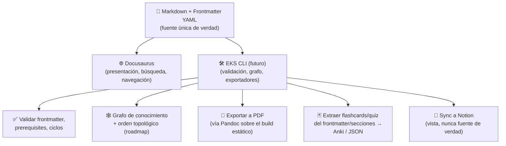

# Engineering Knowledge System (EKS) — Arquitectura

**Versión:** 2.0 (post-pivote a Docusaurus)
**Última actualización:** 2026-08-05

Este documento es la fuente de verdad arquitectónica del proyecto.
Reemplaza cualquier versión anterior que hayas visto — la primera
versión fue escrita en un entorno equivocado y nunca llegó a este
repositorio; esta es la real.

---

## 1. Visión

EKS es tu segundo cerebro profesional: un sistema de conocimiento de
calidad de libro técnico que te acompañará hacia Senior → Staff Engineer
→ Solutions Architect durante los próximos 10 años. No es una wiki, no
es una colección de notas, no es un proyecto de ejemplo.

**Regla de oro del proyecto:** calidad sobre velocidad. Un tema
excelente vale más que diez mediocres. Cada capítulo debe poder competir
con un capítulo de un libro técnico profesional.

## 2. Decisión Arquitectónica Central: Markdown + Docusaurus + CLI complementario

### 2.1 Por qué se abandonó el servidor Express custom

La primera iteración de este proyecto incluía un servidor Node.js/Express
escrito a medida para servir el contenido. Se abandonó por una razón de
**arquitecto, no de gusto**: estábamos reconstruyendo, con más riesgo de
bugs y cero comunidad detrás, funcionalidad que herramientas maduras ya
resuelven de forma robusta (routing, búsqueda, sidebar, dark mode,
generación estática). Reescribir infraestructura genérica que no es tu
ventaja competitiva es, con distintas palabras, el mismo error que
"escalar a microservicios sin tener el problema de Netflix" — estás
pagando complejidad de mantenimiento a cambio de nada.

### 2.2 Por qué Docusaurus específicamente

- **Sidebar jerárquico automático** vía `_category_.json` — coincide
  exactamente con la estructura Volumen → Módulo → Tema que pediste.
- **Búsqueda integrada** sin configuración adicional.
- **Generación estática** — se despliega gratis en Netlify/Vercel/GitHub
  Pages, sin servidor que mantener ni que se caiga.
- **Markdown + frontmatter como fuente de verdad** — exactamente tu
  requisito de "escribir una vez, sin vendor lock-in". El contenido es
   legible y portable incluso si mañana abandonas Docusaurus.
- **Soporte nativo de Mermaid** para todos los tipos de diagrama que
  pediste.
- **Comunidad y mantenimiento activo** — a diferencia de nuestro
  servidor custom, Docusaurus lo mantiene un equipo dedicado (Meta +
  comunidad open source).

### 2.3 Lo que Docusaurus NO resuelve (y cómo lo resolvemos)

Tu visión original pedía más que una web de documentación: CLI,
sincronización con Notion, generación de PDF, flashcards, quizzes,
grafo de conocimiento, progreso por tema. Docusaurus no hace nada de
esto por defecto. La solución arquitectónica es una **capa delgada de
plataforma** (un CLI, futuro) que opera **sobre** el mismo Markdown,
sin duplicar lo que Docusaurus ya resuelve:



**Por qué esta separación es la correcta:** cada pieza hace una sola
cosa bien (principio que ya viste en `monolith-architecture.md` sobre
monolitos modulares — el mismo principio de límites claros aplica a
nivel de plataforma completa). Docusaurus nunca necesita saber que
existen flashcards. El CLI nunca necesita renderizar HTML. Si mañana
reemplazas Docusaurus por otra cosa, el CLI y el contenido sobreviven
intactos.

### 2.4 Roadmap de implementación del CLI (Fase 2, no bloquea el contenido)

| Comando | Qué hace |
|---|---|
| `eks validate` | Verifica frontmatter contra un schema, detecta prerequisites que no existen y ciclos de dependencia |
| `eks graph` | Genera el grafo de conocimiento y el orden topológico (el ROADMAP.md se podrá regenerar automáticamente desde aquí) |
| `eks new` | Crea un nuevo tema desde `templates/topic-template.md` con el frontmatter pre-rellenado |
| `eks export pdf` | Corre `docusaurus build` + Pandoc sobre el HTML resultante |
| `eks export cards` | Extrae la sección `## 🃏 Flashcards` de cada tema y genera un mazo Anki (`.apkg`) |
| `eks sync notion` | Empuja el contenido renderizado a una página de Notion (solo lectura desde Notion — nunca se edita ahí) |

**Decisión explícita:** no se construye esto ahora. Construirlo antes de
tener 15-20 temas reales sería optimizar prematuramente una herramienta
para contenido que aún no existe. Se construye cuando el volumen de
contenido lo justifique — el mismo principio de "divide por evidencia,
no por moda" del tema de Monolito.

## 3. Estructura de Información

### 3.0 EKS son dos libros, no uno

EKS se divide en **dos instancias independientes** del plugin de docs:

| Libro | Carpeta | Ruta | Sidebar | Cómo se consume |
|---|---|---|---|---|
| **Ingeniería** | `docs/` | `/` | `sidebars.ts` | Por consulta: entras a buscar un tema |
| **Inglés para Ingenieros** | `english/` | `/ingles` | `sidebarsEnglish.ts` | En secuencia: se recorre módulo a módulo con práctica diaria |

**Por qué separados y no como "Volumen VIII".** No es una decisión
estética — son dos modos de estudio incompatibles dentro de un mismo
árbol. El libro técnico se consulta (llegas por búsqueda, lees un tema,
te vas) y su orden lo define un grafo de prerequisitos. El de inglés se
recorre (Módulo 0 → 5, 20 minutos diarios, con actividades que dependen
de haber hecho la del día anterior) y su valor depende de la secuencia.
Mezclarlos habría roto dos cosas concretas: la navegación prev/next
(saltarías de "Event-Driven Architecture" a "Los 8 sonidos") y el
sidebar del libro técnico, que dejaría de ser un índice de conocimiento
para volverse una mezcla de temario y curso.

Como instancias separadas, cada libro tiene su propio home, su propio
prev/next y su propia entrada en el navbar — y el costo es una entrada
de ~10 líneas en `plugins` de `docusaurus.config.ts`.

El libro de inglés tiene además su propia convención: las carpetas van
**numeradas** (`00-arranque`, `01-gramatica-minima`, ...) porque el
orden es contenido, no metadata. Docusaurus elimina el prefijo numérico
de la URL final (`/ingles/arranque/diagnostico`), así que el número
ordena sin ensuciar los links. Cada `_category_.json` fija un `slug`
explícito (`/ingles/modulo-0-arranque`) para que las páginas índice de
módulo no hereden URLs generadas desde labels con emoji.

### 3.1 Libro de ingeniería

```
docs/
├── intro.md                              (slug: /, página de bienvenida)
├── volume-1-soft-skills/
│   └── communication/
├── volume-2-technical/
│   ├── languages/
│   └── databases/
├── volume-3-architecture/
│   ├── fundamentals/                     (Nivel 1 del roadmap)
│   ├── patterns/                         (Nivel 2-3 del roadmap)
│   └── case-studies/                     (Nivel 5 del roadmap)
├── volume-4-labs/
│   └── docker/ ...
├── volume-5-interviews/
│   ├── system-design/
│   ├── behavioral/
│   └── technical-challenges/
├── volume-6-career/
└── volume-7-personal/
    └── postmortems/
```

### 3.2 Libro de inglés

```
english/
├── intro.md                              (slug: /, portada del libro)
├── como-usar-este-libro.md               (el método: 20 min/día)
├── 00-arranque/                          (diagnóstico, sonidos, kit de frases)
├── 01-gramatica-minima/                  (7 reglas, 3 tiempos, verbos, errores)
├── 02-ingles-de-trabajo/                 (standup, code review, reuniones,
│                                          Slack/email, incidentes)
├── 03-oido-y-boca/                       (shadowing, listening, pronunciación
│                                          de jerga técnica)
├── 04-entrevistas/                       (pitch, STAR, system design, salario)
├── 05-practica/                          (plan de 30 días, ejercicios, tarjetas)
└── 06-referencia/                        (glosario ES↔EN, índice de perlas)
```

**Estándar de calidad propio.** Cada tema del libro de inglés lleva:
resumen ejecutivo, explicación ELI5, objetivos, contenido con frases
copiables, al menos una 💎 Perla Escondida numerada, **actividades con
soluciones desplegables** y un Diccionario Rápido. Las perlas están
numeradas de forma global y agregadas en
`english/06-referencia/perlas.md` — es la página de mayor densidad del
libro y funciona como resumen ejecutivo de todo.

**Decisión: Case Studies vive dentro de Volumen III (Architecture), no
como volumen propio.** Tu brief original los describe como una sección
grande independiente, pero arquitectónicamente un caso de estudio ES un
análisis de arquitectura aplicado — separarlo en su propio volumen
fragmentaría el aprendizaje (leerías "Microservicios" en un volumen y
"cómo Netflix usa microservicios" en otro completamente distinto). Si
prefieres que sea un volumen VIII independiente, es un cambio mecánico
de mover una carpeta — dímelo y lo hacemos.

## 4. Navegación: `_category_.json` en vez de `sidebars.ts` manual

Se simplificó `sidebars.ts` a una sola línea (`autogenerated`). Cada
carpeta tiene su propio `_category_.json` con label, posición y
descripción. **Por qué:** en un proyecto de 10 años con potencialmente
cientos de temas, un sidebar manual es el archivo que con más
probabilidad se te va a olvidar actualizar, dejando temas "huérfanos"
(existen, pero no aparecen en la navegación). Con autogenerated, crear
el `.md` en la carpeta correcta es suficiente.

## 5. Estándar de Calidad por Tema

Cada tema publicado (`status: "published"`) debe incluir, como mínimo:

- Resumen ejecutivo + versión ELI5 ("para dummies")
- Objetivos de aprendizaje verificables (checklist)
- Definición formal + historia/motivación
- Mínimo 3 diagramas Mermaid de tipos distintos (flowchart, secuencia, estado, etc.)
- Mínimo 2 ejemplos de código comentados (correcto e incorrecto)
- Mínimo 3 "perlas escondidas" (💎) — insights de industria que no están en tutoriales
- Trade-offs, buenas prácticas y anti-patrones explícitos
- Al menos 1 caso real o comparación con la industria
- 2+ preguntas de entrevista con respuesta modelo
- Checklist de implementación
- Referencias oficiales (libros, papers, docs, videos)
- Flashcards y quiz al final

La plantilla completa vive en `templates/topic-template.md` (fuera de
`/docs` para no interferir con el build de Docusaurus).

## 6. Roadmap de Dependencias

Ver [`ROADMAP.md`](./ROADMAP.md) — el curriculum completo ordenado por
prerequisitos, estilo universidad. No se estudia Kafka antes de
Event-Driven, no se estudia Kubernetes antes de Docker, no se estudian
Microservicios antes de Monolito.

## 7. Estado Actual (2026-08-05)

| Área | Estado |
|---|---|
| Infraestructura Docusaurus | ✅ Funcionando, desplegado en Netlify |
| Navegación por `_category_.json` | ✅ Implementado |
| Plantilla maestra de tema | ✅ Lista en `templates/topic-template.md` |
| ROADMAP de dependencias | ✅ Nivel 0 a 5 documentado |
| Temas completos (calidad publicable) | 4: Monolith Architecture, Event-Driven Architecture, Written Communication, Docker Lab, Netflix Case Study |
| Catálogos de temas pendientes | ✅ Volúmenes II, IV, V, VI, VII con backlog visible |
| CLI de plataforma (validación/PDF/Notion/flashcards) | 🔜 Fase 2 — diseño documentado, implementación pendiente hasta tener más contenido |

## 8. Próximos Pasos Recomendados

1. Completar Nivel 0-1 del roadmap (programming-fundamentals,
   database-fundamentals, networking-basics, layered-architecture,
   api-design, database-design)
2. Completar Nivel 2 (scalability-101, caching-strategies,
   distributed-systems-fundamentals)
3. Recién entonces, Nivel 3 (microservices, saga-pattern, cqrs, outbox-pattern)
4. En paralelo, 1 tema de Soft Skills por cada 2-3 temas técnicos
   (ver ROADMAP.md, sección "Transversal")
5. Cuando existan ~20 temas, evaluar construir el CLI de validación —
   antes de eso, revisar manualmente es suficiente y más rápido

---

**Nota sobre este documento:** la primera versión de esta arquitectura
fue escrita con una herramienta que la guardó en un entorno que nunca se
sincronizó con tu Mac — nunca la viste realmente. Esta versión fue
escrita, transferida y **verificada por comando** (`ls`/`cat`) contra tu
repositorio real antes de darse por completa. Cualquier documento futuro
en este proyecto seguirá ese mismo estándar de verificación.
