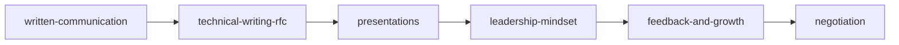

# 🗺️ EKS Roadmap — Curriculum Ordenado por Dependencias

Este roadmap funciona como el plan de estudios de una universidad: cada
"nivel" asume que dominaste el anterior. No hay atajos — no se aprende
Kafka sin Event-Driven, no se aprende Kubernetes sin Docker, no se
aprenden Microservicios sin Monolito.

Cada tema referencia su `id` (el que va en el frontmatter `prerequisites`).
Cuando el CLI de validación exista (ver `EKS_ARCHITECTURE.md`), este grafo
se generará automáticamente a partir del frontmatter — este documento es
la versión legible-por-humanos y la fuente inicial de verdad mientras el
contenido crece.

---

## Nivel 0 — Fundamentos Absolutos

Sin esto, nada más tiene sentido.

| Tema | Volumen | Por qué es nivel 0 |
|---|---|---|
| `programming-fundamentals` | II | Base de todo lo técnico |
| `written-communication` | I | Todo ingeniero necesita comunicar por escrito desde el día 1 |
| `database-fundamentals` | II | Casi todo sistema persiste datos |
| `networking-basics` | II | HTTP, TCP/IP — necesario para entender cualquier arquitectura distribuida |

## Nivel 1 — Arquitectura de Aplicación Única

Requiere: Nivel 0.

| Tema | Prerequisitos | Por qué va aquí |
|---|---|---|
| `monolith-architecture` | `programming-fundamentals`, `database-fundamentals` | Punto de partida de toda arquitectura de software |
| `layered-architecture` | `monolith-architecture` | Cómo organizar el monolito internamente |
| `api-design` | `networking-basics` | Contrato entre sistemas, necesario antes de hablar de servicios |
| `database-design` | `database-fundamentals` | Modelado antes de escalar |

## Nivel 2 — Escalabilidad y Comunicación Asíncrona

Requiere: Nivel 1. **No se salta este nivel** — es el más ignorado y el más costoso de saltarse.

| Tema | Prerequisitos | Por qué va aquí |
|---|---|---|
| `scalability-101` | `monolith-architecture` | Escalar el monolito ANTES de dividirlo |
| `caching-strategies` | `scalability-101` | La optimización #1 real, antes de arquitecturas complejas |
| `event-driven-architecture` | `monolith-architecture`, `api-design` | Requisito real para entender Kafka/RabbitMQ más adelante |
| `distributed-systems-fundamentals` | `event-driven-architecture` | CAP theorem, consistencia, latencia de red |

## Nivel 3 — Arquitecturas Distribuidas

Requiere: Nivel 2. Aquí es donde la mayoría se apresura sin base — por eso
fallan las entrevistas de Staff Engineer.

| Tema | Prerequisitos | Por qué va aquí |
|---|---|---|
| `microservices` | `monolith-architecture`, `distributed-systems-fundamentals` | Solo tiene sentido si ya sabes por qué NO usar un monolito |
| `saga-pattern` | `microservices`, `event-driven-architecture` | Transacciones distribuidas requieren ambos conceptos |
| `cqrs` | `event-driven-architecture` | Separación de lectura/escritura |
| `outbox-pattern` | `event-driven-architecture`, `database-design` | Consistencia entre DB y mensajería |

## Nivel 4 — Infraestructura y Operación

Requiere: Nivel 3 conceptualmente, aunque los labs de Docker pueden
adelantarse si son solo mecánica de contenedores (sin arquitectura).

| Lab | Prerequisitos | Por qué va aquí |
|---|---|---|
| `lab-docker` | `programming-fundamentals` | Mecánica pura, se puede aprender temprano |
| `lab-kubernetes` | `lab-docker` | **Nunca antes de Docker** — K8s orquesta lo que Docker empaqueta |
| `lab-kafka` | `event-driven-architecture` | **Nunca antes de Event-Driven** — si no entiendes pub/sub, Kafka es magia negra |
| `lab-rabbitmq` | `event-driven-architecture` | Mismo principio que Kafka |
| `lab-redis` | `caching-strategies` | Redis es una implementación, no el concepto |
| `lab-terraform` | `lab-docker` | Infraestructura como código, asume que ya piensas en contenedores |
| `lab-opentelemetry` | `microservices` | Observabilidad importa cuando tienes múltiples servicios que rastrear |
| `lab-aws` / `lab-azure` | `lab-docker`, `networking-basics` | Cloud providers, requieren fundamentos de red y contenedores |

## Nivel 5 — Casos de Estudio Reales

Requiere: Nivel 3 y 4. Los casos de estudio son donde todo se conecta —
por eso van al final, no al principio.

| Caso | Prerequisitos conceptuales |
|---|---|
| `case-netflix` | `microservices`, `scalability-101`, `caching-strategies` |
| `case-uber` | `event-driven-architecture`, `distributed-systems-fundamentals` |
| `case-stripe` | `saga-pattern`, `outbox-pattern` (consistencia financiera) |
| `case-whatsapp` | `distributed-systems-fundamentals`, `networking-basics` |
| `case-payment-gateway` | `saga-pattern`, seguridad (Volumen III/Security) |

## Transversal — Soft Skills (se estudia en paralelo, no en serie)

A diferencia de los volúmenes técnicos, Soft Skills no bloquea nada y nada
lo bloquea a él. Se recomienda **1 tema de soft skills por cada 2-3 temas
técnicos**, para no perder la habilidad de comunicar mientras se acumula
profundidad técnica.



## Transversal — Personal Knowledge

Se alimenta continuamente desde el día 1 (cada incidente real que vivas,
cada postmortem que escribas), no tiene "nivel" — es tu bitácora.

---

## 📅 Vista de Progreso (actualiza esto conforme avances)

```
Nivel 0 ████████░░ 3/4 (falta programming-fundamentals)
Nivel 1 █████░░░░░ 2/4 (monolith ✅, api-design ✅)
Nivel 2 ██░░░░░░░░ 1/4 (event-driven ✅)
Nivel 3 ░░░░░░░░░░ 0/4
Nivel 4 ░░░░░░░░░░ 0/8 (docker en progreso)
Nivel 5 ░░░░░░░░░░ 0/13 (netflix en progreso)
```

**Regla de oro del roadmap:** si vas a estudiar un tema y no reconoces sus
prerequisitos, detente y estúdialos primero. Saltarse niveles se siente
más rápido a corto plazo, pero produce el mismo hueco conceptual que
lleva a fallar entrevistas de Staff Engineer: sabes usar la herramienta,
pero no puedes explicar *por qué* existe.
