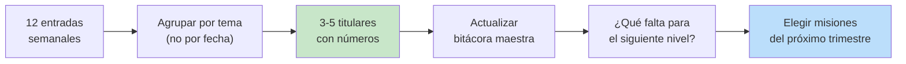

# 📓 Ruta 0 — Bitácora de Evidencia

**Empieza aquí, aunque tu objetivo sea Tech Lead o Arquitecto.** Esta es la
única ruta sin la cual las otras no producen resultado: puedes completar quince
misiones y no obtener nada si nadie —incluyéndote a ti— puede reconstruir qué
hiciste.

---

## 🧒 El Problema Real (ELI5)

Es diciembre. Tu manager tiene que escribir tu evaluación anual. Se sienta
frente a la pantalla y recuerda:

- Lo que hiciste en las últimas 4 semanas (con detalle).
- Un par de cosas grandes del resto del año.
- El incidente donde algo salió mal (eso siempre se recuerda).

Once meses de trabajo tuyo comprimidos en tres recuerdos. No es maldad ni
desinterés: tu manager tiene 6 personas más y su propia carga. **Nadie lleva el
registro de tu trabajo excepto tú.**

La bitácora es simplemente el archivo que te permite llegar a esa conversación
con los once meses completos, con fechas y números, en vez de con la sensación
de "creo que fue un buen año".

> 💎 **Perla Escondida #1**: el mejor momento para escribir tu bitácora es el
> día del hecho, y la razón no es la memoria — es la **magnitud**. El día que
> arreglaste el bug sabes que afectaba a 3.000 usuarios y que la latencia pasó
> de 800 ms a 120 ms. Seis meses después solo recuerdas "mejoré el
> rendimiento", que es exactamente la frase vacía que hace que una promoción se
> caiga. Los números no se recuperan después; se pierden.

---

## 🎯 Objetivos de Esta Ruta

Al terminar podrás:

- Mantener un registro de 5 minutos semanales que sobrevive a la evaluación anual
- Convertir tareas ("migré el servicio") en impacto ("reduje el costo de infra 22%")
- Llegar a un 1:1 de promoción con evidencia citable en vez de percepciones
- Responder preguntas conductuales de entrevista con casos reales y datos

---

## 📋 Prerequisitos

Ninguno. Esta ruta se puede empezar hoy, con cualquier nivel de experiencia.

---

## 🧩 Cómo Funciona

### 1. La Entrada Semanal (5 minutos, viernes)

Una entrada por semana, aunque la semana haya sido aburrida. Formato:

```markdown
## 2026-W32 (4–8 agosto)

**Hecho**
- Migré el endpoint `/orders` a paginación por cursor. PR #412.

**Impacto (números)**
- p95 de 1.4 s → 210 ms. Timeouts del cliente móvil: ~40/día → 0.

**Ayudé a**
- Camila: pair de 1 h sobre índices compuestos; salió sola con su query.

**Aprendí**
- OFFSET grande escanea todo lo anterior. Ver `caching-strategies`.

**Visible para**
- Demo en el weekly. Product preguntó si aplicaba al listado de facturas.
```

Los cinco campos importan por una razón concreta:

| Campo | Por qué está |
|---|---|
| **Hecho** | El dato crudo. Sin esto no hay nada que recuperar. |
| **Impacto** | Lo que convierte tarea en logro. Sin número, no es evidencia. |
| **Ayudé a** | La evidencia de senior/lead que *nunca* queda en el git log. |
| **Aprendí** | Materia prima para "cuéntame de una vez que te equivocaste". |
| **Visible para** | Quién puede confirmarlo si preguntan. Un logro sin testigo es débil. |

> 💎 **Perla Escondida #2**: el campo que la gente borra por parecer irrelevante
> es **"Ayudé a"** — y es el que más pesa a partir de senior. Los niveles altos
> se justifican con *impacto a través de otros*: desbloqueaste a alguien,
> evitaste que un equipo tomara el camino caro, hiciste que un junior dejara de
> necesitarte. Eso no aparece en ningún PR ni en ninguna métrica de la empresa.
> Si no lo escribes tú, no existe en ningún lado.

### 2. La Traducción a Impacto

La mayoría escribe tareas y cree que escribió logros. La diferencia:

| Lo que escribiste | Lo que cuenta como evidencia |
|---|---|
| "Migré el servicio a Docker" | "Bajé el setup de un dev nuevo de 2 días a 40 min; el último onboarding tuvo 0 tickets de entorno" |
| "Arreglé bugs de checkout" | "Cerré los 3 bugs de checkout con más reportes; los tickets de soporte del flujo bajaron ~60% en 2 sprints" |
| "Escribí documentación" | "Documenté el flujo de pagos; en el trimestre siguiente 4 personas lo implementaron sin preguntarme" |
| "Ayudé a un compañero" | "Mentoré a Camila en diseño de índices; ahora es la que revisa los PRs de queries del equipo" |

La regla mecánica: **después de escribir qué hiciste, pregúntate "¿y eso qué
cambió, para quién, cuánto?"**. Si no puedes responder, tienes una tarea, no un
logro — y probablemente sea una tarea que no valía la pena listar.

Cuando no hay número disponible (pasa, y es normal), sirve el
**contrafactual**: "sin ese cambio, el equipo habría seguido perdiendo ~medio
día por release". Es más débil que un dato duro, pero infinitamente mejor que
"mejoré el proceso".

### 3. La Consolidación Trimestral

Cada 90 días, en la misma revisión del ciclo de misiones:



**Agrupar por tema, no por fecha** es la parte que cambia el resultado. Doce
entradas cronológicas se leen como "estuvo ocupado". Las mismas doce agrupadas
en "confiabilidad del checkout", "rendimiento de la API" y "mentoría" se leen
como *tres áreas donde esta persona es la referente*. Es el mismo trabajo,
contado en el nivel correcto.

---

## 💡 Buenas Prácticas

- Guarda la bitácora **fuera de los sistemas de la empresa** (tu Notion, tu
  repo privado, este mismo EKS). Es tuya y te sirve en la siguiente empresa —
  cuidando de no sacar información confidencial: guarda métricas relativas
  ("−40% de latencia") en vez de datos internos absolutos.
- Enlaza siempre al artefacto: PR, RFC, dashboard, postmortem, hilo de Slack.
- Registra también lo que salió mal, con la lección. Es la única forma de
  responder bien a "cuéntame de un fracaso" sin improvisar.
- Cuando alguien te agradezca por escrito, **pega la cita textual**. Un
  "gracias, esto me desbloqueó toda la semana — Andrés" vale más en una
  evaluación que tres párrafos tuyos describiéndote.
- 5 minutos el viernes, con recordatorio. La bitácora perfecta que no se
  escribe pierde contra la mediocre que sí.

---

## 🚫 Anti-Patrones

### AP1: "La bitácora retroactiva"

Sentarse en noviembre a reconstruir el año. Se pierde el 80% del detalle y,
peor, se pierden justo las cosas pequeñas y frecuentes —las ayudas, los
desbloqueos, las decisiones evitadas— que son la evidencia de seniority. Queda
solo lo grande y visible, que es lo que tu manager ya sabía.

### AP2: "El diario de sentimientos"

Escribir "semana pesada, mucho contexto switching, me sentí improductivo". Es
válido para ti como persona, pero no es evidencia de nada y con el tiempo hace
que abras el archivo con desgano. La bitácora registra **hechos e impacto**; el
desahogo va en otro lado.

---

## 🎤 Preguntas de Entrevista

**P: "Cuéntame del proyecto del que estés más orgulloso."**

Con bitácora respondes con situación, decisión técnica, número y consecuencia
para el negocio, en 90 segundos. Sin bitácora la respuesta empieza con "mmm,
déjame pensar…" y termina describiendo tecnologías en vez de impacto. La
diferencia no es memoria ni carisma: es que uno tiene el archivo abierto desde
hace un año.

---

## ☑️ Checklist

- [ ] Creé el archivo hoy, con la entrada de esta semana (aunque sea corta)
- [ ] Tengo recordatorio recurrente los viernes
- [ ] Mis últimas 3 entradas tienen al menos un número o un contrafactual
- [ ] Al menos una entrada del último mes tiene algo en "Ayudé a"
- [ ] Tengo fecha en el calendario para la consolidación trimestral
- [ ] Puedo citar, ahora mismo, 3 logros míos con datos concretos

---

## 📄 Plantilla Copiable

```markdown
# Bitácora de Evidencia — <tu nombre>

## Bitácora maestra (se actualiza cada trimestre)

### Confiabilidad / Incidentes
- [2026-Q3] ...

### Rendimiento / Costos
- [2026-Q3] ...

### Impacto a través de otros (mentoría, desbloqueos, documentación)
- [2026-Q3] ...

### Decisiones técnicas que definí
- [2026-Q3] ...

---

## Entradas semanales

## <AAAA-Wnn> (rango de fechas)

**Hecho**
-

**Impacto (números)**
-

**Ayudé a**
-

**Aprendí**
-

**Visible para**
-
```

---

## 🔗 Conceptos Relacionados

- [Objetivos — Cómo Usar Este Sistema](./index.md)
- [Negociación](../volume-1-soft-skills/negotiation/negotiation.md) — la bitácora es el insumo de cualquier negociación de nivel o salario
- [Feedback y Crecimiento](../volume-1-soft-skills/feedback/feedback-and-growth.md)
- [Plantilla de Postmortem](../volume-7-personal/postmortems/postmortem-template.md) — los incidentes van a los dos lados

---

## 📝 Resumen Final

Nadie lleva el registro de tu trabajo excepto tú, y tu manager recordará cerca
de un mes de tus últimos doce cuando escriba tu evaluación. La bitácora es el
archivo que cierra ese hueco: una entrada semanal de cinco minutos con hecho,
impacto numérico, a quién ayudaste, qué aprendiste y quién lo vio. Los números
solo existen el día del hecho —después se degradan a "mejoré el
rendimiento"— y el campo "ayudé a" es el que sostiene los niveles senior en
adelante, porque el impacto a través de otros no aparece en ningún sistema de
la empresa. Cada trimestre agrupas por tema, no por fecha: doce entradas
cronológicas dicen "estuvo ocupado", las mismas agrupadas dicen "es la
referente de estas tres áreas".
