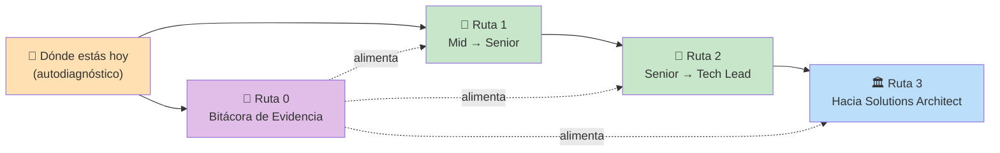
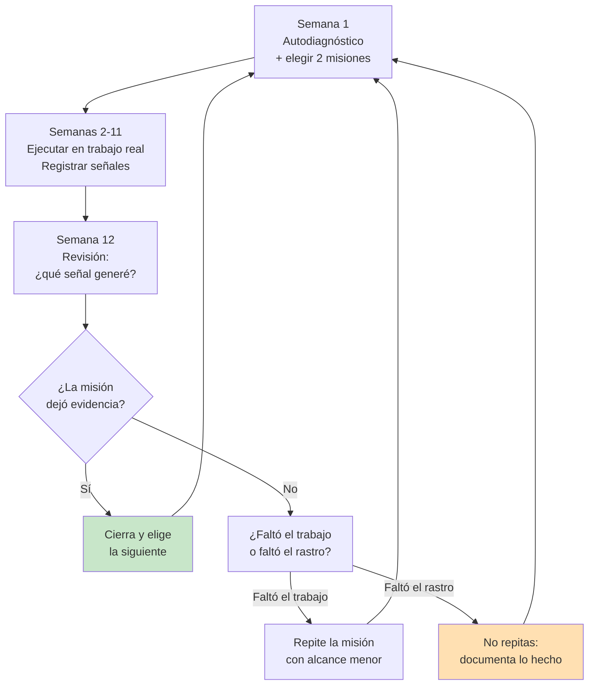

# 🎯 Objetivos y Misiones

El resto de EKS te enseña **qué saber**. Esta sección es lo otro: **qué hacer**.

Son misiones concretas, con una señal verificable de que ya las lograste. No
"aprende arquitectura" — sino "escribe un RFC que alguien más implemente sin
preguntarte nada". No "mejora tu comunicación" — sino "explica un incidente a
alguien de producto y que lo repita correctamente sin ti".

---

## 🧒 Por Qué Existe Esta Sección (ELI5)

Imagina dos personas aprendiendo a manejar.

La primera se lee el manual de tránsito completo. Se sabe todas las señales,
las distancias de frenado, la mecánica del motor. Podría dar una clase.
Nunca ha manejado sola en hora pico.

La segunda maneja todos los días. Ha llevado gente al aeropuerto, ha manejado
bajo lluvia, se le pinchó una llanta en una carretera y la cambió.

Cuando alguien necesita que lo lleven al aeropuerto a las 4 a.m., **llama a la
segunda**. No porque sepa más, sino porque hay evidencia de que puede.

Los títulos de Senior, Tech Lead y Arquitecto funcionan igual: **no se dan por
conocimiento acumulado, se dan por evidencia acumulada.** Esta sección existe
para que generes esa evidencia a propósito, no por accidente.

> 💎 **Perla Escondida #1**: la causa #1 de estancamiento en mid-level no es
> falta de conocimiento técnico — es que la persona sí hace cosas de senior,
> pero de forma invisible. Arregla el bug crítico en su rama sin decirle a
> nadie, ayuda a un compañero por DM, propone la solución correcta en una
> reunión donde otro se lleva el crédito. Todo el trabajo, cero evidencia. La
> mitad de estas misiones no son "haz algo más difícil", son "haz lo mismo que
> ya haces, pero de forma que deje rastro".

---

## 🗺️ Las Cuatro Rutas

| Ruta | Para quién | Horizonte real |
|---|---|---|
| [📓 Bitácora de Evidencia](./bitacora-de-evidencia.md) | Todos, desde hoy | Permanente — empieza esta semana |
| [🚀 Mid → Senior](./ruta-senior.md) | Ejecutas bien tareas que otros definen | 12–24 meses |
| [🧭 Senior → Tech Lead](./ruta-tech-lead.md) | Ya defines el *cómo*, quieres definir el *qué* y con quién | 12–24 meses después |
| [🏛️ Solutions Architect](./ruta-arquitecto.md) | Horizonte largo — pero hay cosas que empiezan hoy | 3–6 años |

**Empieza por la Bitácora.** Suena aburrido comparado con las otras, pero sin
ella las demás no se pueden demostrar, y una promoción que no se puede
demostrar no ocurre.

---

## 📍 Autodiagnóstico: ¿Dónde Estás Hoy?

Lee cada fila y marca la columna que describe **lo que ya haces habitualmente**,
no lo que podrías hacer si te lo pidieran. Sé honesto: el diagnóstico inflado
solo produce misiones que no te sirven.

| Eje | Mid | Senior | Tech Lead | Architect |
|---|---|---|---|---|
| **Alcance** | Tickets bien definidos | Un servicio/módulo completo | Un equipo y su roadmap técnico | Varios equipos / un dominio de negocio |
| **Ambigüedad** | Necesitas requisitos claros | Conviertes un problema vago en un plan | Decides qué problema atacar primero | Defines qué problemas existen |
| **Decisión técnica** | Sigues las convenciones | Eliges entre alternativas y justificas | Fijas la convención del equipo | Fijas restricciones que otros heredan |
| **Errores** | Alguien los detecta en review | Los detectas tú antes de mergear | Diseñas el proceso que los detecta | Diseñas el sistema donde no ocurren |
| **Comunicación** | Explicas tu código | Escribes RFCs que otros implementan | Alineas al equipo y a producto | Traduces negocio ↔ tecnología ↔ costo |
| **Impacto en otros** | Aprendes de otros | Desbloqueas a otros | Haces crecer a otros | Cambias cómo la org toma decisiones |
| **Horizonte** | Este sprint | Este trimestre | 2–3 trimestres | 1–3 años |

**Cómo leer tu resultado:**

- **Mayoría en Mid** → empieza en [Mid → Senior](./ruta-senior.md), misiones M1–M4.
- **Mezcla Mid/Senior** → esto es lo normal, y no es un problema. Trabaja las
  filas donde estás en "Mid": son exactamente tu cuello de botella.
- **Mayoría en Senior** → ya eres senior de facto aunque el título no llegue.
  Ve a [Senior → Tech Lead](./ruta-tech-lead.md) y en paralelo lee
  [Negociación](../volume-1-soft-skills/negotiation/negotiation.md), porque tu
  problema ahora es de reconocimiento, no de capacidad.

> 💎 **Perla Escondida #2**: la fila que más gente subestima es **Ambigüedad**.
> Es la que realmente separa mid de senior — mucho más que la habilidad técnica.
> Un mid excelente resuelve un problema difícil bien definido. Un senior
> promedio toma "los usuarios se quejan de que la app está lenta" y sale de ahí
> con un plan de 3 pasos priorizado por impacto. Si solo puedes trabajar en una
> fila este trimestre, trabaja esa.

---

## 🧩 Cómo Funciona Una Misión

Cada misión tiene esta forma:

> **M0 — Ejemplo**
> - 🎯 **Objetivo:** la capacidad que estás construyendo (el *por qué*).
> - 🛠️ **Qué hacer:** la acción concreta, en tu trabajo real. No un ejercicio.
> - ✅ **Señal de que ya lo tienes:** el hecho observable que prueba que ocurrió.
>   Si no puedes contárselo a tu manager en una frase, no cuenta.
> - ⏱️ **Tiempo típico:** cuánto suele tomar de forma realista.
> - 📎 **Apoyo en EKS:** el tema del libro que te da la teoría.

**Reglas de uso** (estas importan más que las misiones en sí):

1. **Máximo 2 misiones activas a la vez.** Con 6 abiertas no completas ninguna
   y solo acumulas culpa.
2. **Usa trabajo real, nunca un proyecto paralelo.** Un side project no genera
   evidencia que tu empresa reconozca en una evaluación.
3. **La señal se registra el día que ocurre**, en tu
   [Bitácora](./bitacora-de-evidencia.md). En tres meses no vas a recordar el
   número del PR ni cuánta latencia bajaste.
4. **Una misión sin señal observable está incompleta**, aunque hayas hecho el
   trabajo. Volver a hacerla no sirve — lo que falta es dejar rastro.
5. **No hay orden obligatorio**, pero el orden dentro de cada ruta está pensado
   por dependencia: las primeras hacen más fáciles las siguientes.

> 💎 **Perla Escondida #3**: la trampa clásica es tratar esto como una lista de
> tareas que hay que terminar completa antes de "merecer" el título. No
> funciona así. En la práctica, la promoción llega cuando **tu manager ya no
> puede describir lo que haces usando el nivel actual** — normalmente eso pasa
> con 60–70% de las misiones, no con el 100%. El resto lo terminas *ya siendo*
> senior. Nadie llega completo; llegas suficientemente lejos como para que el
> título sea un trámite.

---

## 📅 El Ciclo de 90 Días

El sistema funciona en trimestres porque ese es el ritmo real al que las
empresas evalúan, y porque 90 días es lo mínimo para que un cambio de
comportamiento sea visible para otros.

**Semana 12 no es opcional.** Es la única parte del ciclo donde conviertes
trabajo en evidencia, y es la que todo el mundo se salta. Ponla en el
calendario ahora, como evento recurrente, antes de seguir leyendo.

---

## 🚫 Anti-Patrones de Esta Sección

### AP1: "El coleccionista de misiones"

Marcar misiones como completadas leyendo la descripción y pensando "sí, eso ya
lo hago más o menos". La misión no es el texto, es la **señal observable**. Si
no puedes citar el PR, el documento, el incidente o la persona concreta, no
está completa. Este anti-patrón se siente productivo y no mueve nada.

### AP2: "El que espera el título para actuar"

"Cuando me hagan tech lead voy a organizar el onboarding del equipo." Al revés:
el título describe lo que ya haces. Ninguna empresa promueve a alguien a Tech
Lead con la esperanza de que empiece a liderar — promueve al que ya lidera y
solo le está faltando el nombre. Ver
[Ownership y Liderazgo sin Autoridad](../volume-1-soft-skills/leadership/leadership-mindset.md).

### AP3: "Todas las rutas al mismo tiempo"

Trabajar misiones de Senior, Tech Lead y Arquitecto en paralelo porque las tres
suenan bien. El resultado típico es avance superficial en las tres y evidencia
sólida en ninguna. Las rutas están ordenadas porque las capacidades se apilan:
liderar técnicamente sin ser un referente técnico produce un líder al que nadie
consulta.

---

## ☑️ Checklist de Arranque

- [ ] Hice el autodiagnóstico honestamente y sé en qué 2 filas estoy más flojo
- [ ] Creé mi [Bitácora de Evidencia](./bitacora-de-evidencia.md) (archivo real, no intención)
- [ ] Elegí **2** misiones activas, ni una más
- [ ] Puse el evento de revisión trimestral en el calendario, con fecha concreta
- [ ] Cada misión activa la puedo conectar con un proyecto real que ya tengo asignado

---

## 📖 Diccionario Rápido de Esta Sección

| Término | Qué significa | Contexto aquí |
|---|---|---|
| Evidencia | Hecho observable y citable que prueba una capacidad | La moneda de las promociones |
| Señal | La forma concreta que toma la evidencia de una misión | Campo obligatorio de cada misión |
| Brag document | Registro propio de logros con fecha y datos | Ver [Bitácora](./bitacora-de-evidencia.md) |
| Alcance (scope) | Cuánto sistema/gente abarca tu trabajo | Eje principal del autodiagnóstico |
| Ambigüedad | Cuánto contexto falta cuando te dan un problema | El eje que más separa mid de senior |
| De facto | Que ya lo haces aunque el título no lo diga | "Senior de facto" |

---

## 📝 Resumen Final

Los ascensos técnicos no premian conocimiento acumulado sino evidencia
acumulada, y la mayoría de la gente estancada en mid-level ya hace trabajo de
senior — solo que de forma invisible. Este sistema convierte eso en algo
deliberado: te ubicas con el autodiagnóstico, eliges dos misiones (nunca más),
las ejecutas en trabajo real y registras la señal el día que ocurre. Cada 90
días revisas si generaste evidencia; si no, distingues entre "no hice el
trabajo" y "lo hice pero no dejé rastro", porque el remedio es distinto. La
promoción llega cuando tu manager ya no puede describir lo que haces con tu
nivel actual — normalmente alrededor del 70% de las misiones, no del 100%.
