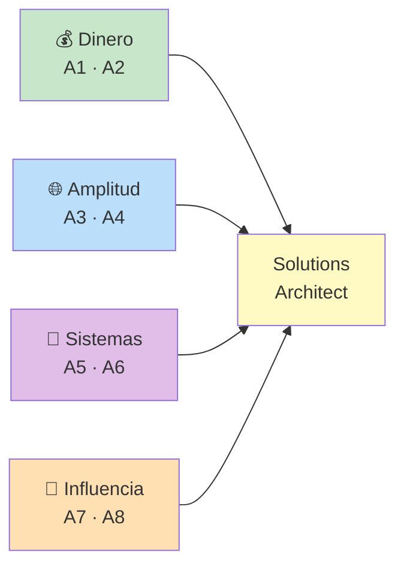

# 🏛️ Ruta 3 — Hacia Solutions Architect

**Horizonte realista:** 3 a 6 años desde senior. **Misiones activas:** 1, en
paralelo con tu ruta principal.

---

## 🎯 Primero: Sí Te Queda Lejos, y Eso No Es el Problema

Vamos con la parte honesta, porque es la que sirve.

Solutions Architect es un rol que **casi siempre requiere haber vivido**
sistemas grandes durante años: haber visto una migración fracasar, haber pagado
la factura de una decisión propia tres años después, haber trabajado con
restricciones reales de presupuesto y de gente. Eso **no se puede acelerar con
estudio** — es la única parte de esta carrera donde el tiempo es un
ingrediente, no un obstáculo.

Ahora la parte útil: la razón por la que la gente no llega no es que sea muy
difícil. Es que llegan **con el perfil incompleto**. Pasan diez años
profundizando en lo técnico y llegan al puesto sin haber hablado nunca de
costos, sin saber presentar a una gerencia, sin haber dicho que no a un
proveedor. Y esa mitad del perfil —la que *sí* se puede construir desde hoy— es
la que decide quién llega.

> 💎 **Perla Escondida #1**: la falta de experiencia se resuelve sola con el
> tiempo; la falta de perfil no. Por eso esta ruta se corre **en paralelo** a
> las otras, con una sola misión activa, desde ahora. No para "ser arquitecto
> antes", sino para que cuando tengas los años, no te falte la otra mitad. La
> gente que llega a arquitecto a los 8 años y la que no llega nunca suelen
> tener la misma profundidad técnica: se diferencian en si empezaron a mirar
> costo, riesgo y negocio a los 3 años o a los 12.

---

## 🧒 Qué Hace Realmente un Arquitecto (ELI5)

Un tech lead es como el maestro de obra de una casa: responde por que esa casa
se construya bien, a tiempo, con su cuadrilla.

Un arquitecto de soluciones responde por otra cosa: **que la casa correcta se
construya en el terreno correcto**. Antes de que exista un plano, ya preguntó
cuánta gente va a vivir ahí en diez años, cuánto dinero hay, si el terreno se
inunda, si conviene comprar prefabricado en vez de construir, y qué pasa si el
presupuesto se recorta a la mitad a mitad de obra.

Puede que no sepa poner ladrillos mejor que el maestro de obra. Pero es el
único que puede decir, con argumentos, "esta casa no se debe construir así" —
y sostenerlo delante de quien paga.

---

## 📊 Arquitecto vs. los Otros Roles

| | Tech Lead | Staff Engineer | Solutions Architect |
|---|---|---|---|
| **Alcance** | Un equipo | Varios equipos, un área técnica | Un dominio de negocio / la organización |
| **Pregunta central** | ¿Cómo lo construimos bien? | ¿Cómo lo construimos bien *a escala*? | ¿Qué construimos, compramos o no hacemos? |
| **Horizonte** | 2–3 trimestres | 1–2 años | 1–3 años |
| **Habla con** | Su equipo, producto | Otros ingenieros senior | Negocio, gerencia, proveedores, clientes |
| **Mide en** | Entregas, calidad | Consistencia técnica, apalancamiento | Costo total, riesgo, capacidad futura |
| **Autoridad** | Sobre un equipo | Por reputación técnica | Por restricciones que otros heredan |

Tres cosas que llaman la atención de esa tabla, y que son el corazón del rol:

1. **"Compramos"** es una respuesta legítima y frecuente. Un arquitecto que
   siempre propone construir no está haciendo su trabajo.
2. **Mide en dinero.** Es el primer rol donde el costo no es un detalle del
   final, sino una variable de diseño desde el minuto uno.
3. **"No hacerlo"** también es una salida válida. La decisión más valiosa de un
   arquitecto suele ser la que evita un proyecto de dos años que no debía
   existir.

---

## 🗺️ Las 8 Misiones de Largo Plazo

Estas misiones son **más lentas y menos frecuentes** que las de las otras
rutas: dependen de que aparezca la oportunidad. La estrategia correcta no es
forzarlas, es estar preparado para reconocerlas cuando pasen.

---

## 💰 Frente A — Pensar en Dinero

El frente que más rápido te diferencia, y el que casi ningún ingeniero trabaja.

### A1 — Calcular el costo real de una solución

- 🎯 **Objetivo:** dejar de razonar solo en elegancia técnica y empezar a
  razonar en costo total.
- 🛠️ **Qué hacer:** para el próximo diseño mediano, calcula el **TCO**: infra
  mensual, licencias, horas de desarrollo (sí, con el costo por hora del
  equipo), mantenimiento anual estimado, y el costo de migrar fuera si sale
  mal. Compara al menos dos opciones con esos números encima.
- ✅ **Señal:** presentaste una comparación con cifras y la decisión se tomó
  mirando esa tabla.
- ⏱️ **Tiempo típico:** 2–4 semanas.
- 📎 **Apoyo en EKS:** [Glosario: TCO](/glosario)

### A2 — Defender un "comprar" en vez de un "construir"

- 🎯 **Objetivo:** perder el sesgo de constructor. Es el sesgo más caro de la
  industria y el más invisible desde adentro.
- 🛠️ **Qué hacer:** identifica algo que tu equipo esté construyendo (o vaya a
  construir) que exista como producto: autenticación, facturación, buscador,
  motor de reglas, dashboards. Haz el análisis honesto —costo, tiempo,
  diferenciación real, riesgo de dependencia— y defiéndelo aunque la respuesta
  sea "esto no nos hace especiales, comprémoslo".
- ✅ **Señal:** una decisión de construir-vs-comprar se tomó con tu análisis,
  hacia cualquiera de los dos lados.
- ⏱️ **Tiempo típico:** aparece 1–2 veces al año; ten el análisis listo.
- 📎 **Apoyo en EKS:** [Negociación](../volume-1-soft-skills/negotiation/negotiation.md)

> 💎 **Perla Escondida #2**: la pregunta que usan los arquitectos con más
> criterio para decidir construir vs. comprar no es "¿podemos hacerlo?" (casi
> siempre sí) sino **"¿esto es parte de por qué nos eligen los clientes?"**. Si
> la respuesta es no, construirlo es gastar tu recurso más escaso —tiempo de
> ingeniería— en algo que no te diferencia. Un banco no debería construir su
> propio sistema de correo; Netflix sí debía construir su propio CDN. La misma
> decisión técnica, respuestas opuestas, y lo que cambia no es la tecnología.

---

## 🌐 Frente B — Amplitud

De especialista profundo a alguien que puede comparar mundos distintos.

### A3 — Trabajar fuera de tu zona técnica

- 🎯 **Objetivo:** un arquitecto compara opciones; no se puede comparar lo que
  no se conoce por dentro.
- 🛠️ **Qué hacer:** durante un año, sal deliberadamente de tu especialidad. Si
  eres de backend, mete las manos en infraestructura, datos o frontend lo
  suficiente como para entender sus restricciones reales (no para dominarlas).
  Suficiente profundidad para saber qué es caro y qué es barato en ese mundo.
- ✅ **Señal:** contribuiste algo real en un área que no era la tuya y puedes
  explicar sus trade-offs sin repetir clichés.
- ⏱️ **Tiempo típico:** 6–12 meses.
- 📎 **Apoyo en EKS:** [Volumen IV — Labs](../volume-4-labs/index.md)

### A4 — Certificarte en una nube (y usarla de verdad)

- 🎯 **Objetivo:** el vocabulario común de las conversaciones de arquitectura
  hoy, y el filtro formal más habitual para estos puestos.
- 🛠️ **Qué hacer:** una certificación de arquitecto de la nube que uses en el
  trabajo (AWS Solutions Architect, Azure Solutions Architect Expert o
  equivalente). **La certificación sin práctica no vale**: acompáñala
  construyendo algo real, aunque sea pequeño, con costos que tú pagues o
  monitorees.
- ✅ **Señal:** la certificación obtenida **y** al menos un sistema real donde
  aplicaste sus patrones.
- ⏱️ **Tiempo típico:** 3–6 meses.
- 📎 **Apoyo en EKS:** [Docker Basics](../volume-4-labs/docker/docker-basics.md) — la base antes de cualquier nube

---

## 🧩 Frente C — Pensar en Sistemas

De diseñar servicios a diseñar cómo encajan las piezas de toda la empresa.

### A5 — Mapear un dominio completo del negocio

- 🎯 **Objetivo:** ver la organización como un sistema, no como una lista de
  repositorios.
- 🛠️ **Qué hacer:** elige un dominio (pagos, inventario, identidad, reporting) y
  documenta el mapa real: qué sistemas participan, qué datos fluyen entre
  ellos, quién es dueño de cada pieza, dónde están las duplicaciones y los
  puntos únicos de falla. Casi nadie tiene ese mapa — por eso el que lo hace se
  vuelve inmediatamente valioso.
- ✅ **Señal:** tu mapa se usa en discusiones de otros equipos, o alguien lo
  pidió para una decisión.
- ⏱️ **Tiempo típico:** 1–2 meses.
- 📎 **Apoyo en EKS:** [Arquitectura Orientada a Eventos](../volume-3-architecture/patterns/event-driven-architecture.md), [Diseño de APIs](../volume-3-architecture/fundamentals/api-design.md)

### A6 — Diseñar una integración entre equipos distintos

- 🎯 **Objetivo:** el trabajo diario del arquitecto es exactamente esto: las
  costuras entre sistemas con dueños distintos.
- 🛠️ **Qué hacer:** toma una integración real entre dos equipos y diseña el
  contrato: qué datos, con qué garantías (¿entrega exacta? ¿duplicados
  posibles?), qué pasa cuando el otro lado está caído, cómo evoluciona sin
  romper, quién es dueño de qué. Negocia el contrato con el otro equipo —esa
  negociación *es* la misión, no un trámite previo.
- ✅ **Señal:** la integración está en producción y sobrevivió a un cambio de
  una de las dos partes sin romperse.
- ⏱️ **Tiempo típico:** 2–4 meses.
- 📎 **Apoyo en EKS:** [Diseño de APIs](../volume-3-architecture/fundamentals/api-design.md), [Caso Netflix](../volume-3-architecture/case-studies/netflix.md)

> 💎 **Perla Escondida #3**: los sistemas grandes casi nunca fallan dentro de un
> servicio bien escrito. Fallan **en las costuras**: el timeout que nadie
> configuró, el reintento que duplicó el cobro, el campo que un equipo cambió
> sin avisar, el orden de eventos que se asumió y no estaba garantizado. Por
> eso el valor de un arquitecto se concentra en A6 y no en A5: el mapa se puede
> dibujar en un mes, pero diseñar costuras que aguanten el cambio organizacional
> —gente que rota, equipos que se reorganizan, prioridades que se mueven— es lo
> que realmente toma años aprender.

---

## 🎤 Frente D — Influencia Organizacional

De convencer a tu equipo a convencer a quien firma el presupuesto.

### A7 — Presentar una propuesta técnica a gerencia

- 🎯 **Objetivo:** comunicar en el nivel de abstracción y el idioma de quien
  decide con dinero.
- 🛠️ **Qué hacer:** prepara una propuesta de 10 minutos para gente no técnica:
  problema de negocio, opciones, costo y riesgo de cada una, recomendación,
  qué pasa si no se hace nada. Cero jerga técnica. Una gráfica de dinero o de
  riesgo, no un diagrama de arquitectura. Prepara sobre todo las **preguntas
  incómodas**: "¿y si no lo hacemos?", "¿por qué tan caro?", "¿por qué ahora?".
- ✅ **Señal:** una decisión con presupuesto se tomó a partir de tu
  presentación.
- ⏱️ **Tiempo típico:** aparece 1–2 veces al año.
- 📎 **Apoyo en EKS:** [Presentaciones](../volume-1-soft-skills/communication/presentations.md)

### A8 — Establecer un estándar que cruce equipos

- 🎯 **Objetivo:** influir sin autoridad, a escala de organización. Es el examen
  final del rol.
- 🛠️ **Qué hacer:** identifica algo que cada equipo resuelve distinto sin razón
  (formato de logs, manejo de errores en APIs, autenticación entre servicios,
  versionado) y consigue que **al menos tres equipos** adopten un estándar
  común. Y lo que decide el resultado no es el documento: es que la adopción
  sea más fácil que ignorarlo — biblioteca lista, plantilla, migración
  acompañada.
- ✅ **Señal:** tres o más equipos lo adoptaron sin que ningún jefe lo impusiera.
- ⏱️ **Tiempo típico:** 6–12 meses.
- 📎 **Apoyo en EKS:** [Ownership y Liderazgo sin Autoridad](../volume-1-soft-skills/leadership/leadership-mindset.md), [Technical Writing y RFCs](../volume-1-soft-skills/communication/technical-writing-rfc.md)

---

## 🚫 Anti-Patrones de Esta Ruta

### AP1: "El arquitecto de PowerPoint"

Dibujar diagramas y fijar estándares sin haber operado nada de eso en
producción. Se detecta rapidísimo desde adentro —los equipos dejan de invitarte
a las discusiones reales y te avisan cuando ya decidieron— y es la razón por la
que en muchas empresas la palabra "arquitecto" tiene mala fama entre
ingenieros. El antídoto es no soltar nunca del todo el contacto con producción:
seguir revisando diseños reales, seguir participando en incidentes.

### AP2: "El coleccionista de certificaciones"

Tres certificaciones de nube y ningún sistema real diseñado por ti. Las
certificaciones abren la puerta de un proceso de selección; la conversación
técnica de 45 minutos la aprueba únicamente quien ha vivido las decisiones. Si
tienes que elegir entre estudiar la cuarta certificación y diseñar la
integración de A6, diseña la integración.

### AP3: "Saltarse tech lead"

Intentar ir de senior a arquitecto sin haber liderado gente ni proyectos. Es
posible en el papel, pero produce arquitectos que diseñan soluciones que ningún
equipo real puede ejecutar, porque nunca vivieron lo que cuesta coordinar a
cinco personas con prioridades distintas. La experiencia de la Ruta 2 no es un
requisito burocrático: es de dónde sale el realismo.

---

## ☑️ Checklist de la Ruta

**Dinero**
- [ ] A1 · Calculé el TCO de una solución y se decidió con esa tabla
- [ ] A2 · Defendí un comprar-vs-construir con análisis, no con opinión

**Amplitud**
- [ ] A3 · Contribuí de verdad fuera de mi especialidad
- [ ] A4 · Certificación de nube **+** un sistema real donde la apliqué

**Sistemas**
- [ ] A5 · Mapeé un dominio completo y otros usan ese mapa
- [ ] A6 · Diseñé una integración entre equipos que sobrevivió a un cambio

**Influencia**
- [ ] A7 · Presenté a gerencia y se decidió presupuesto con eso
- [ ] A8 · Tres o más equipos adoptaron un estándar mío sin imposición

---

## 🧭 Qué Hacer Esta Semana (Si el Horizonte Se Siente Enorme)

Se siente enorme porque lo es. Pero tres de estas misiones no dependen de tener
años de experiencia — solo de que decidas empezar:

1. **A1** — En tu diseño actual, agrega una tabla de costo estimado. Hoy. Nadie
   te lo pidió y ahí está justamente el valor.
2. **A5** — Dibuja el mapa del dominio en el que ya trabajas. Ya tienes el
   contexto; solo falta escribirlo.
3. **A3** — Elige la disciplina vecina que menos entiendes y toma una tarea real
   ahí el próximo trimestre.

Ninguna requiere permiso, título, ni diez años. Y las tres construyen
exactamente la mitad del perfil que la gente que no llega nunca trabajó.

---

## 📖 Diccionario Rápido de Este Tema

| Término | Qué significa | Contexto aquí |
|---|---|---|
| TCO (Total Cost of Ownership) | Costo total de una solución en toda su vida útil, no solo el inicial | A1 |
| Build vs. Buy | Decisión entre construir en casa o comprar un producto existente | A2 |
| Dominio | Área del negocio con lógica y datos propios (pagos, inventario…) | A5 |
| Costura | El punto de contacto entre dos sistemas con dueños distintos | A6 |
| Vendor lock-in | Quedar atado a un proveedor por el costo de salir | A1, A2 |
| Punto único de falla (SPOF) | Componente cuya caída tumba todo el sistema | A5 |

---

## 🔗 Conceptos Relacionados

- [Ruta 2 — Senior → Tech Lead](./ruta-tech-lead.md) — el paso anterior, y no es opcional
- [Bitácora de Evidencia](./bitacora-de-evidencia.md)
- [Volumen III — Arquitectura](../volume-3-architecture/fundamentals/monolith-architecture.md)
- [Casos de Estudio](../volume-3-architecture/case-studies/index.md)

---

## 📝 Resumen Final

Solutions Architect requiere años vividos —decisiones propias cuya factura
llegó tres años después— y esa parte no se acelera estudiando. Pero la razón
por la que la gente no llega no es esa: es que llega con el perfil incompleto,
con mucha profundidad técnica y cero conversación sobre costo, riesgo y
negocio. Esa mitad sí se construye desde hoy, y es la que decide quién llega.
Las 8 misiones cubren dinero (TCO, construir-vs-comprar), amplitud (salir de tu
especialidad, nube con práctica real), sistemas (mapear un dominio, diseñar las
costuras entre equipos —que es donde los sistemas grandes realmente fallan—) e
influencia organizacional (presentar a quien firma el presupuesto, imponer un
estándar sin autoridad). Corre esta ruta con una sola misión activa, en
paralelo con la tuya principal, y empieza por A1 o A5: ninguna de las dos
requiere permiso ni antigüedad.
