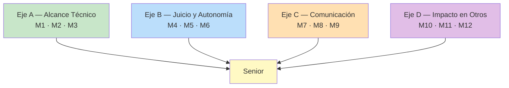

# 🚀 Ruta 1 — Mid → Senior

**Duración realista:** 12 a 24 meses. **Misiones activas a la vez:** 2.

---

## 🎯 Qué Cambia Realmente en Este Salto

La creencia común es que senior = saber más tecnologías. En la práctica, en
toda empresa donde he visto el criterio escrito, el salto se define así:

> **Mid resuelve bien el problema que le dan. Senior descubre cuál es el
> problema, elige la solución que el equipo puede sostener, y se hace cargo de
> lo que pase después.**

Tres palabras cargan casi todo el peso:

- **Descubre** — trabajas con ambigüedad, no esperas requisitos completos.
- **Puede sostener** — optimizas para el equipo real, no para la solución elegante.
- **Lo que pase después** — el trabajo no termina en el merge.

> 💎 **Perla Escondida #1**: el error más caro de un mid ambicioso es demostrar
> capacidad con **complejidad**: introducir el patrón sofisticado, el framework
> nuevo, la abstracción genérica. Produce el efecto contrario. Un senior con
> criterio se reconoce por lo que *no* construye — la solución de 40 líneas que
> el equipo entiende, en vez de la de 400 que solo tú puedes mantener. Cuando
> dudes entre parecer capaz y ser sostenible, elige sostenible: es exactamente
> la señal que el comité de promoción busca y la que casi nadie muestra a
> propósito.

---

## 🧭 Los 4 Ejes y sus 12 Misiones

Se recomienda avanzar **en paralelo entre ejes, en orden dentro de cada eje**:
una misión activa del eje donde estás más flojo, y otra del que más disfrutas.
La combinación evita que el trimestre se vuelva penitencia.

---

## 🔧 Eje A — Alcance Técnico

De "mi ticket" a "mi servicio".

### M1 — Ser el dueño de un componente completo

- 🎯 **Objetivo:** dejar de trabajar en tickets sueltos y responder por una
  pieza entera (un servicio, un módulo, un flujo de punta a punta).
- 🛠️ **Qué hacer:** elige un componente con dueño difuso y hazte cargo:
  entiende su historia, documenta cómo funciona, arregla sus 3 deudas más
  molestas, y ponte como revisor por defecto de sus PRs.
- ✅ **Señal:** durante un mes, las preguntas sobre ese componente llegan
  primero a ti — sin que nadie lo haya decretado.
- ⏱️ **Tiempo típico:** 2–3 meses.
- 📎 **Apoyo en EKS:** [Arquitectura Monolítica](../volume-3-architecture/fundamentals/monolith-architecture.md), [Ownership y Liderazgo](../volume-1-soft-skills/leadership/leadership-mindset.md)

### M2 — Llevar algo a producción de punta a punta

- 🎯 **Objetivo:** conocer el ciclo completo, no solo la parte de escribir código.
- 🛠️ **Qué hacer:** toma una funcionalidad y acompáñala desde la definición
  hasta producción: diseño, implementación, tests, migración de datos si
  aplica, despliegue, métricas y monitoreo posterior. Especialmente la parte
  aburrida: el rollback plan y el feature flag.
- ✅ **Señal:** puedes mostrar el dashboard con el comportamiento real de tu
  cambio en producción, y sabías de antemano qué gráfica mirar.
- ⏱️ **Tiempo típico:** 1–2 meses.
- 📎 **Apoyo en EKS:** [Docker Basics](../volume-4-labs/docker/docker-basics.md), [Diseño de APIs](../volume-3-architecture/fundamentals/api-design.md)

### M3 — Diagnosticar un problema de producción con datos

- 🎯 **Objetivo:** depurar sistemas, no solo código. Es la habilidad que más
  rápido te vuelve "el que sabe" en un equipo.
- 🛠️ **Qué hacer:** toma un problema real y difuso ("a veces va lento", "falla
  de vez en cuando") y llega a la causa raíz con evidencia: logs, métricas,
  trazas, reproducción. Escribe el hallazgo aunque no seas tú quien lo arregle.
- ✅ **Señal:** un documento corto que va de síntoma a causa raíz con datos, y
  que alguien más usó para decidir qué hacer.
- ⏱️ **Tiempo típico:** 2–6 semanas (depende de que aparezca el problema).
- 📎 **Apoyo en EKS:** [Plantilla de Postmortem](../volume-7-personal/postmortems/postmortem-template.md)

---

## ⚖️ Eje B — Juicio y Autonomía

De "¿cómo lo hago?" a "esto es lo que hay que hacer, y por esto".

### M4 — Convertir un problema vago en un plan

- 🎯 **Objetivo:** la capacidad que más separa mid de senior — operar sin
  requisitos completos.
- 🛠️ **Qué hacer:** cuando llegue algo tipo "hay que mejorar el rendimiento del
  buscador", no pidas especificaciones: vuelve en 3 días con un documento de
  una página — qué encontraste, 3 opciones con costo y riesgo, cuál recomiendas
  y por qué, y qué harías primero.
- ✅ **Señal:** tu plan se aprueba sin que nadie te haya dado los requisitos, o
  se rechaza discutiendo tus opciones (que también cuenta: significa que el
  documento fijó los términos de la discusión).
- ⏱️ **Tiempo típico:** 3–4 semanas.
- 📎 **Apoyo en EKS:** [Technical Writing y RFCs](../volume-1-soft-skills/communication/technical-writing-rfc.md)

### M5 — Documentar una decisión técnica con sus alternativas

- 🎯 **Objetivo:** que tus decisiones sobrevivan a tu memoria y sean auditables.
- 🛠️ **Qué hacer:** en la próxima decisión no trivial, escribe un ADR: contexto,
  opciones consideradas, criterio de decisión, opción elegida, consecuencias
  aceptadas. Incluye explícitamente **qué estás sacrificando** — un ADR sin
  trade-off declarado es publicidad, no una decisión.
- ✅ **Señal:** alguien —incluido tu yo futuro— consulta ese ADR meses después
  para entender por qué el sistema es como es.
- ⏱️ **Tiempo típico:** 1–2 semanas.
- 📎 **Apoyo en EKS:** [Technical Writing y RFCs](../volume-1-soft-skills/communication/technical-writing-rfc.md), [Glosario: ADR](/glosario)

### M6 — Decir "no" a una solución con argumento técnico

- 🎯 **Objetivo:** ejercer criterio, no solo capacidad de ejecución.
- 🛠️ **Qué hacer:** la próxima vez que te pidan algo que consideras un error
  técnico, no lo implementes en silencio ni te niegues en seco. Responde con la
  fórmula: **riesgo concreto + costo estimado + alternativa viable**. ("Si lo
  hacemos así, cada cambio de precio va a requerir un deploy; son ~2 horas por
  cambio y ocurre semanal. Con una tabla de configuración son 3 días más ahora
  y cero después. ¿Vale la pena?")
- ✅ **Señal:** una decisión del equipo cambió por tu argumento, **o** se
  mantuvo pero registraste el riesgo por escrito y luego pudiste señalarlo.
- ⏱️ **Tiempo típico:** aparece solo; prepárate y espera la ocasión.
- 📎 **Apoyo en EKS:** [Negociación](../volume-1-soft-skills/negotiation/negotiation.md)

> 💎 **Perla Escondida #2**: M6 asusta porque se confunde "decir que no" con
> "ser difícil". La diferencia práctica es una sola: **quien dice que no sin
> alternativa está bloqueando; quien dice que no con alternativa está
> decidiendo**. Nadie ha frenado su carrera por proponer un camino mejor con
> números encima. Se frena por las otras dos rutas: implementar en silencio
> algo que sabes malo (y cargar con el resultado), o negarse sin ofrecer salida.

---

## 🗣️ Eje C — Comunicación

De "explico mi código" a "otros deciden con lo que escribo".

### M7 — Escribir un RFC que alguien más implemente

- 🎯 **Objetivo:** que tu diseño sea ejecutable por otra persona sin ti al lado.
  Es el examen más honesto de claridad que existe.
- 🛠️ **Qué hacer:** para el próximo cambio mediano, escribe el diseño antes de
  programar: problema, solución propuesta, diagrama, impacto en otros sistemas,
  plan de migración, qué queda fuera de alcance. Compártelo y recoge comentarios
  **antes** de escribir código.
- ✅ **Señal:** alguien implementó una parte basándose solo en tu documento, sin
  preguntarte nada fuera de lo escrito.
- ⏱️ **Tiempo típico:** 3–6 semanas.
- 📎 **Apoyo en EKS:** [Technical Writing y RFCs](../volume-1-soft-skills/communication/technical-writing-rfc.md)

### M8 — Explicar algo técnico a alguien no técnico

- 🎯 **Objetivo:** traducir. Sin esto, tu trabajo solo lo puede valorar quien ya
  sabe lo que tú sabes — y esa gente no suele estar en la reunión de presupuesto.
- 🛠️ **Qué hacer:** toma un tema técnico con impacto de negocio (deuda técnica,
  un incidente, por qué esa estimación es de 3 semanas) y explícaselo a alguien
  de producto, soporte o comercial. Sin analogías de código. Con el costo o el
  riesgo en el idioma de esa persona.
- ✅ **Señal:** esa persona se lo explicó correctamente a un tercero sin ti
  presente. Es la única prueba real de que entendió.
- ⏱️ **Tiempo típico:** 2–4 semanas.
- 📎 **Apoyo en EKS:** [Presentaciones](../volume-1-soft-skills/communication/presentations.md), [Comunicación Escrita](../volume-1-soft-skills/communication/written-communication.md)

### M9 — Comunicar un incidente en tiempo real

- 🎯 **Objetivo:** ser útil bajo presión, cuando la información vale más que el
  código.
- 🛠️ **Qué hacer:** en el próximo incidente, toma el rol de comunicador aunque
  no lo arregles tú: actualizaciones cada 15–30 minutos con impacto conocido,
  qué se está probando, próxima actualización. Sin especular sobre causas y sin
  desaparecer mientras investigas.
- ✅ **Señal:** alguien fuera del equipo técnico supo el estado del incidente
  sin tener que preguntar.
- ⏱️ **Tiempo típico:** cuando ocurra; ten la plantilla lista antes.
- 📎 **Apoyo en EKS:** [Plantilla de Postmortem](../volume-7-personal/postmortems/postmortem-template.md)

> 💎 **Perla Escondida #3**: M9 es la misión con mejor relación
> esfuerzo/visibilidad de toda la ruta, y casi nadie la toma porque durante un
> incidente todos quieren estar en el código —ahí está la adrenalina—. Pero el
> rol de comunicador lo ve **toda** la organización, incluidos niveles que
> normalmente nunca observan tu trabajo. Un incidente bien comunicado te da más
> reputación de senior que tres meses de features entregadas a tiempo. No es
> justo, pero es cómo funciona: la gente recuerda quién le dio claridad cuando
> todo estaba en llamas.

---

## 🤝 Eje D — Impacto en Otros

De "hago mi trabajo" a "el equipo rinde más porque estoy".

### M10 — Hacer code reviews que enseñen

- 🎯 **Objetivo:** subir el nivel del equipo con algo que ya haces igual.
- 🛠️ **Qué hacer:** cambia el estilo de tus reviews. En vez de "esto está mal",
  usa: qué observaste, qué consecuencia tiene, y una pregunta abierta. Separa
  explícitamente lo bloqueante de la preferencia personal (marca los comentarios
  con `nit:` cuando sean gusto). Y aprueba con un comentario cuando algo esté
  bien resuelto — casi nadie lo hace.
- ✅ **Señal:** alguien te pide explícitamente que revises su PR porque tus
  comentarios le sirven.
- ⏱️ **Tiempo típico:** 4–8 semanas para que se note.
- 📎 **Apoyo en EKS:** [Feedback y Crecimiento](../volume-1-soft-skills/feedback/feedback-and-growth.md)

### M11 — Mentorear a alguien hasta que no te necesite

- 🎯 **Objetivo:** impacto a través de otros — el criterio central de todos los
  niveles de aquí en adelante.
- 🛠️ **Qué hacer:** elige un área concreta y a una persona concreta (un junior o
  alguien recién llegado). Acompáñala con sesiones cortas y regulares durante
  un trimestre. El objetivo **no** es que aprenda: es que deje de consultarte
  en esa área.
- ✅ **Señal:** esa persona resuelve sola casos de ese tipo — mejor aún, ahora
  se lo explica a otro.
- ⏱️ **Tiempo típico:** 1 trimestre.
- 📎 **Apoyo en EKS:** [Feedback y Crecimiento](../volume-1-soft-skills/feedback/feedback-and-growth.md), [Ownership y Liderazgo](../volume-1-soft-skills/leadership/leadership-mindset.md)

### M12 — Eliminar una fuente recurrente de fricción del equipo

- 🎯 **Objetivo:** mejorar el sistema en el que trabaja el equipo, no solo el
  producto.
- 🛠️ **Qué hacer:** identifica la queja que se repite todas las semanas (el
  entorno local que se rompe, el test flaky que todos re-lanzan, el deploy
  manual de 40 minutos, el dato de producción que hay que pedirle a alguien) y
  elimínala de raíz. No la mejores: elimínala.
- ✅ **Señal:** la queja dejó de aparecer, y puedes estimar el tiempo semanal
  que el equipo recuperó.
- ⏱️ **Tiempo típico:** 2–6 semanas.
- 📎 **Apoyo en EKS:** [Docker Basics](../volume-4-labs/docker/docker-basics.md)

---

## 🚫 Anti-Patrones de Esta Ruta

### AP1: "El héroe del incidente"

Construir reputación siendo siempre quien salva la producción a las 2 a.m.
Funciona unos meses y luego se vuelve una trampa: el equipo se acostumbra a que
tú resuelvas, tú te acostumbras a la adrenalina, y nadie arregla la causa. Los
comités de promoción distinguen bien entre "apaga incendios" y "hace que no
haya incendios" — y solo el segundo justifica un nivel. Si te reconocen como el
héroe, tu siguiente misión es M12, no otro rescate.

### AP2: "El senior técnico puro"

Apostar todo a los ejes A y B y descartar C y D como "política". Es el perfil
que se queda en la puerta durante años sin entender por qué, mientras alguien
técnicamente menos fuerte pasa. La razón es simple y no es injusta: a partir de
senior, la empresa paga por **impacto**, y el impacto de una sola persona tiene
techo. Los cuatro ejes no son opcionales; son el nivel.

---

## ☑️ Checklist de la Ruta

**Eje A — Alcance**
- [ ] M1 · Soy el punto de referencia de un componente completo
- [ ] M2 · Llevé algo de la definición a producción con métricas
- [ ] M3 · Diagnostiqué un problema difuso hasta su causa raíz con datos

**Eje B — Juicio**
- [ ] M4 · Convertí un problema vago en un plan que se aprobó
- [ ] M5 · Escribí un ADR con alternativas y trade-offs declarados
- [ ] M6 · Cambié o registré una decisión con argumento técnico

**Eje C — Comunicación**
- [ ] M7 · Escribí un RFC que otro implementó sin preguntarme
- [ ] M8 · Alguien no técnico explicó mi tema correctamente sin mí
- [ ] M9 · Comuniqué un incidente en tiempo real

**Eje D — Impacto en Otros**
- [ ] M10 · Me piden reviews por el valor de mis comentarios
- [ ] M11 · Mentoreé a alguien hasta que dejó de necesitarme
- [ ] M12 · Eliminé una fricción recurrente del equipo

**Con ~8 de 12 marcadas y registradas en tu
[Bitácora](./bitacora-de-evidencia.md), ya eres senior de facto.** Ese es el
momento de la conversación de nivel — no cuando estén las 12.

---

## 🎤 Preguntas de Entrevista Que Esta Ruta Responde

| Pregunta típica | Misión que te da la respuesta |
|---|---|
| "Cuéntame de una decisión técnica difícil" | M5, M6 |
| "¿Cómo manejas requisitos poco claros?" | M4 |
| "Cuéntame de un conflicto técnico con alguien" | M6 |
| "¿Cómo has ayudado a crecer a otros?" | M10, M11 |
| "Describe un incidente en producción que viviste" | M3, M9 |
| "¿Qué mejorarías del proceso de tu equipo?" | M12 |

---

## 📖 Diccionario Rápido de Este Tema

| Término | Qué significa | Contexto aquí |
|---|---|---|
| ADR | Registro corto de una decisión de arquitectura ya tomada | M5 |
| RFC | Documento de propuesta técnica abierto a comentarios antes de construir | M7 |
| Causa raíz | El origen real de un fallo, no su síntoma visible | M3 |
| Test flaky | Test que falla de forma intermitente sin cambios de código | M12 |
| `nit:` | Marca de comentario menor / preferencia, no bloqueante | M10 |
| Senior de facto | Haces el trabajo del nivel aunque el título no lo diga | Checklist |

---

## 🔗 Conceptos Relacionados

- [Objetivos — Cómo Usar Este Sistema](./index.md)
- [Ruta 2 — Senior → Tech Lead](./ruta-tech-lead.md)
- [Bitácora de Evidencia](./bitacora-de-evidencia.md)
- [Ownership y Liderazgo Técnico](../volume-1-soft-skills/leadership/leadership-mindset.md)

---

## 📝 Resumen Final

El salto a senior no se gana acumulando tecnologías: se gana operando con
ambigüedad, eligiendo soluciones que el equipo pueda sostener y respondiendo
por lo que ocurre después del merge. Las 12 misiones cubren cuatro ejes —
alcance técnico, juicio, comunicación e impacto en otros— y el error más común
es apostar todo a los dos primeros, porque a partir de este nivel la empresa
paga por impacto y el impacto individual tiene techo. Cada misión termina en
una señal observable: alguien implementó tu RFC sin preguntarte, alguien dejó
de necesitarte, una queja semanal desapareció. Con ocho de doce registradas ya
eres senior de facto, y ese —no el doce de doce— es el momento de pedir la
conversación.
