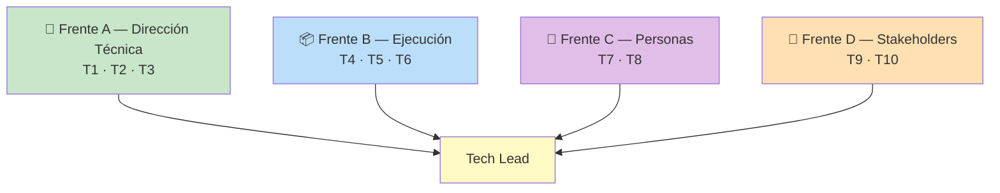

# 🧭 Ruta 2 — Senior → Tech Lead

**Duración realista:** 12 a 24 meses desde senior sólido.
**Misiones activas a la vez:** 2.

---

## 🎯 Qué Cambia Realmente en Este Salto

El cambio de senior a tech lead es más brusco de lo que la gente espera, porque
**cambia la unidad de medida de tu trabajo**:

| | Senior | Tech Lead |
|---|---|---|
| Te evalúan por | Lo que entregas tú | Lo que entrega el equipo |
| Tu mejor día | Resolviste algo difícil | Nadie te necesitó y todo avanzó |
| Tu peor riesgo | Escribir código malo | Que el equipo construya lo correcto… tarde, o lo incorrecto a tiempo |
| Tu tiempo | ~70% código | ~30% código, y está bien |
| Éxito | El sistema funciona | El equipo puede sostener el sistema sin ti |

> 💎 **Perla Escondida #1**: la crisis de identidad de todo tech lead nuevo es
> la misma: "hoy no programé nada, entonces no trabajé". Es el reflejo de años
> midiendo tu valor en commits. La señal de que estás haciéndolo bien es
> incómoda al principio: **el equipo avanza rápido en cosas que tú no tocaste**.
> Quien no supera esto termina siendo un senior que además tiene reuniones — el
> peor de los dos mundos: cuello de botella técnico *y* con agenda llena.

**Aviso honesto:** Tech Lead no es "senior con más sueldo", es un rol distinto
con costos reales. Menos tiempo de código profundo, más interrupciones, más
responsabilidad por cosas que no controlas del todo. Si lo que amas es
programar ocho horas seguidas, la vía de **Staff Engineer** (profundidad
técnica sin gestión de equipo) es una carrera igual de válida y suele pagar
igual. Elegir con los ojos abiertos es parte de la ruta.

---

## 🗺️ Los 4 Frentes y sus 10 Misiones

---

## 🧱 Frente A — Dirección Técnica

De "tomo buenas decisiones" a "el equipo toma buenas decisiones".

### T1 — Definir el estándar técnico del equipo

- 🎯 **Objetivo:** que la calidad no dependa de quién escriba el código ni de si
  tú alcanzaste a revisar el PR.
- 🛠️ **Qué hacer:** documenta y acuerda con el equipo las convenciones que hoy
  viven solo en la cabeza de dos personas: estructura de proyectos, manejo de
  errores, logging, tests obligatorios, criterio de "listo". Y luego lo que
  realmente lo hace funcionar: **automatiza lo automatizable** (linters, CI,
  plantillas de PR) para que el estándar no dependa de tu vigilancia.
- ✅ **Señal:** una persona nueva escribe código conforme al estándar sin que
  nadie se lo explique en un PR.
- ⏱️ **Tiempo típico:** 1–2 meses.
- 📎 **Apoyo en EKS:** [Technical Writing y RFCs](../volume-1-soft-skills/communication/technical-writing-rfc.md)

### T2 — Construir el roadmap técnico del trimestre

- 🎯 **Objetivo:** pasar de reaccionar a dirigir; que la deuda técnica deje de
  competir en desventaja permanente contra las funcionalidades.
- 🛠️ **Qué hacer:** haz el inventario de deuda técnica y riesgos, estima el
  costo de **no** atenderlos (en horas de equipo, en incidentes, en velocidad
  de entrega), priorízalo y negocia una porción fija de capacidad por sprint
  con producto. La clave es no pedir "tiempo para refactorizar" sino presentar
  un caso con costo, como cualquier otra inversión.
- ✅ **Señal:** existe un roadmap técnico escrito, con capacidad reservada
  acordada, y al final del trimestre puedes decir qué se cumplió.
- ⏱️ **Tiempo típico:** 1 trimestre.
- 📎 **Apoyo en EKS:** [Negociación](../volume-1-soft-skills/negotiation/negotiation.md)

### T3 — Conducir una decisión de arquitectura en grupo

- 🎯 **Objetivo:** facilitar decisiones, no imponerlas. Una decisión impuesta se
  ejecuta mal aunque sea correcta.
- 🛠️ **Qué hacer:** en la próxima decisión grande, no llegues con la respuesta.
  Llega con el problema y los criterios de evaluación. Haz que el equipo genere
  opciones, modera la discusión, y **decide explícitamente** cuando el grupo se
  atore (facilitar no es esperar consenso eterno). Documenta el resultado con
  los trade-offs aceptados.
- ✅ **Señal:** alguien que prefería otra opción defiende la decisión ante un
  tercero, porque entendió por qué se tomó.
- ⏱️ **Tiempo típico:** 3–6 semanas.
- 📎 **Apoyo en EKS:** [Arquitectura Orientada a Eventos](../volume-3-architecture/patterns/event-driven-architecture.md), [Caso Netflix](../volume-3-architecture/case-studies/netflix.md)

> 💎 **Perla Escondida #2**: el error de casi todo tech lead nuevo en T3 es
> confundir facilitar con no decidir. Se pide opinión, se abren tres reuniones,
> nadie converge, y la decisión se toma sola por agotamiento —normalmente la
> peor opción, que es "seguir como estamos"—. El trabajo del lead es **cerrar**:
> "escuché las tres opciones, vamos con la B por estas dos razones, revisamos
> en 3 meses si el supuesto X no se cumple". El equipo tolera mucho mejor una
> decisión con la que no está de acuerdo que la parálisis.

---

## 📦 Frente B — Ejecución

De "entrego mi parte" a "el equipo entrega lo prometido".

### T4 — Descomponer un proyecto grande en trabajo paralelo

- 🎯 **Objetivo:** que 4 personas avancen en paralelo sin pisarse ni esperar.
- 🛠️ **Qué hacer:** toma un proyecto de varios meses y pártelo en piezas con
  interfaces claras entre ellas, de forma que cada pieza pueda desarrollarse y
  probarse sin esperar a las otras. Identifica el **camino crítico** (lo que
  bloquea a todo lo demás) y ponlo primero, con la persona más fuerte.
- ✅ **Señal:** el equipo trabajó una semana completa sin bloqueos por
  dependencias internas.
- ⏱️ **Tiempo típico:** 1 proyecto.
- 📎 **Apoyo en EKS:** [Diseño de APIs](../volume-3-architecture/fundamentals/api-design.md) — los contratos son el mecanismo real de paralelización

### T5 — Dar una fecha y sostenerla (o renegociarla a tiempo)

- 🎯 **Objetivo:** volverte predecible. La confianza organizacional se construye
  con predictibilidad, no con velocidad.
- 🛠️ **Qué hacer:** estima con rangos y supuestos explícitos, no con números
  únicos ("6–8 semanas si el equipo de datos entrega el esquema antes del 20").
  Sigue el avance semanalmente contra esos supuestos. Y cuando la fecha se caiga
  —se va a caer—, **avisa en cuanto lo sepas**, con opciones: recortar alcance,
  mover fecha, sumar gente (sabiendo que casi nunca acelera).
- ✅ **Señal:** entregaste dentro del rango, o avisaste de la desviación con
  semanas de anticipación y opciones sobre la mesa.
- ⏱️ **Tiempo típico:** 1 proyecto.
- 📎 **Apoyo en EKS:** [Negociación](../volume-1-soft-skills/negotiation/negotiation.md)

### T6 — Diseñar el proceso de calidad del equipo

- 🎯 **Objetivo:** que los errores los detecte el sistema, no tu revisión
  personal.
- 🛠️ **Qué hacer:** mapea dónde se escapan los bugs hoy (¿falta de tests? ¿PRs
  gigantes? ¿ausencia de staging? ¿despliegues sin métricas?) y arregla el
  eslabón más débil, no todos. Añade una capa automática: CI que bloquee,
  cobertura mínima en lo crítico, canary release, alertas que le lleguen a
  alguien.
- ✅ **Señal:** bajó una métrica concreta — bugs en producción, incidentes por
  release, tiempo de recuperación — y puedes mostrar el antes/después.
- ⏱️ **Tiempo típico:** 1–2 meses.
- 📎 **Apoyo en EKS:** [Plantilla de Postmortem](../volume-7-personal/postmortems/postmortem-template.md), [Glosario: canary release](/glosario)

---

## 👥 Frente C — Personas

De "ayudo cuando me preguntan" a "el equipo crece porque estoy".

### T7 — Sostener 1:1s técnicos con propósito

- 🎯 **Objetivo:** conocer los bloqueos reales antes de que se vuelvan renuncias
  o proyectos hundidos.
- 🛠️ **Qué hacer:** 30 minutos cada dos semanas con cada persona del equipo. No
  es un reporte de estado (eso ya lo tienes en el tablero): es en qué está
  atascado, qué le aburre, qué quiere aprender, qué le molesta del equipo.
  Habla menos de la mitad del tiempo. Toma notas y da seguimiento a lo que
  prometiste — un 1:1 sin seguimiento es peor que no tenerlo, porque enseña que
  hablar contigo no cambia nada.
- ✅ **Señal:** alguien te trajo un problema difícil (personal, de equipo, de
  motivación) **antes** de que explotara.
- ⏱️ **Tiempo típico:** 2–3 meses para que aparezca la confianza.
- 📎 **Apoyo en EKS:** [Feedback y Crecimiento](../volume-1-soft-skills/feedback/feedback-and-growth.md)

### T8 — Hacer crecer a alguien un nivel completo

- 🎯 **Objetivo:** la evidencia más fuerte de liderazgo que existe, y la más
  difícil de fingir.
- 🛠️ **Qué hacer:** elige a una persona con potencial, identifica con ella los
  2 ejes que le faltan para el siguiente nivel, y **asígnale trabajo que los
  ejercite** — que es lo que realmente mueve la aguja, más que cualquier
  consejo. Dale visibilidad: que presente ella su proyecto, que sea ella quien
  responda en la reunión. Prepara el caso con datos para su evaluación.
- ✅ **Señal:** esa persona subió de nivel formalmente, o asumió
  responsabilidades que antes eran tuyas.
- ⏱️ **Tiempo típico:** 2–4 trimestres.
- 📎 **Apoyo en EKS:** [Feedback y Crecimiento](../volume-1-soft-skills/feedback/feedback-and-growth.md), [Bitácora de Evidencia](./bitacora-de-evidencia.md)

> 💎 **Perla Escondida #3**: el instinto en T8 es dar consejos y recomendar
> lecturas. Casi no funciona. Lo que sube de nivel a alguien es **la asignación
> de trabajo**: nadie aprende a manejar ambigüedad recibiendo tickets claros, ni
> aprende a comunicar sin exponerse ante una audiencia. Tu palanca real como
> lead no es lo que enseñas, es lo que repartes — y eso implica soltar tareas
> visibles que hoy haces tú porque las haces mejor. Ese es el costo real del
> puesto, y el momento donde muchos se quedan sin darse cuenta.

---

## 🤝 Frente D — Stakeholders

De "hablo con mi equipo" a "represento al equipo hacia afuera".

### T9 — Ser el interlocutor técnico ante producto/negocio

- 🎯 **Objetivo:** que las decisiones de producto se tomen con el costo técnico
  sobre la mesa, no después.
- 🛠️ **Qué hacer:** entra a las reuniones de planeación como socio, no como
  receptor de tareas. Aporta en el idioma correcto: qué es barato y qué es
  caro, qué opciones existen a mitad de precio, qué riesgo se está aceptando.
  Traduce siempre a costo/riesgo/tiempo, nunca a nombres de tecnologías.
- ✅ **Señal:** producto te consulta **antes** de comprometer una fecha o un
  alcance con un cliente.
- ⏱️ **Tiempo típico:** 1–2 trimestres.
- 📎 **Apoyo en EKS:** [Presentaciones](../volume-1-soft-skills/communication/presentations.md), [Negociación](../volume-1-soft-skills/negotiation/negotiation.md)

### T10 — Proteger al equipo sin volverte un muro

- 🎯 **Objetivo:** filtrar ruido y presión sin aislar al equipo del contexto que
  necesita para decidir bien.
- 🛠️ **Qué hacer:** absorbe las interrupciones que no requieren al equipo
  completo (preguntas de estado, escalamientos, pedidos sueltos por Slack) y
  canalízalas. Pero **transmite el porqué del negocio**: por qué esta prioridad,
  qué está en juego, qué pasa si no llega. Filtrar el ruido es tu trabajo;
  filtrar el contexto es infantilizar al equipo y produce gente que ejecuta sin
  criterio.
- ✅ **Señal:** un miembro del equipo justificó una decisión técnica usando una
  razón de negocio, sin que tú estuvieras en la conversación.
- ⏱️ **Tiempo típico:** continuo.
- 📎 **Apoyo en EKS:** [Ownership y Liderazgo](../volume-1-soft-skills/leadership/leadership-mindset.md)

---

## 🚫 Anti-Patrones de Esta Ruta

### AP1: "El lead que sigue siendo el mejor programador"

Quedarse con las tareas técnicas más interesantes porque las haces más rápido y
mejor. A corto plazo el proyecto avanza; a mediano plazo tienes un equipo que
no creció, un cuello de botella con tu nombre, y ningún argumento de liderazgo
que mostrar. Si tu equipo se detiene cuando tomas vacaciones, no eres tech lead
todavía — eres el ingeniero más ocupado del equipo.

### AP2: "El lead ausente del código"

El extremo opuesto: abandonar el código por completo y volverse solo reuniones.
En 6 meses pierdes el criterio técnico que justificaba tu rol, empiezas a tomar
decisiones desactualizadas, y el equipo lo nota inmediatamente. El punto de
equilibrio práctico es mantener un pie dentro: revisar PRs con regularidad,
tomar alguna tarea del camino no crítico, y participar en los diseños. Suficiente
para conservar el criterio, no tanto como para bloquear el proyecto.

### AP3: "El traductor unidireccional"

Llevar las quejas del equipo a producto pero no llevar el contexto de negocio de
vuelta al equipo. Produce un equipo que se siente maltratado y un producto que
te ve como obstáculo. El rol es un puente, y los puentes se cruzan en los dos
sentidos.

---

## ☑️ Checklist de la Ruta

**Dirección técnica**
- [ ] T1 · Existe un estándar escrito y automatizado que se sigue solo
- [ ] T2 · Hay roadmap técnico con capacidad acordada y resultados medibles
- [ ] T3 · Conduje una decisión de arquitectura grupal y quedó documentada

**Ejecución**
- [ ] T4 · Partí un proyecto grande en trabajo paralelo sin bloqueos internos
- [ ] T5 · Sostuve un compromiso de fecha, o renegocié con anticipación
- [ ] T6 · Mejoré una métrica de calidad con antes/después

**Personas**
- [ ] T7 · Tengo 1:1s regulares y alguien me trajo un problema antes de que explotara
- [ ] T8 · Alguien de mi equipo subió de nivel o asumió responsabilidades mías

**Stakeholders**
- [ ] T9 · Producto me consulta antes de comprometer fechas o alcance
- [ ] T10 · Mi equipo argumenta decisiones técnicas con razones de negocio

**Con ~7 de 10 sostenidas durante dos trimestres, estás ejerciendo el rol.** Y
si ya lo ejerces sin el título, esa es exactamente la conversación a tener —
con la [Bitácora](./bitacora-de-evidencia.md) abierta.

---

## 🎤 Preguntas de Entrevista Que Esta Ruta Responde

| Pregunta típica | Misión que te da la respuesta |
|---|---|
| "¿Cómo manejas un desacuerdo técnico en tu equipo?" | T3 |
| "Cuéntame de un proyecto que lideraste de punta a punta" | T4, T5 |
| "¿Cómo priorizas deuda técnica frente a features?" | T2 |
| "¿Cómo has desarrollado a alguien de tu equipo?" | T7, T8 |
| "Cuéntame de una fecha que no lograste cumplir" | T5 |
| "¿Cómo trabajas con producto?" | T9, T10 |

---

## 📖 Diccionario Rápido de Este Tema

| Término | Qué significa | Contexto aquí |
|---|---|---|
| Camino crítico | La cadena de tareas que determina la fecha final del proyecto | T4 |
| Deuda técnica | Costo futuro acumulado por decisiones de corto plazo | T2 |
| 1:1 | Reunión individual y periódica entre lead y cada persona | T7 |
| Stakeholder | Quien tiene interés en el resultado: producto, negocio, soporte | Frente D |
| Canary release | Desplegar a un % pequeño de usuarios antes que a todos | T6 |
| Staff Engineer | Vía de crecimiento técnico profundo, sin gestión de equipo | Alternativa a esta ruta |

---

## 🔗 Conceptos Relacionados

- [Ruta 1 — Mid → Senior](./ruta-senior.md)
- [Ruta 3 — Hacia Solutions Architect](./ruta-arquitecto.md)
- [Ownership y Liderazgo Técnico](../volume-1-soft-skills/leadership/leadership-mindset.md)
- [Negociación](../volume-1-soft-skills/negotiation/negotiation.md)

---

## 📝 Resumen Final

Ser tech lead cambia la unidad de medida: te evalúan por lo que entrega el
equipo, no por lo que entregas tú, y la señal de que va bien es incómoda —el
equipo avanza rápido en cosas que no tocaste—. Las 10 misiones cubren dirección
técnica (estándares que se sostienen solos, roadmap técnico negociado,
decisiones grupales que se cierran), ejecución (paralelizar, ser predecible,
calidad automatizada), personas (1:1s con seguimiento, subir a alguien de nivel
repartiendo trabajo visible) y stakeholders (ser socio de producto, filtrar
ruido sin filtrar contexto). Los dos fracasos típicos son opuestos y ambos
frecuentes: quedarse con el trabajo técnico interesante y volverse cuello de
botella, o abandonar el código y perder el criterio en seis meses. Y conviene
decidirlo con los ojos abiertos: si lo que amas es programar a fondo, Staff
Engineer es una carrera igual de válida.
