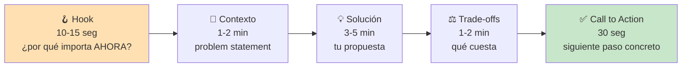
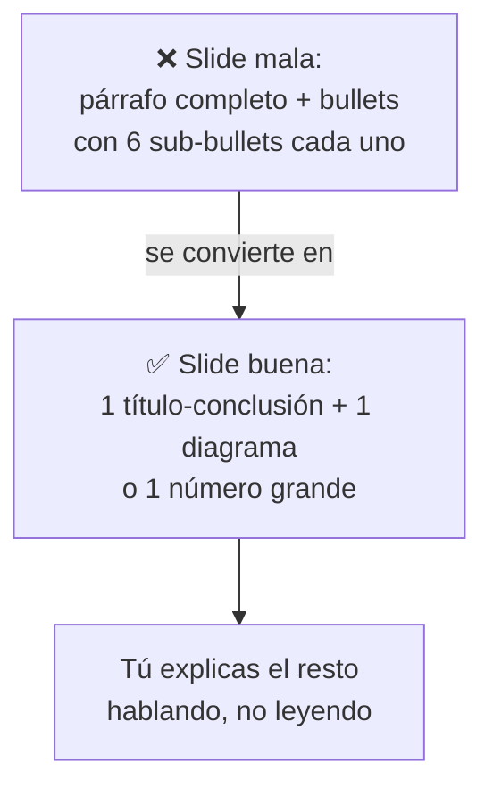
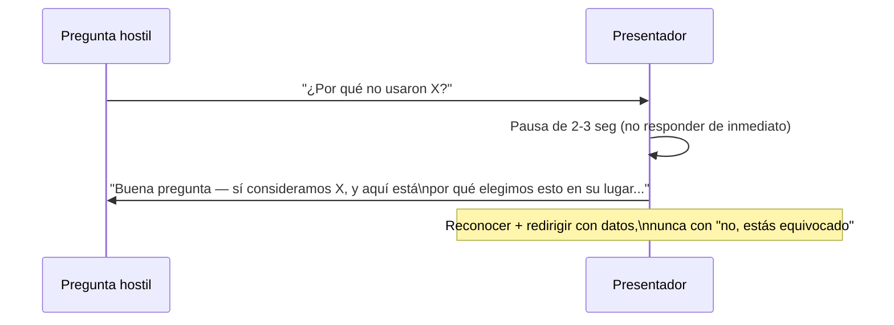
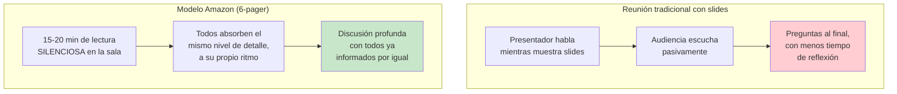

# Presentaciones Técnicas Efectivas

## Resumen Ejecutivo

Presentar tus ideas a un grupo es el momento de mayor apalancamiento de tu influencia técnica: 20
minutos bien estructurados pueden decidir la arquitectura de los próximos 2 años, o pueden perderse en
una audiencia que dejó de escuchar en el minuto 3. Este tema cubre cómo estructurar una presentación
técnica para que sea imposible de ignorar, cómo manejar preguntas hostiles sin perder autoridad, y por
qué "menos slides, más preguntas" casi siempre gana.

## 🧒 Explicación para Dummies (ELI5)

Imagina que le vas a explicar a un amigo por qué deberían cambiar el router de la casa. Hay dos formas:

- **Forma A**: le muestras 20 diapositivas con specs técnicas del router nuevo (frecuencia, chipset,
  protocolo), y a la mitad tu amigo ya está viendo el teléfono.
- **Forma B**: empiezas con "el internet se cae cada vez que alguien usa el microondas — aquí está el
  router nuevo que lo arregla, cuesta esto, y tarda 10 minutos en instalarse."

La Forma B no tiene menos información técnica real — tiene la información **en el orden que le importa
a quien escucha**: primero el dolor que ya conocen, después la solución, después el costo. Eso es
estructura de presentación. La diferencia entre una presentación técnica que convence y una que aburre
casi nunca es el contenido — es el orden.

## 🎯 Objetivos de Aprendizaje

Al terminar este tema podrás:

- Estructurar cualquier presentación técnica con el framework Hook-Contexto-Solución-Trade-offs-CTA
- Diseñar slides que se leen en 3 segundos, no que se leen en voz alta
- Responder preguntas hostiles en vivo sin ponerte defensivo ni perder el control de la sala
- Decidir cuándo una presentación es la herramienta correcta y cuándo un documento escrito la sustituye mejor

## 📋 Prerequisitos

- [Comunicación Escrita](./written-communication.md) — muchos de los principios (pirámide invertida,
  ser específico) se trasladan directo a slides

## 📖 Definición

Una **presentación técnica** es una sesión sincrónica y en vivo diseñada para lograr que un grupo
entienda un problema o adopte una decisión en menos tiempo del que tomaría leer un documento — su valor
está en la interacción en tiempo real (preguntas, lectura de la sala, ajuste sobre la marcha), no en la
cantidad de información transmitida.

## 🕰️ Historia y Motivación

La estructura "Hook-Contexto-Solución" tiene su origen en el modelo de **storytelling clásico** (Freytag,
siglo XIX) adaptado a contextos de negocio por consultoras como McKinsey en los años 80-90 (el "pyramid
principle" de Barbara Minto, 1985), y llegó a la cultura de ingeniería a través de conferencias técnicas
(QCon, Strange Loop) donde el tiempo es fijo (20-40 min) y la audiencia es exigente.

> 💎 **Perla Escondida #1**: la razón por la que el Hook va primero, antes de cualquier contexto técnico,
> es pura gestión de atención: la atención de una audiencia es más alta en los primeros 30 segundos y
> cae exponencialmente después. Si gastas esos 30 segundos en "buenos días, hoy les voy a hablar de..."
> ya quemaste tu mejor momento en nada. Los presentadores senior arrancan con la conclusión o el dolor,
> no con la agenda — la agenda se puede poner en un slide de apoyo, no en la apertura hablada.

## 🧩 Conceptos Fundamentales

### 1. La Estructura de 5 Actos

Cada acto responde a una pregunta distinta que la audiencia se está haciendo en silencio: "¿por qué me
debería importar esto?" → "¿qué está pasando exactamente?" → "¿qué propones?" → "¿qué me cuesta a mí o
al equipo?" → "¿qué necesitas de mí específicamente, ahora?"

> 💎 **Perla Escondida #2**: la sección de Trade-offs no es opcional ni es "mostrar debilidad" —
> paradójicamente, es lo que más credibilidad te da. Una propuesta sin trade-offs visibles suena a venta,
> no a análisis técnico honesto, y una audiencia senior lo detecta de inmediato y empieza a buscar el
> trade-off que no mencionaste (casi siempre lo encuentra, y ahí perdiste la sala). Nombrar tú mismo el
> costo más grande, antes de que alguien lo pregunte, es la señal más fuerte de que hiciste la tarea.

### 2. Diseño de Slides: la Regla de los 3 Segundos

Una slide técnica bien diseñada debe poder entenderse — el punto principal, no cada detalle — en 3
segundos de un vistazo. Si tu audiencia necesita leer un párrafo para entender la slide, la slide está
compitiendo con tu voz en vez de apoyarla.

> 💎 **Perla Escondida #3**: pon la conclusión de la slide en el título de la slide, no en el cuerpo. Por
> ejemplo, en vez de un título "Latencia del servicio" con un gráfico debajo, usa como título "La latencia
> p99 bajó 40% tras el cambio de caché" y el gráfico como evidencia debajo. Así, incluso alguien que
> entra tarde a la reunión y ve un solo slide de reojo se lleva el mensaje correcto — no depende de que
> escuchen tu narración completa.

### 3. Manejo de Preguntas Hostiles

La reacción instintiva ante una pregunta agresiva ("¿y por qué no consideraron X, que obviamente es
mejor?") es defenderse inmediatamente. La técnica más efectiva es la inversa: pausar, reconocer la validez
parcial, y responder con datos, no con tono.

> 💎 **Perla Escondida #4**: cuando no sabes la respuesta a una pregunta en vivo, la frase que más
> credibilidad conserva es "no tengo ese dato ahora, te lo confirmo después de la reunión" — dicha sin
> disculpa excesiva ni improvisación. Improvisar una respuesta técnica que no verificaste es mucho más
> costoso a largo plazo que admitir un vacío puntual, porque una respuesta incorrecta en vivo se recuerda
> más que un "no sé" honesto.

## 🏢 Caso Real: Amazon Prohíbe las Slides (Jeff Bezos)

Jeff Bezos, en su carta a accionistas de 2004 y documentado en detalle en el libro *Working Backwards*
(Colin Bryar y Bill Carr, 2021, escrito por dos ex-ejecutivos de Amazon), prohibió las presentaciones en
PowerPoint en las reuniones ejecutivas de Amazon. En su lugar, cada reunión importante empieza con 15-20
minutos de **lectura silenciosa en la sala** de un memo narrativo de hasta 6 páginas (el "6-pager" que
también aparece en el tema de [Comunicación Escrita](./written-communication.md)), y solo después de esa
lectura empieza la discusión.

La razón que da Bezos para esta política es simple: las slides permiten "ocultar" ideas poco
desarrolladas detrás de bullets y viñetas atractivas, mientras que escribir un memo narrativo completo
obliga al autor a tener realmente claro su argumento — "escribir bien fuerza a pensar mejor". Además, la
lectura silenciosa en sala nivela el campo: todos leen el mismo documento al mismo nivel de detalle, en
vez de que algunos se pierdan detalles mientras el presentador avanza slide tras slide a su propio ritmo.

> 💎 **Perla Escondida #5**: el caso de Amazon no dice "nunca uses slides" — dice que **el formato debe
> corresponder al tipo de decisión**. Para decisiones ejecutivas complejas y costosas de revertir (tipo 1
> en términos de Bezos, ver [RFC y ADR](./technical-writing-rfc.md)), un memo narrativo completo supera a
> las slides porque fuerza rigor de pensamiento. Para actualizaciones rápidas de estado o alineación
> ligera entre pares, unas slides ágiles siguen siendo más eficientes que escribir 6 páginas. La lección
> no es "las slides son malas" — es elegir el formato según cuánto rigor necesita realmente la decisión.

## ⚖️ Trade-offs

| Formato | Cuándo usarlo | Costo |
|---|---|---|
| Presentación en vivo | Decisión que requiere alineación de varias personas a la vez | Consume tiempo de calendario de todos los asistentes |
| Documento escrito (RFC/6-pager) | Decisión que necesita revisión profunda, no reacción inmediata | No captura objeciones en tiempo real |
| Async (Slack/loom) | Actualización de estado, sin decisión que tomar | Pierde la lectura de la sala y el debate en vivo |

## ✅ Buenas Prácticas

- Practica en voz alta al menos una vez antes de presentar — no solo repasar mentalmente
- Manda el contexto por escrito antes de la reunión, para no gastar los primeros 5 minutos poniendo a todos al día
- Deja el 20-30% del tiempo para preguntas explícitamente, no como "lo que sobre"
- Termina siempre con un call-to-action concreto: qué decisión necesitas, de quién, para cuándo

## 🚫 Anti-Patrones

### AP1: "El Reader de Slides"

Leer literalmente el texto de la slide en voz alta. La audiencia lee más rápido de lo que hablas, así
que cuando terminas de leer la slide ya perdiste su atención — deberían escucharte explicar algo que la
slide, por diseño, no dice completo.

### AP2: "La Presentación sin Ask"

Terminar sin pedir nada específico ("bueno, eso era todo, gracias"). Si presentaste para lograr algo
(aprobación, feedback, alineación), y no lo pides explícitamente al final, la audiencia sale sin saber
qué se espera de ella — y la decisión que buscabas simplemente no ocurre.

## 🎤 Preguntas de Entrevista

**P: "Cuéntame de una presentación técnica que no salió como esperabas. ¿Qué hiciste?"**

R: La señal buscada no es "salió perfecto" — es que reconozcas qué falló en la estructura o en el manejo
de la sala, y qué ajustaste (en tiempo real o para la próxima vez). Autoconciencia sobre la audiencia
importa más que la anécdota en sí.

## ☑️ Checklist

- [ ] Mi presentación tiene un Hook de menos de 15 segundos, no una agenda
- [ ] Cada slide se entiende en 3 segundos sin necesidad de leerla completa
- [ ] Nombro yo mismo el trade-off más grande, antes de que me lo pregunten
- [ ] Termino con un call-to-action específico: qué necesito, de quién, para cuándo

## 🔗 Conceptos Relacionados

- [Comunicación Escrita](./written-communication.md)
- [RFC y ADR](./technical-writing-rfc.md)
- [Ownership y Liderazgo Técnico](../leadership/leadership-mindset.md)

## 📚 Recursos Oficiales

- Barbara Minto — *The Pyramid Principle* (1985)
- Nancy Duarte — *Resonate: Present Visual Stories that Transform Audiences* (2010)
- Chris Anderson (TED) — *TED Talks: The Official TED Guide to Public Speaking* (2016)

## 📝 Resumen Final

Una presentación técnica efectiva no es la que contiene más información — es la que ordena la
información en la secuencia que la audiencia necesita para tomar una decisión: por qué importa, qué está
pasando, qué propones, qué cuesta, y qué necesitas de ellos ahora. Las slides apoyan tu voz, no la
reemplazan, y nombrar tú mismo el trade-off más grande antes de que alguien lo pregunte es la señal más
fuerte de rigor técnico que puedes dar en 20 minutos.

## 📖 Diccionario Rápido de Este Tema

| Término | Qué significa | Contexto en este tema |
|---|---|---|
| Hook | Apertura breve que capta atención explicando por qué algo importa ahora | Primer acto de la estructura de 5 actos |
| Pyramid Principle | Método de Barbara Minto para ordenar información de conclusión a detalle | Historia y motivación de la estructura |
| Call to Action (CTA) | Pedido específico y concreto al final de una comunicación | Último acto de la presentación |
| p99 (percentil 99) | Métrica de latencia: el 99% de las peticiones son más rápidas que este valor | Ejemplo de título de slide con conclusión |

## 🃏 Flashcards

1. **P:** ¿Cuáles son los 5 actos de una presentación técnica efectiva?
   **R:** Hook, Contexto, Solución, Trade-offs, Call to Action.

2. **P:** ¿Por qué nombrar tú mismo el trade-off más grande aumenta tu credibilidad en vez de restarla?
   **R:** Porque una audiencia senior detecta trade-offs ausentes y los busca activamente; nombrarlo tú
   primero muestra que hiciste el análisis honesto, no una venta.

## 🧪 Quiz

**1. Según este tema, ¿en qué acto de la presentación debería aparecer el trade-off más grande, si sabes que alguien lo va a preguntar de todos modos?**

- A) Nunca lo menciones, para no dar municiones a la audiencia
- B) Al final, solo si alguien pregunta
- C) Tú lo nombras proactivamente en el acto de Trade-offs, antes de que lo pregunten
- D) En un documento separado, después de la reunión

*Respuesta correcta: C*
