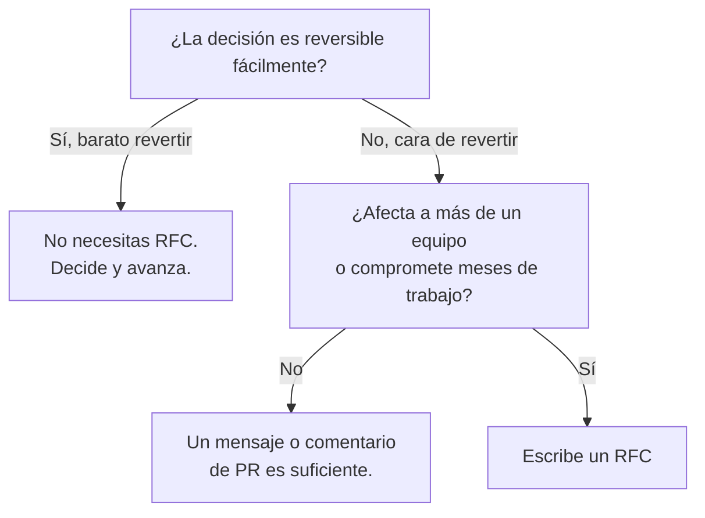
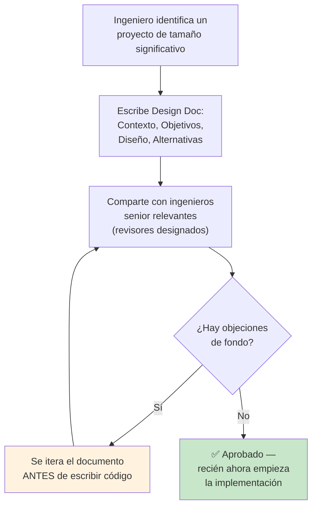

# RFC y Architecture Decision Records (ADR)

## 🎯 Resumen Ejecutivo

Un **RFC** propone una decisión *antes* de tomarla, abriendo espacio a que
el equipo la cuestione. Un **ADR** documenta una decisión *ya tomada*,
junto con el contexto y las alternativas descartadas. Son las dos caras de
la misma moneda: una mira hacia adelante (¿deberíamos hacer esto?), la
otra hacia atrás (¿por qué lo hicimos así?). Dominar ambas es lo que
separa a un ingeniero que "simplemente construye" de uno que **influye en
la dirección técnica** de su equipo — la definición práctica de Staff
Engineer.

## 🎓 Para Dummies (ELI5)

Imagina que quieres remodelar la cocina de un departamento que compartes
con 4 roommates. No empiezas a tumbar paredes el sábado por la mañana sin
avisar — escribes en el chat del grupo: "propongo mover el fregadero
aquí, por esta razón, esto es lo que cambia para cada uno, avísenme si ven
un problema" (eso es un **RFC**). Una semana después, ya con la remodelación
hecha, pegas una nota en el refrigerador: "movimos el fregadero acá porque
la tubería original pasaba por debajo del cuarto de Ana y hubiera sido más
caro moverla a ella" (eso es un **ADR** — para que en un año, cuando
alguien nuevo se mude, no pregunte "¿por qué el fregadero está aquí?" y
tenga que investigar desde cero).

## 🎯 Objetivos de Aprendizaje

- [ ] Distinguir cuándo escribir un RFC vs. cuándo ya no hace falta
- [ ] Estructurar un RFC que genere discusión útil, no bikeshedding
- [ ] Escribir un ADR que explique el "por qué no" tanto como el "por qué sí"
- [ ] Reconocer cuándo NO se necesita ninguno de los dos (no todo requiere ceremonia)

## 📚 Prerequisitos

> - [Comunicación Escrita para Ingenieros](./written-communication.md) — este tema profundiza específicamente en RFC/ADR, que ahí solo se mencionan de paso.

## 🔍 Definición

> Un **RFC (Request for Comments)** es un documento que propone una
> decisión técnica antes de implementarla, diseñado explícitamente para
> recibir objeciones y mejoras del equipo antes de comprometer recursos.

> Un **ADR (Architecture Decision Record)** es un documento corto que
> registra una decisión arquitectónica ya tomada: qué se decidió, por qué,
> qué alternativas se consideraron y por qué se descartaron.

## 📖 Historia y Motivación

El término "RFC" viene de la IETF (Internet Engineering Task Force), el
organismo que define los estándares de Internet (HTTP, TCP/IP) — desde los
años 60 publican propuestas técnicas como "Request for Comments" antes de
convertirlas en estándar. La cultura de empresas de tecnología adoptó el
mismo nombre y espíritu: proponer en abierto, antes de construir.

El formato ADR es más reciente y más simple — lo popularizó Michael
Nygard en 2011 con un artículo corto ("Documenting Architecture
Decisions") que resolvía un problema muy concreto: la documentación de
arquitectura tradicional (diagramas gigantes, wikis eternas) se desactualiza
casi de inmediato. Un ADR, en cambio, es **inmutable** — describe una
decisión en un momento del tiempo y nunca se "actualiza", solo se
reemplaza por un ADR nuevo que referencia al anterior.

> **💎 Perla escondida #1:** La razón por la que los ADR funcionan mejor
> que la documentación tradicional es que **no intentan mantenerse al día**.
> Un diagrama de arquitectura "vivo" casi siempre miente, porque nadie lo
> actualiza en cada cambio. Un ADR dice "esto decidimos el 5 de marzo de
> 2024, con esta información" — y se queda así para siempre, como una
> fotografía. Si la decisión cambia después, escribes un ADR *nuevo* que
> dice "superamos la decisión del ADR-012 porque...".

## 🧩 Conceptos Fundamentales

### Concepto 1: Cuándo Escribir un RFC (y Cuándo No)

**¿Qué es?** No toda decisión merece un RFC. Escribir uno para elegir el
nombre de una variable es tan desperdiciado como NO escribir uno para
decidir cambiar de base de datos en producción.



**💎 Perla escondida #2:** Jeff Bezos populariza la idea de decisiones
"tipo 1" (puerta de un solo sentido, difíciles de revertir — merecen
deliberación seria) vs. "tipo 2" (puerta de dos sentidos, fácilmente
reversibles — decide rápido y ajusta después). El error más común de
equipos jóvenes es tratar TODAS las decisiones como tipo 1, paralizando el
progreso con RFCs para cosas que se podrían revertir en una tarde.

### Concepto 2: Estructura de un RFC que Genera Discusión Útil

```markdown
# RFC: [Título específico, no genérico]

## Contexto
¿Qué problema estamos resolviendo? ¿Por qué ahora?

## Propuesta
La solución concreta que propones.

## Alternativas consideradas
Lista al menos 2 alternativas reales, con sus trade-offs — no las
menciones solo para descartarlas rápido, tómalas en serio.

## Qué NO estamos resolviendo
Delimita el alcance explícitamente. Esto evita que la discusión se
desvíe hacia temas relacionados pero fuera de foco.

## Riesgos y mitigaciones
Sé honesto sobre lo que puede salir mal.

## Pregunta abierta para el equipo
Termina con 1-3 preguntas específicas — no "¿qué opinan?" (demasiado
abierto), sino "¿el timeout de 500ms les parece razonable dado que el
p99 actual es de 350ms?" (específico, fácil de responder).
```

**💎 Perla escondida #3:** La sección "Qué NO estamos resolviendo" es la
más subestimada y la más útil. Sin ella, cada RFC se convierte en un imán
para todos los problemas adyacentes que alguien quiere resolver — y la
discusión nunca converge. Delimitar el alcance explícitamente es lo que
distingue un RFC que se aprueba en una semana de uno que se debate
durante tres meses.

### Concepto 3: Estructura de un ADR (Corto, a Propósito)

```markdown
# ADR-014: Usar PostgreSQL en vez de MongoDB para el servicio de Pedidos

## Estado
Aceptado (2026-08-05)

## Contexto
El servicio de Pedidos necesita transacciones ACID entre pedido,
inventario y pagos. El equipo tenía experiencia previa con MongoDB.

## Decisión
Usaremos PostgreSQL.

## Alternativas descartadas
- MongoDB: descartado porque las transacciones multi-documento son más
  limitadas y el equipo tendría que implementar consistencia a mano.
- DynamoDB: descartado por el costo de aprendizaje del equipo y porque
  no necesitamos su escala horizontal en este servicio todavía.

## Consecuencias
Necesitaremos migrar el conocimiento del equipo de NoSQL a SQL relacional.
Aceptamos ese costo a cambio de consistencia transaccional real.
```

Un ADR bueno es **corto** (media página a una página) — si necesitas más
de eso, probablemente es un RFC, no un ADR.

## 🏢 Caso Real: Design Docs en Google

Google documentó públicamente (a través del ensayo ampliamente citado *"Design Docs at Google"* de
Malte Ubl, ex-ingeniero de Google, y confirmado por múltiples ingenieros en charlas y blogs técnicos) su
práctica interna de escribir un **Design Doc** — esencialmente un RFC — antes de cualquier proyecto de
ingeniería de tamaño significativo, revisado por ingenieros senior antes de que se escriba una sola línea
de código de producción.



Lo que hace que esta práctica escale a una empresa con decenas de miles de ingenieros es que el Design
Doc tiene una sección de **Alternativas Consideradas** obligatoria — igual que el RFC de este tema — y
que la revisión ocurre *antes* de invertir semanas de código, no después. Ubl documenta que Google
estima que corregir un problema de diseño detectado en la fase de Design Doc cuesta órdenes de magnitud
menos que corregirlo una vez que el sistema ya está en producción, precisamente porque el documento es
mucho más barato de reescribir que el código y la infraestructura ya desplegada.

> 💎 **Perla escondida #4**: la práctica de Google refuerza algo que ya vimos con las decisiones "tipo
> 1 vs. tipo 2" de Bezos: el costo de revisar un RFC/Design Doc es fijo y pequeño (unas horas de lectura
> de varios ingenieros senior), mientras que el costo de descubrir el mismo problema en producción es
> variable y potencialmente enorme (rediseño, migración de datos, downtime). Esto es lo que hace que
> invertir tiempo en RFCs para decisiones tipo 1 casi siempre tenga retorno positivo, aunque en el
> momento se sienta como "burocracia que retrasa escribir código".

## ⚖️ Trade-offs

**✅ Ventajas:** decisiones más pensadas, memoria institucional que
sobrevive a la rotación de equipo, menos debates repetidos sobre lo mismo.

**❌ Costos:** tiempo real de escritura y revisión; riesgo de "parálisis
por análisis" si se usa para decisiones que no lo ameritan (ver Concepto 1).

## ✨ Buenas Prácticas

- Escribe el RFC en prosa completa, no en bullets sueltos (ver
  [Written Communication](./written-communication.md) sobre por qué).
- Pon un plazo explícito para comentarios ("cierro esta discusión el
  viernes") — un RFC sin fecha límite nunca se resuelve.
- Un ADR se escribe DESPUÉS de decidir, no antes — no lo confundas con el RFC.

## ⚠️ Anti-patrones y Errores Comunes

**AP1 — El RFC para todo:** escribir un RFC de 10 páginas para decidir el
nombre de un endpoint. Consume tiempo del equipo sin necesidad — ver el
árbol de decisión del Concepto 1.

**AP2 — El ADR que se reescribe:** editar un ADR viejo para "actualizarlo"
en vez de crear uno nuevo que lo reemplace. Rompe el propósito de tener un
registro histórico honesto de cómo pensaba el equipo en cada momento.

## 🔬 Cuándo Usar Cada Uno

| Situación | Usa |
|---|---|
| Quieres proponer un cambio de arquitectura antes de construirlo | RFC |
| Ya decidiste algo y quieres que el futuro entienda por qué | ADR |
| La decisión es fácilmente reversible | Ninguno — decide y avanza |
| Afecta a varios equipos o es cara de revertir | RFC primero, ADR después |

## ❓ Preguntas de Entrevista

**P1: "¿Cómo aseguras que una decisión de arquitectura quede documentada?"**

*Respuesta modelo:* "Uso ADRs cortos e inmutables — un párrafo de contexto,
la decisión, las alternativas descartadas y por qué. No los edito después;
si la decisión cambia, escribo un ADR nuevo que referencia al anterior,
para mantener un registro histórico honesto."

## 📋 Checklist de Implementación

- [ ] ¿La decisión es realmente tipo 1 (difícil de revertir)? Si no, no necesitas RFC.
- [ ] ¿Tu RFC incluye al menos 2 alternativas reales, no solo la que ya querías?
- [ ] ¿Delimitaste explícitamente qué NO estás resolviendo?
- [ ] ¿Tu ADR cabe en menos de una página?

## 🔗 Temas Relacionados

- [Comunicación Escrita para Ingenieros](./written-communication.md)
- Liderazgo y Ownership *(ver más abajo en este mismo volumen)*

## 📚 Recursos Oficiales

**Artículos:**
- *"Documenting Architecture Decisions"* — Michael Nygard (2011), el artículo original que popularizó el formato ADR
- Colección pública de RFCs de la IETF: ietf.org/standards/rfcs

**Libros:**
- *"Staff Engineer"* — Will Larson (capítulo sobre escritura de RFCs como herramienta de influencia técnica)

## 🏁 Resumen Final

RFC = proponer antes de construir. ADR = registrar después de decidir.
Ninguno de los dos es burocracia si se usan para las decisiones correctas
— úsalos para lo que es caro revertir, sáltatelos para lo que no.

## 📖 Diccionario Rápido de Este Tema

| Término | Qué significa | Contexto en este tema |
|---|---|---|
| **RFC** | Documento que propone una decisión antes de tomarla, abierto a objeciones del equipo. | El tema central de la primera mitad de este documento. |
| **ADR** | Documento corto e inmutable que registra una decisión ya tomada y por qué. | La segunda pieza clave — complementa al RFC. |
| **Decisión tipo 1 vs. tipo 2** | Tipo 1 = difícil/cara de revertir (merece deliberación). Tipo 2 = fácil de revertir (decide rápido). | Término de Jeff Bezos que ayuda a decidir si necesitas un RFC o no. |
| **Bikeshedding** | Debatir excesivamente un detalle trivial en vez de la decisión importante. | Ver el [Glosario Técnico](/glosario) — riesgo real si un RFC no delimita bien su alcance. |

## 🃏 Flashcards

```
Q: ¿Cuál es la diferencia entre un RFC y un ADR?
A: El RFC propone una decisión ANTES de tomarla, para debate. El ADR documenta una decisión YA tomada, con las alternativas descartadas.

Q: ¿Qué son las decisiones "tipo 1" y "tipo 2" de Jeff Bezos?
A: Tipo 1 = difíciles/caras de revertir, merecen deliberación seria (RFC). Tipo 2 = fáciles de revertir, mejor decidir rápido sin ceremonia.

Q: ¿Por qué un ADR no se debe editar después de escrito?
A: Porque su valor es ser un registro histórico honesto del momento en que se decidió algo — si la decisión cambia, se escribe un ADR nuevo que reemplaza al anterior, no se reescribe el viejo.
```

## 📝 Quiz

1. **Un equipo quiere cambiar el nombre de una variable interna que nadie más usa. ¿Necesita un RFC?**
   - [ ] Sí, todo cambio técnico necesita RFC
   - [x] No, es una decisión tipo 2 (fácil de revertir) y de bajo impacto
   - [ ] Solo si el equipo tiene más de 10 personas
   - [ ] Solo si se documenta primero en un ADR

   *Explicación: los RFC se reservan para decisiones difíciles o costosas de revertir con impacto real — renombrar una variable interna no lo amerita.*
