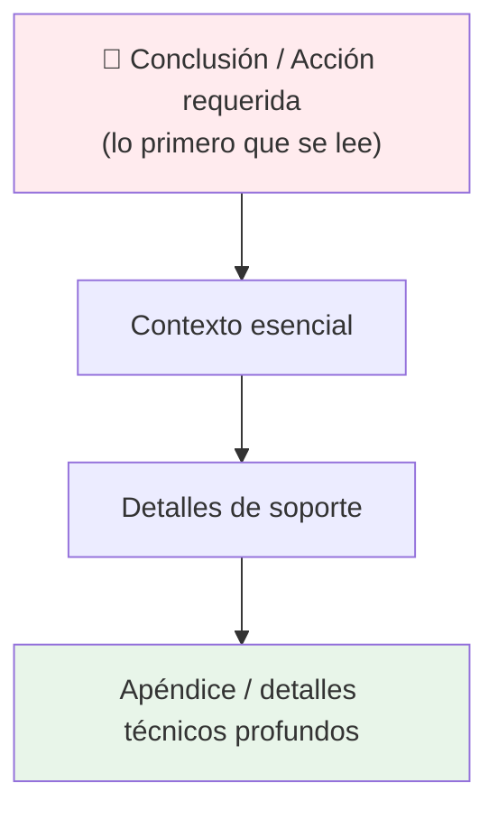
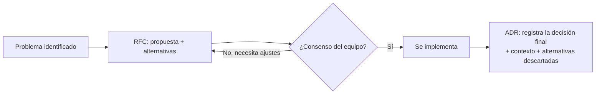

# Comunicación Escrita para Ingenieros

## 🎯 Resumen Ejecutivo

La comunicación escrita es, probablemente, la habilidad que más
correlaciona con el nivel senior de un ingeniero — más incluso que la
habilidad técnica pura. Un Staff Engineer influye en decenas de personas
que nunca verá en persona, y lo hace casi exclusivamente **por escrito**:
RFCs, comentarios de PR, postmortems, documentación de arquitectura.
Este tema te da la estructura para escribir de forma que la gente
realmente lea y actúe.

## 🎓 Para Dummies (ELI5)

Piensa en la diferencia entre un mensaje de texto que dice "oye necesito
que veas algo urgente" (genera ansiedad, no da contexto, obliga a
preguntar más) versus uno que dice "El servidor de pagos está caído
desde las 3pm, afecta a checkout, ya estoy investigando, te aviso en
15 min" (da contexto completo, no requiere respuesta inmediata, permite
que el otro decida si actuar ahora o después). La segunda versión
respeta el tiempo de quien lee. Esa es la esencia de la buena
comunicación escrita: **optimizar para quien lee, no para quien escribe**.

## 🎯 Objetivos de Aprendizaje

- [ ] Aplicar la estructura "pirámide invertida" en cualquier mensaje técnico
- [ ] Escribir un comentario de PR que mejora el código sin generar fricción
- [ ] Reconocer cuándo un mensaje debería ser un documento, no un chat
- [ ] Evitar los 3 anti-patrones más comunes de escritura técnica

## 🔍 Definición

> La **comunicación escrita técnica** es la práctica de transmitir
> información de ingeniería —decisiones, problemas, propuestas— de forma
> asíncrona, clara y accionable, optimizando para que el lector entienda
> lo esencial en el menor tiempo posible.

## 📖 Historia y Motivación

### Por qué escribir importa más de lo que parece

En equipos distribuidos y remotos —el estándar de la industria desde
2020— la comunicación síncrona (reuniones, llamadas) escala mal: cada
persona nueva en el equipo multiplica el costo de coordinación. Amazon
formalizó esto con su famosa política de **"no PowerPoints"**: en vez de
presentaciones, cada reunión importante empieza con la lectura silenciosa
de un documento de 6 páginas (el "6-pager"), porque Jeff Bezos observó
que las presentaciones permiten ocultar pensamiento incompleto detrás de
bullets vagos, mientras que la prosa completa obliga a pensar con rigor.

> **💎 Perla escondida #1:** La política del "6-pager" de Amazon no es
> sobre el formato — es sobre forzar al autor a **pensar completamente**
> antes de pedir tiempo de otros. Si no puedes escribir tu propuesta en
> prosa completa (no bullets), probablemente no la entiendes lo
> suficientemente bien todavía. Prueba esto la próxima vez que quieras
> convocar una reunión de arquitectura: escribe el problema en 3 párrafos
> antes de agendar nada.

## 🧩 Conceptos Fundamentales

### Concepto 1: La Pirámide Invertida

**¿Qué es?** Estructura tomada del periodismo: pon la conclusión y la
información más importante **primero**, y los detalles de soporte
después. El lector puede parar en cualquier momento y ya tiene lo
esencial.



**Ejemplo — Mal (estructura cronológica, "novela"):**
> "Ayer estuve revisando el sistema de pagos porque un cliente reportó
> un problema. Después de varias horas de debugging, encontré que había
> un timeout mal configurado. Investigué el historial de cambios y until
> vi que se modificó hace 2 semanas. Mi conclusión es que deberíamos
> revertir ese cambio."

**Ejemplo — Bien (pirámide invertida):**
> "**Acción propuesta:** revertir el cambio de timeout del sistema de
> pagos (PR #4521), desplegado hace 2 semanas, que está causando fallos
> intermitentes en checkout.
>
> **Contexto:** un cliente reportó el problema ayer; el debugging
> confirmó que el timeout de 500ms es insuficiente bajo carga actual.
>
> **Detalles:** [historial de investigación, logs, gráficas]"

**💎 Perla escondida #2:** Nota que la versión "Bien" permite que un
manager que solo tiene 10 segundos lea la primera línea y ya sepa qué
decisión se necesita. La versión "Mal" obliga a leer todo el párrafo
para llegar al mismo punto. En un equipo con 50 mensajes de Slack al
día, esa diferencia decide si tu mensaje se lee o se ignora.

### Concepto 2: Comentarios de Pull Request que No Generan Fricción

**¿Qué es?** Un comentario de PR es comunicación escrita de alto riesgo:
mal formulado, se siente como un ataque personal; bien formulado, mejora
el código y fortalece la relación con el autor.

**Mal:**
> "Esto está mal, no deberías hacer esto así."

**Bien:**
> "¿Consideraste usar un `Set` en vez de una lista aquí? Con listas
> grandes, `in` es O(n); con un `Set` sería O(1). Puede que no importe
> en este caso si el volumen es bajo — solo quería confirmarlo contigo."

**Por qué funciona:** propone una alternativa concreta, explica el *por
qué* técnico, y dejas espacio para que el autor tenga contexto que tú no
tienes (quizás el volumen realmente es bajo). No es una orden, es una
pregunta genuina con fundamento técnico.

### Concepto 3: RFC y Architecture Decision Records (ADR)

**¿Qué es?** Un RFC (*Request for Comments*) documenta una propuesta
antes de implementarla, dando espacio a que el equipo la cuestione. Un
ADR documenta una decisión **ya tomada**, junto con el contexto y las
alternativas consideradas, para que alguien en el futuro entienda *por
qué* se hizo así.



**💎 Perla escondida #3:** Un ADR bien escrito no solo dice *qué* se
decidió — dice explícitamente **qué alternativas se descartaron y por
qué**. Esto evita que alguien, 2 años después, "redescubra" y proponga
de nuevo una alternativa que ya fue evaluada y rechazada con buenas
razones, ahorrando semanas de debate repetido.

## 💻 Ejemplo Real: Estructura de un Incident Report

```markdown
# Incident Report: Caída de checkout — 2026-08-03

## Resumen (1 párrafo, léelo si solo tienes 30 segundos)
El servicio de checkout estuvo caído 23 minutos (14:02–14:25 UTC),
afectando ~1,200 intentos de compra. Causa raíz: timeout de conexión
a la base de datos de inventario tras un pico de tráfico no anticipado.

## Línea de tiempo
- 14:02 — Alertas de error 500 en checkout
- 14:05 — On-call confirma el incidente, escala a #incidentes
- 14:12 — Se identifica timeout de DB como causa probable
- 14:20 — Se aumenta el pool de conexiones
- 14:25 — Servicio restaurado, monitoreado por 1h adicional

## Causa raíz
[Detalle técnico completo]

## Impacto
~1,200 intentos de compra fallidos, estimado en $18,000 de ingresos
potenciales perdidos.

## Acciones de seguimiento
- [ ] Aumentar pool de conexiones permanentemente (owner: @maria, due: viernes)
- [ ] Agregar alerta proactiva de saturación de pool (owner: @juan, due: próximo sprint)
- [ ] Postmortem sin culpa (blameless) programado para el jueves
```

**Nota el patrón:** resumen primero (pirámide invertida), luego
cronología, luego causa raíz técnica, luego — lo más importante para el
futuro — **acciones de seguimiento con dueño y fecha**. Un incident
report sin acciones de seguimiento asignadas es solo una historia
interesante, no una mejora real.

## ⚖️ Trade-offs

### ✅ Ventajas de invertir en escritura

- **Escala tu impacto** sin necesitar estar en cada reunión
- **Crea memoria institucional** — decisiones documentadas sobreviven a la rotación de equipo
- **Fuerza claridad de pensamiento** — escribir mal revela pensar mal, y viceversa

### ❌ Costos reales

- **Toma tiempo real** — un buen RFC puede tomar horas, no minutos
- **No sustituye la conversación** para temas de alta ambigüedad o carga emocional (feedback difícil es mejor en persona/llamada, luego resumido por escrito)

## ✨ Buenas Prácticas

**BP1 — Una idea por párrafo.** Si un párrafo cubre dos ideas, el lector
retiene la mitad de ambas.

**BP2 — Cierra siempre con una acción clara.** "¿Qué necesito que hagas
tú, específicamente, después de leer esto?"

**BP3 — Escribe el título como si fuera el resumen.** "Checkout caído
23 min por timeout de DB" comunica más que "Incidente del 3 de agosto".

## ⚠️ Anti-patrones y Errores Comunes

### AP1: El "Wall of Text" sin estructura
Un mensaje de 10 párrafos sin encabezados ni bullets obliga al lector a
hacer el trabajo de estructurar que el autor debió hacer.

### AP2: Enterrar la pregunta al final
```
❌ "...[500 palabras de contexto]... entonces, ¿debería usar Redis o Memcached?"
✅ "Pregunta: ¿Redis o Memcached para cache de sesión? [contexto abajo]"
```

### AP3: Feedback de código sin razón técnica
```
❌ "No me gusta esto."
✅ "Esto podría causar un memory leak porque el listener nunca se remueve — ¿lo movemos al cleanup del componente?"
```

## 🔬 Cuándo Escribir vs. Cuándo Hablar

| Situación | Formato recomendado |
|---|---|
| Decisión de arquitectura con impacto amplio | RFC + ADR |
| Feedback de código específico | Comentario de PR |
| Feedback de desempeño o carrera | Conversación 1:1, resumida por escrito después |
| Incidente en producción | Documento en vivo durante, informe completo después |
| Desacuerdo técnico con carga emocional | Llamada primero, decisión documentada después |

## ❓ Preguntas de Entrevista

**P1: "Cuéntame de una vez que tu comunicación escrita cambió el resultado de un proyecto."**

*Qué busca el entrevistador:* que tengas un ejemplo concreto (no
genérico) donde un documento —no una reunión— generó una decisión o
evitó un error. Usa el formato STAR (Situación, Tarea, Acción,
Resultado).

**P2: "¿Cómo das feedback difícil por escrito sin generar conflicto?"**

*Respuesta modelo:* "Separo la observación del juicio: describo el
comportamiento específico y su impacto medible, en vez de caracterizar
a la persona. Y para feedback con alta carga emocional, prefiero una
llamada breve primero, y dejo el resumen escrito para después, no como
sustituto de la conversación."

## 📋 Checklist Antes de Enviar

- [ ] ¿La primera línea comunica la conclusión o la acción requerida?
- [ ] ¿Hay una acción clara para el lector al final?
- [ ] ¿Cada párrafo tiene una sola idea?
- [ ] ¿Si esto es feedback de código, incluye el "por qué" técnico?
- [ ] ¿Lo leería alguien con 30 segundos y entendería lo esencial?

## 🔗 Temas Relacionados

- RFC & Architecture Decision Records *(próximamente)*
- Presentaciones y Public Speaking *(próximamente)*

## 📚 Recursos Oficiales

**Libros:**
- *"On Writing Well"* — William Zinsser (los principios aplican perfecto a escritura técnica)
- *"The Manager's Path"* — Camille Fournier (capítulos sobre comunicación escrita en liderazgo técnico)

**Artículos:**
- *"Writing Narratively at Amazon"* — sobre la cultura del "6-pager"
- ADR templates públicos de Michael Nygard (quien popularizó el formato ADR)

## 🏁 Resumen Final

**Qué es:** transmitir información técnica de forma clara, asíncrona y
accionable.

**Por qué importa:** es la habilidad que más escala tu impacto como
ingeniero senior — influyes en gente que nunca ves en persona.

**Recuerda:**
- Pirámide invertida: conclusión primero, detalles después
- Cierra siempre con una acción clara para el lector
- RFC para proponer, ADR para documentar lo decidido

## 🃏 Flashcards

```
Q: ¿Qué es la "pirámide invertida" en escritura técnica?
A: Estructura donde la conclusión y la acción requerida van primero, y los detalles de soporte después.

Q: ¿Cuál es la diferencia entre un RFC y un ADR?
A: RFC propone una decisión ANTES de tomarla (para debate). ADR documenta una decisión YA tomada, junto con las alternativas descartadas y por qué.

Q: ¿Qué debe tener siempre un incident report además del análisis técnico?
A: Acciones de seguimiento con dueño y fecha concreta — sin eso, es solo una historia, no una mejora.
```

## 📝 Quiz

1. **¿Cuál de estos comentarios de PR es más efectivo?**
   - [ ] "Esto está mal."
   - [x] "¿Consideraste usar un Set aquí? Sería O(1) en vez de O(n) para listas grandes."
   - [ ] "No me convence este approach."
   - [ ] (sin comentario, solo aprobar el PR)

   *Explicación: el comentario efectivo propone una alternativa concreta con razón técnica, sin atacar a la persona ni dejar la crítica sin fundamento.*

2. **¿Qué va PRIMERO en la estructura de pirámide invertida?**
   - [x] La conclusión o acción requerida
   - [ ] El contexto histórico completo
   - [ ] Los detalles técnicos profundos
   - [ ] Los agradecimientos y saludos

   *Explicación: la pirámide invertida prioriza que el lector obtenga lo esencial de inmediato, dejando los detalles de soporte para quien quiera profundizar.*

## 📖 Diccionario Rápido de Este Tema

| Término | Qué significa | Contexto en este tema |
|---|---|---|
| **RFC** | "Request for Comments" — un documento que propone una decisión ANTES de tomarla, para que el equipo la discuta. | Se usa para debatir arquitectura antes de construir. |
| **ADR** | "Architecture Decision Record" — documento que registra una decisión YA tomada, con el porqué y las alternativas descartadas. | Sirve para que alguien, años después, entienda por qué se hizo así. |
| **6-pager** | Documento de 6 páginas en prosa completa (sin bullets) que Amazon usa en vez de presentaciones, para forzar pensamiento riguroso. | Ejemplo de cómo una cultura de escritura cambia la calidad de las decisiones. |
| **Blameless (postmortem)** | Analizar un incidente enfocándose en el sistema y el proceso, nunca en culpar a una persona. | Aplica también a comunicación escrita: describe comportamiento, no caracterices a la persona. |
| **Incident report** | Documento que resume qué pasó, cuándo, por qué y qué se hará al respecto tras una falla en producción. | Es el ejemplo práctico central de este tema. |
