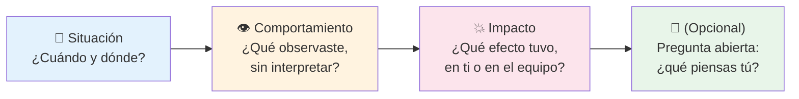
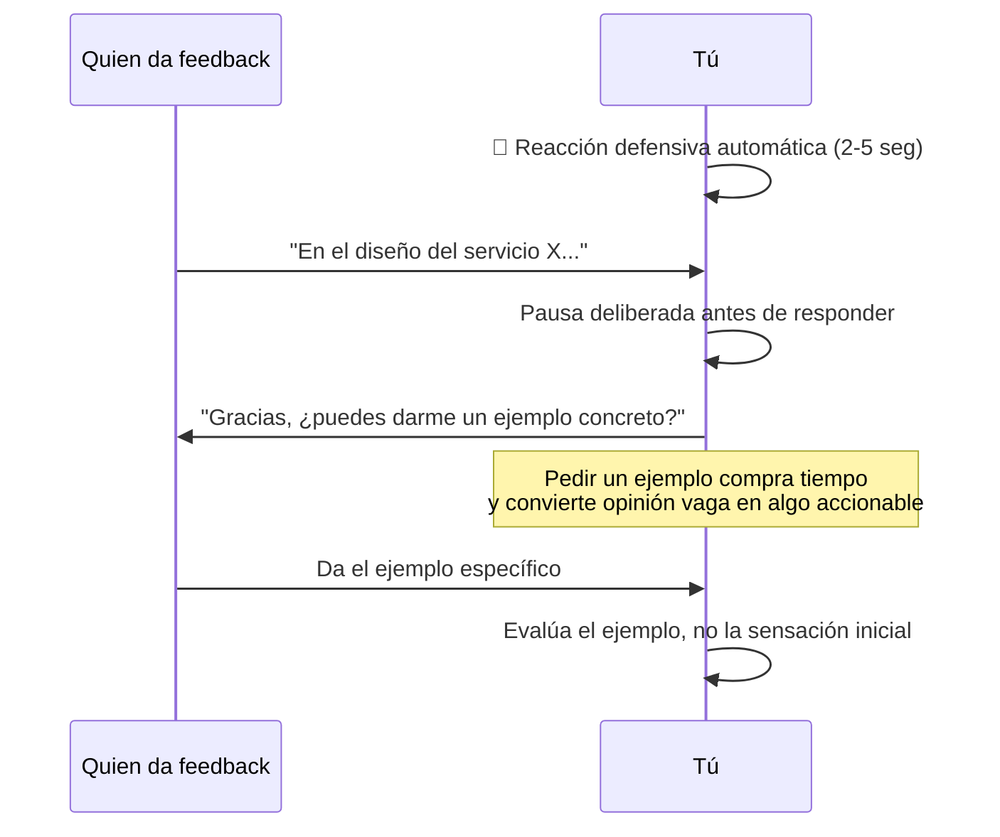
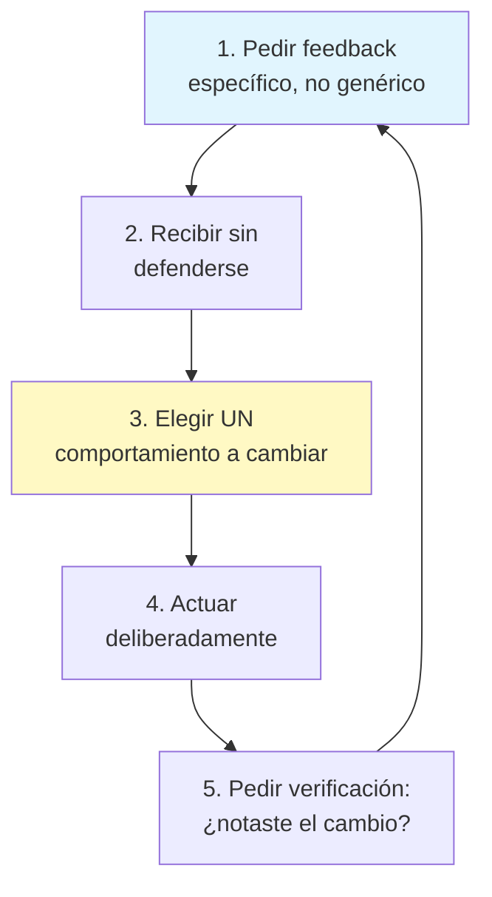
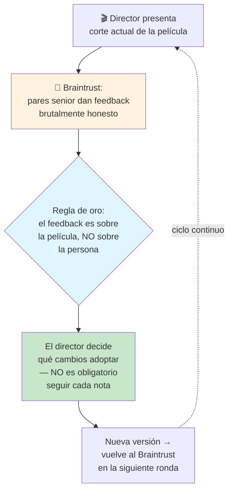

# Feedback y Crecimiento Continuo

## Resumen Ejecutivo

Dar feedback técnico mal formulado ("tu código es un desastre") no cambia comportamiento, solo genera
defensividad. Dar feedback bien formulado es una habilidad tan técnica como escribir un buen algoritmo:
tiene una estructura, principios y trampas conocidas. Este tema cubre cómo dar feedback que efectivamente
cambia comportamiento (en code reviews, 1:1s, retros), cómo recibirlo sin la reacción defensiva
automática, y cómo convertir el feedback recibido en un ciclo de crecimiento medible en el tiempo.

## 🧒 Explicación para Dummies (ELI5)

Imagina que le enseñas a alguien a cocinar. Hay dos formas de corregirlo cuando le queda salada la sopa:

- **Forma A**: "Esta sopa está horrible, no sabes cocinar."
- **Forma B**: "Le pusiste sal dos veces sin querer — la próxima vez, prueba antes de agregar la segunda
  vez. El sabor base está bien, solo fue eso."

Ambas apuntan al mismo problema (demasiada sal). Pero la Forma A ataca a la *persona* ("no sabes
cocinar") y la Forma B apunta al *comportamiento específico* ("agregaste sal dos veces") con una
sugerencia concreta para la próxima vez. La persona que recibe la Forma A se pone a la defensiva y deja
de escuchar el resto. La persona que recibe la Forma B, en general, agradece la corrección porque siente
que le ayudaste, no que la atacaste. **Ese es el 90% de lo que hace que el feedback funcione o no.**

## 🎯 Objetivos de Aprendizaje

Al terminar este tema podrás:

- Estructurar feedback técnico usando el modelo SBI (Situación-Comportamiento-Impacto)
- Reconocer y neutralizar tu propia reacción defensiva al recibir feedback
- Diferenciar feedback de "opinión disfrazada de feedback" (una confusión muy común en code reviews)
- Aplicar el ciclo de crecimiento: pedir feedback específico → actuar → verificar cambio

## 📋 Prerequisitos

- [Comunicación Escrita](../communication/written-communication.md)

## 📖 Definición

**Feedback** es información específica sobre un comportamiento observado y su impacto, entregada con la
intención de ayudar a la otra persona a mejorar — no de desahogarte, ni de "tener razón".

Se diferencia de una **opinión** en que la opinión es un juicio general ("esto está mal diseñado") sin
comportamiento observable ni impacto concreto, mientras que el feedback siempre puede rastrearse a un
hecho específico ("en la línea 42 el método hace 3 cosas distintas, lo que hace difícil testearlo por
separado").

## 🕰️ Historia y Motivación

El modelo **SBI (Situation-Behavior-Impact)** fue desarrollado por el Center for Creative Leadership en
los años 1970s-80s como parte de su investigación sobre desarrollo de liderazgo, y se ha vuelto el
estándar de facto en programas de feedback corporativo, incluyendo en la mayoría de las big tech
(Google, Meta, Amazon lo enseñan explícitamente en su training de managers).

> 💎 **Perla Escondida #1**: la razón por la que SBI funciona mejor que feedback genérico no es
> "psicológica" en abstracto — es que **elimina la ambigüedad de qué se espera que cambie**. "Sé más
> comunicativo" no es accionable porque no dice qué comportamiento específico repetir o dejar de hacer.
> "Cuando no compartiste el bloqueador en el standup del martes, el equipo perdió 2 días esperando"
> sí lo es: la persona sabe exactamente qué comportamiento ajustar la próxima vez.

## 🧩 Conceptos Fundamentales

### 1. El Modelo SBI (Situación - Comportamiento - Impacto)

**Ejemplo aplicado a un code review:**

> "En el PR #482 (situación), el manejo de errores solo cubre el caso feliz y no hay try/catch en la
> llamada a la API externa (comportamiento observado, sin juicio de valor). Si esa API falla en
> producción, el servicio completo se cae en vez de degradar con gracia (impacto). ¿Había alguna razón
> para no envolverlo, o se pasó por alto?"

Compáralo con: "Tu manejo de errores es descuidado." — mismo problema, cero información accionable, y
además ataca a la persona en vez del comportamiento.

> 💎 **Perla Escondida #2**: el paso más saltado del modelo SBI es el "impacto". Los ingenieros tienden a
> quedarse en comportamiento ("no pusiste try/catch") sin conectar por qué importa. Sin el impacto, el
> feedback se siente arbitrario — como una regla de estilo personal. Con el impacto explícito ("el
> servicio completo se cae"), se vuelve obviamente importante y deja de sentirse como preferencia
> subjetiva del revisor.

### 2. Recibir Feedback sin Reacción Defensiva

La reacción defensiva es automática y biológica (respuesta de amenaza), no un defecto de carácter. La
técnica más efectiva no es "no sentirla" — es **retrasar la respuesta** el tiempo suficiente para que la
reacción inicial pase.

> 💎 **Perla Escondida #3**: la frase "gracias, ¿puedes darme un ejemplo concreto?" es probablemente la
> herramienta más subestimada en toda la comunicación técnica. Sirve para tres cosas a la vez: (1) te da
> 5-10 segundos para que baje tu reacción defensiva, (2) fuerza a quien da el feedback a ser específico
> en vez de quedarse en una opinión vaga, y (3) señala genuina apertura, lo cual hace que la otra persona
> se sienta segura de seguir dando feedback honesto en el futuro — mucha gente deja de dar feedback
> sincero después de una sola reacción defensiva fuerte.

### 3. El Ciclo de Crecimiento Deliberado

Recibir feedback no genera crecimiento por sí solo — el crecimiento ocurre en el ciclo completo:

> 💎 **Perla Escondida #4**: pedir feedback con "¿algo que deba mejorar?" casi siempre produce una
> respuesta genérica o "todo bien" — la pregunta es demasiado abierta y pone el trabajo de pensar en la
> otra persona. Pedir feedback específico ("¿cómo estuvo mi manejo de la discusión de arquitectura de
> hoy? ¿Hablé demasiado en algún punto?") produce respuestas mucho más útiles, porque le das a la otra
> persona un ángulo concreto sobre el cual pensar en vez de pedirle que genere el ángulo desde cero.

## 🏢 Caso Real: El Braintrust de Pixar

Ed Catmull, cofundador de Pixar, documentó en su libro *Creativity, Inc.* (2014) el "Braintrust": una
reunión periódica donde los directores de cada película presentan su corte actual a un grupo de otros
directores y guionistas senior, para recibir feedback brutalmente honesto — de hecho, casi todas las
películas de Pixar en algún punto de producción "no funcionan" y necesitan reescrituras grandes gracias
a este proceso (Toy Story 2 y Ratatouille son ejemplos documentados públicamente).

Dos reglas del Braintrust son las que lo hacen funcionar y son directamente trasladables a code reviews
y retros de ingeniería: (1) el feedback se dirige siempre al trabajo, nunca a la persona que lo hizo —
la separación exacta que describe el modelo SBI de este tema — y (2) quien recibe el feedback conserva
la autoridad de decidir qué cambios hacer; nadie más puede imponerlos. Esa segunda regla es la que
evita que el feedback brutal se sienta como un ataque: la persona sabe que sigue teniendo el control
final, así que puede escuchar sin ponerse a la defensiva.

> 💎 **Perla Escondida #5**: la razón por la que "el director decide, no está obligado a seguir cada
> nota" hace que el Braintrust funcione mejor, no peor, es contraintuitiva: cuando la gente sabe que su
> feedback es una sugerencia y no una orden, se siente más segura dando feedback honesto y arriesgado —
> no tiene que suavizarlo por miedo a que se imponga sin cuestionamiento. Equipos donde el feedback de
> un superior se vuelve automáticamente obligatorio generan el efecto contrario: la gente empieza a
> callarse las notas más arriesgadas o poco convencionales, precisamente las que más valor podrían tener.

## ⚖️ Trade-offs

| Enfoque | Beneficio | Costo |
|---|---|---|
| Feedback inmediato (en el momento) | Contexto fresco, más específico | Puede sentirse como interrupción |
| Feedback diferido (1:1 programado) | Espacio para procesar sin audiencia | Contexto puede diluirse |
| Feedback público (PR comments) | Transparente, documentado | Puede generar vergüenza si no se cuida el tono |
| Feedback privado (DM) | Más seguro emocionalmente | No comparte el aprendizaje con el equipo |

## ✅ Buenas Prácticas

- Usa SBI incluso en comentarios cortos de PR — no hace falta que sea largo, solo específico
- Separa "esto es una preferencia mía" de "esto es un problema objetivo" explícitamente en tus comentarios
- Pide feedback específico y frecuente, en vez de esperar la revisión de desempeño anual
- Cuando des feedback negativo, hazlo cerca del momento del hecho — el feedback viejo pierde impacto y contexto

## 🚫 Anti-Patrones

### AP1: "El Sandwich Forzado"

Rellenar feedback negativo entre dos elogios genéricos ("¡buen trabajo! ... pero esto está mal ...
¡sigue así!"). La técnica es tan reconocible que la mayoría de la gente ya detecta el patrón y descuenta
los elogios como no genuinos, lo cual diluye ambos mensajes.

### AP2: "Opinión Disfrazada de Feedback"

Presentar una preferencia personal de estilo como si fuera un problema objetivo ("esto está mal
diseñado" cuando en realidad es "yo lo hubiera hecho distinto"). Rompe confianza cuando se descubre,
porque la otra persona invirtió tiempo tratando de resolver un "problema" que en realidad era gusto
personal no declarado como tal.

## 🎤 Preguntas de Entrevista

**P: "Cuéntame de una vez que diste feedback difícil a un compañero."**

R: Busca evidencia de estructura (algo parecido a SBI, aunque no lo llamen así), no solo "fui honesto".
La señal fuerte es que describas el impacto concreto del comportamiento, no solo el comportamiento en sí.

## ☑️ Checklist

- [ ] Mi último feedback técnico incluyó situación, comportamiento observado e impacto — no solo opinión
- [ ] La última vez que recibí feedback que me incomodó, pedí un ejemplo concreto antes de responder
- [ ] Puedo distinguir cuándo estoy dando una preferencia de estilo vs. un problema objetivo
- [ ] He pedido feedback específico (no genérico) en las últimas 2 semanas

## 🔗 Conceptos Relacionados

- [Ownership y Liderazgo Técnico](../leadership/leadership-mindset.md)
- [Comunicación Escrita](../communication/written-communication.md)

## 📚 Recursos Oficiales

- Center for Creative Leadership — modelo SBI (Situation-Behavior-Impact)
- Kim Scott — *Radical Candor* (2017)
- Douglas Stone & Sheila Heen — *Thanks for the Feedback* (2014)

## 📝 Resumen Final

El feedback técnico bien formulado sigue una estructura (SBI) que separa el comportamiento observable de
la persona, y conecta ese comportamiento con un impacto concreto. Recibirlo bien no significa no sentir
la reacción defensiva — significa retrasarla el tiempo suficiente con una pregunta como "¿puedes darme un
ejemplo?" para poder evaluar el contenido en vez de la sensación inicial. El crecimiento real ocurre
cuando el ciclo se cierra: pedir feedback específico, actuar sobre un solo comportamiento a la vez, y
verificar si el cambio se notó.

## 📖 Diccionario Rápido de Este Tema

| Término | Qué significa | Contexto en este tema |
|---|---|---|
| SBI (Situación-Comportamiento-Impacto) | Modelo estructurado para dar feedback específico y accionable | Concepto central del tema |
| Radical Candor | Marco de Kim Scott que combina "importarte genuinamente" con "desafiar directamente" | Recurso recomendado |
| Reacción defensiva | Respuesta automática de amenaza ante crítica percibida | Sección de cómo recibir feedback |

## 🃏 Flashcards

1. **P:** ¿Cuáles son los tres componentes del modelo SBI?
   **R:** Situación, Comportamiento (observado, sin juicio), Impacto (efecto concreto).

2. **P:** ¿Cuál es la mejor respuesta inmediata ante feedback que genera reacción defensiva?
   **R:** Pedir un ejemplo concreto ("¿puedes darme un ejemplo?") — compra tiempo y convierte opinión vaga en algo accionable.

## 🧪 Quiz

**1. ¿Cuál de las siguientes frases sigue mejor el modelo SBI?**

- A) "Tu código es difícil de mantener."
- B) "No me gusta cómo programas."
- C) "En el PR #201, el método \`process()\` mezcla validación y lógica de negocio, lo que hizo que el test unitario necesitara mockear 5 dependencias distintas."
- D) "Deberías ser más cuidadoso."

*Respuesta correcta: C*
