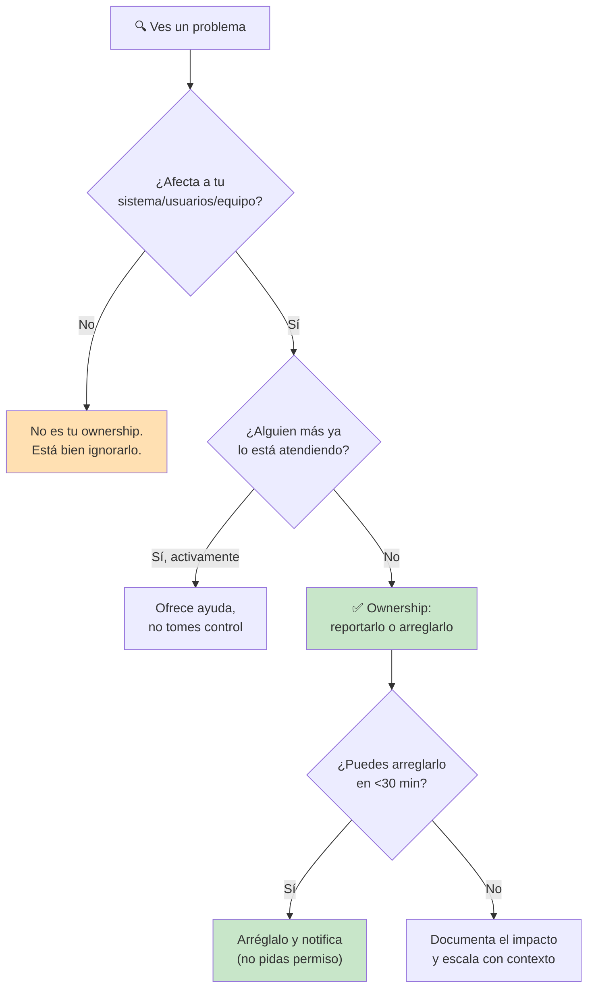
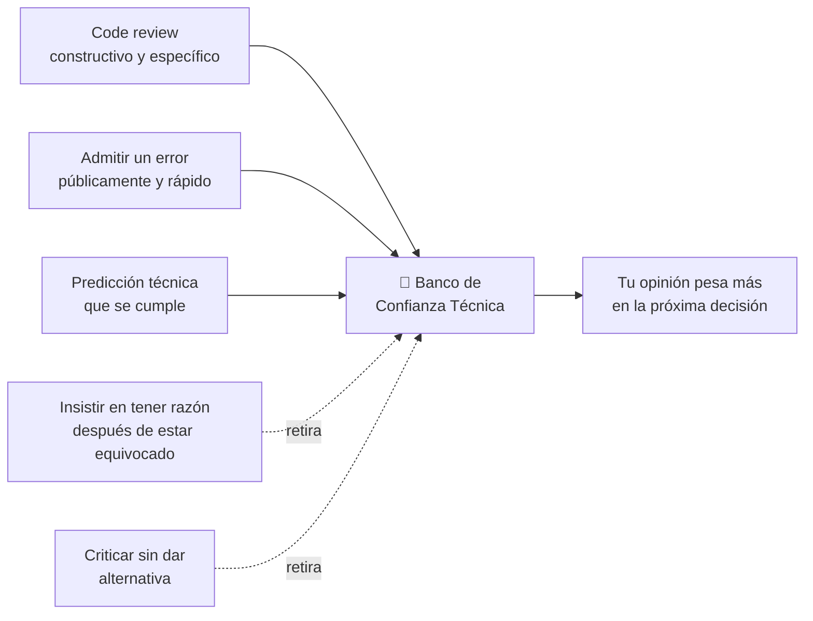

# Ownership y Liderazgo Técnico sin Autoridad

## Resumen Ejecutivo

Liderazgo técnico no es un título, es un comportamiento. Puedes ser "Software Engineer II" y liderar
técnicamente una migración crítica; puedes ser "Staff Engineer" y no liderar nada si nadie confía en tu
criterio. Este tema cubre **ownership** (la actitud de tratar los problemas del sistema como tuyos, no
de "otro equipo") y **liderazgo sin autoridad formal** (influenciar decisiones técnicas sin ser el manager
de nadie) — las dos habilidades que más diferencian a un ingeniero mid-level de uno senior/staff, mucho
más que la habilidad técnica pura.

## 🧒 Explicación para Dummies (ELI5)

Imagina un edificio de apartamentos. Hay dos tipos de vecinos:

- **El vecino tipo A**: si ve un charco en el pasillo, piensa "no es mi problema, yo no lo hice" y sigue
  caminando. Si el ascensor suena raro, espera a que "alguien" (léase: el conserje, que no existe) lo
  arregle.
- **El vecino tipo B**: ve el charco, pone un cono de "piso mojado" aunque no lo haya causado él, y le
  manda un mensaje al grupo del edificio. Si el ascensor suena raro, pregunta quién más lo escuchó antes
  de que se rompa del todo.

El vecino tipo B no tiene más autoridad que el tipo A — no es el administrador del edificio. Pero con el
tiempo, cuando hay una decisión importante (cambiar de administrador, votar una reforma), todos en el
edificio le preguntan a él primero. **Eso es liderazgo sin autoridad formal.** Y la actitud de poner el
cono aunque no sea su culpa — **eso es ownership**.

## 🎯 Objetivos de Aprendizaje

Al terminar este tema podrás:

- Distinguir ownership real de "hacer overtime por culpa" (son cosas completamente distintas)
- Aplicar las 3 preguntas que usan los ingenieros senior antes de decir "no es mi área"
- Influenciar una decisión técnica sin tener autoridad de decisión sobre las personas involucradas
- Reconocer los 2 anti-patrones más comunes que destruyen la confianza del equipo en tu criterio técnico

## 📋 Prerequisitos

- [Comunicación Escrita](../communication/written-communication.md) — liderar sin autoridad depende
  casi por completo de comunicar bien por escrito (Slack, PRs, RFCs)

## 📖 Definición

**Ownership** es la disposición a tratar un problema como propio incluso cuando no lo causaste y no es
formalmente tu responsabilidad, porque afecta al sistema/producto/equipo del que formas parte.

**Liderazgo técnico sin autoridad** (también llamado *influence without authority*) es la capacidad de
que otros ingenieros — incluyendo pares y seniors — adopten tu recomendación técnica basándose en la
calidad de tu razonamiento y tu track record, no en tu posición jerárquica.

No son lo mismo que "ser el que más trabaja" ni "ser el jefe informal". Son, en esencia, **capital de
confianza técnica** que se construye con decisiones pequeñas y consistentes a lo largo de meses.

## 🕰️ Historia y Motivación

El concepto de "liderazgo sin autoridad" se popularizó en ingeniería de software gracias al modelo de
**Staff Engineer** que empresas como Google, Uber y Stripe formalizaron entre 2015 y 2020: en esas
empresas un Staff Engineer no tiene reportes directos, pero se espera que influya en decisiones de
arquitectura de decenas de equipos. Will Larson documentó esto extensamente en su libro *Staff Engineer:
Leadership Beyond the Management Track* (2021), que se convirtió en la referencia de facto del campo.

> 💎 **Perla Escondida #1**: la razón por la que "influence without authority" es *más* difícil que
> liderazgo con autoridad, no menos, es que no tienes el "botón de pánico" de escalarlo a un manager. Si
> tu argumento técnico no convence por sí solo, no tienes forma de forzar la decisión. Esto en realidad
> es una ventaja para ti: te obliga a que tus razones sean objetivamente buenas, no que la gente las siga
> por miedo. Los ingenieros que más rápido llegan a Staff son los que internalizan esto pronto y dejan de
> intentar "ganar" discusiones técnicas y empiezan a intentar *tener razón* — son cosas distintas.

## 🧩 Conceptos Fundamentales

### 1. El Círculo de Ownership

No todo es tu responsabilidad — ownership sin límites es agotamiento, no virtud. La pregunta útil es:
"¿este problema está dentro de mi círculo de impacto, aunque no sea mi código?"

> 💎 **Perla Escondida #2**: la trampa más común en ingenieros nuevos NO es tener poco ownership — es
> tener ownership sin límites y quemarse en 6 meses tratando de arreglar todo lo que ven. Ownership
> maduro incluye la habilidad de decir "esto está fuera de mi círculo hoy" sin culpa. Si sientes que
> *todo* es tu responsabilidad, en realidad tienes un problema de límites, no de compromiso.

### 2. Las 3 Preguntas Antes de Decir "No es Mi Área"

Antes de descartar un problema como "no es mi trabajo", los ingenieros senior se hacen tres preguntas:

1. **¿Si no lo resuelvo yo, alguien lo va a resolver a tiempo?** (Si la respuesta es "probablemente no",
   el costo de ignorarlo es alto aunque técnicamente no sea tu área.)
2. **¿Tengo contexto único que otros no tienen?** (Si viste el bug primero, o entiendes el sistema legacy
   que nadie más toca, tu costo de involucrarte es menor que el de cualquier otra persona.)
3. **¿Qué tan reversible es la decisión de ignorarlo?** (Un bug cosmético es reversible — se puede
   arreglar después. Un problema de seguridad o de pérdida de datos no lo es.)

### 3. Influencia Técnica: El Modelo de "Banco de Confianza"

Cada interacción técnica deposita o retira de un "banco de confianza" que el equipo tiene sobre tu
criterio. Los depósitos grandes no son los que imaginas:

> 💎 **Perla Escondida #3**: el depósito más subestimado en el banco de confianza es **admitir que te
> equivocaste, rápido y en público** (en el canal del equipo, no en un DM). Contraintuitivamente, esto
> aumenta tu credibilidad más que tener razón todo el tiempo — porque le muestra al equipo que cuando SÍ
> defiendes algo con firmeza, es porque de verdad lo verificaste, no por ego. Los ingenieros que nunca
> admiten error público generan el efecto contrario: cada opinión suya empieza a pesar menos.

> 💎 **Perla Escondida #4**: si quieres que una recomendación técnica se adopte sin tener autoridad,
> preséntala siempre con al menos una alternativa que también resolvería el problema, y explica
> explícitamente por qué elegiste la tuya sobre esa alternativa. Esto cambia la conversación de "¿tiene
> razón o no?" (defensiva) a "¿cuál de estas dos opciones es mejor?" (colaborativa) — la gente rara vez
> defiende un ego cuando ya ve que consideraste seriamente su punto de vista antes de descartarlo.

## ⚖️ Trade-offs

| Comportamiento | Beneficio | Costo si se hace mal |
|---|---|---|
| Ownership amplio | Confianza del equipo, visibilidad | Burnout, dispersión de foco |
| Hablar en toda decisión técnica | Influencia creciente | "Ruido" — la gente deja de escucharte |
| Admitir errores en público | Credibilidad a largo plazo | Incomodidad a corto plazo |
| Escalar en vez de arreglar | Da contexto a quien decide | Puede leerse como falta de iniciativa |

## ✅ Buenas Prácticas

- Cuando reportes un problema fuera de tu área, siempre incluye contexto + impacto + severidad — nunca
  solo "esto está roto" (ver [Comunicación Escrita](../communication/written-communication.md))
- Antes de una reunión técnica importante, comparte tu postura por escrito con antelación — la gente
  cambia de opinión más fácilmente en privado, antes de comprometerse públicamente en la sala
- Da crédito público explícito a quien tuvo la idea original, incluso si tú la ejecutaste — es el
  depósito más barato y de mayor retorno en el banco de confianza
- Pide feedback activamente sobre tus decisiones técnicas pasadas, no solo sobre las nuevas

## 🚫 Anti-Patrones

### AP1: "El Bombero Héroe"

Ingeniero que solo aparece en incidentes/crisis y ahí sí "toma ownership total", pero es invisible en el
trabajo preventivo (tests, documentación, revisión de RFCs). El equipo aprende a depender del rescate
en vez de prevenir el incendio — y el "héroe" se agota.

### AP2: "El Crítico sin Propuesta"

Señala problemas en cada decisión ajena pero nunca propone una alternativa concreta ni se ofrece a
implementarla. Retira del banco de confianza rápidamente: el equipo empieza a experimentar sus
intervenciones como fricción, no como valor.

## 🎤 Preguntas de Entrevista

**P: "Cuéntame de una vez que tomaste ownership de algo que no era tu responsabilidad formal."**

R: Usa el formato STAR (Situación, Tarea, Acción, Resultado). La señal que buscan los entrevistadores
NO es "trabajé muchas horas" — es que hayas usado criterio para decidir que valía la pena involucrarte
(las 3 preguntas de la sección anterior), y que hayas comunicado el problema con claridad antes de actuar.

## ☑️ Checklist

- [ ] Puedo dar un ejemplo concreto (no genérico) de ownership que tomé el último trimestre
- [ ] La última vez que me equivoqué técnicamente, lo comuniqué en el canal del equipo, no en privado
- [ ] Cuando propongo algo, incluyo al menos una alternativa considerada y por qué la descarté
- [ ] Sé identificar cuándo un problema está fuera de mi círculo de ownership sin sentir culpa

## 🔗 Conceptos Relacionados

- [Feedback y Crecimiento](../feedback/feedback-and-growth.md)
- [Comunicación Escrita](../communication/written-communication.md)
- [RFC y ADR](../communication/technical-writing-rfc.md)

## 📚 Recursos Oficiales

- Will Larson — *Staff Engineer: Leadership Beyond the Management Track* (2021)
- Camille Fournier — *The Manager's Path* (2017), capítulo sobre tech leads
- Tanya Reilly — *The Staff Engineer's Path* (2022)

## 📝 Resumen Final

Ownership y liderazgo técnico sin autoridad son habilidades aprendibles, no rasgos de personalidad. Se
construyen con decisiones pequeñas y consistentes: reportar lo que ves aunque no sea tu área, admitir
errores rápido y en público, y presentar siempre alternativas antes de defender tu propia postura. El
título no determina cuánto lideras técnicamente — lo determina cuánta confianza técnica has depositado
en el equipo con el tiempo.

## 📖 Diccionario Rápido de Este Tema

| Término | Qué significa | Contexto en este tema |
|---|---|---|
| Ownership | Tratar un problema como propio aunque no seas formalmente responsable | Base de todo el tema |
| Influence without authority | Lograr que se adopte tu recomendación sin tener poder jerárquico | Concepto central de liderazgo sin autoridad |
| Staff Engineer | Rol senior sin reportes directos que influye en arquitectura de múltiples equipos | Contexto histórico del concepto |
| STAR (Situación, Tarea, Acción, Resultado) | Formato para estructurar respuestas de entrevista conductual | Sección de preguntas de entrevista |

## 🃏 Flashcards

1. **P:** ¿Cuál es la diferencia entre ownership y "hacer overtime por culpa"?
   **R:** Ownership es criterio para decidir cuándo involucrarte; hacer overtime por culpa es actuar sin
   ese criterio, sin límites, hasta el burnout.

2. **P:** ¿Cuál es el depósito más subestimado en el "banco de confianza técnica"?
   **R:** Admitir un error en público y rápido — aumenta la credibilidad a largo plazo más que tener
   razón todo el tiempo.

## 🧪 Quiz

**1. Un ingeniero ve un bug en un servicio de otro equipo. ¿Cuál es la mejor primera acción según este tema?**

- A) Ignorarlo, no es su código
- B) Arreglarlo inmediatamente sin avisar a nadie
- C) Aplicar las 3 preguntas (impacto, contexto único, reversibilidad) antes de decidir
- D) Escalarlo directamente a un VP

*Respuesta correcta: C*
