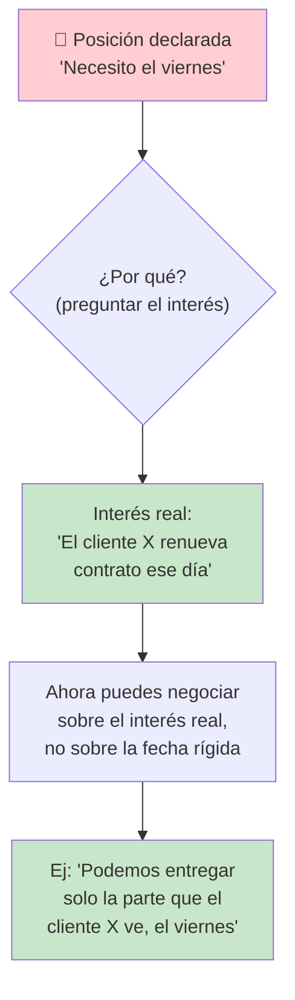
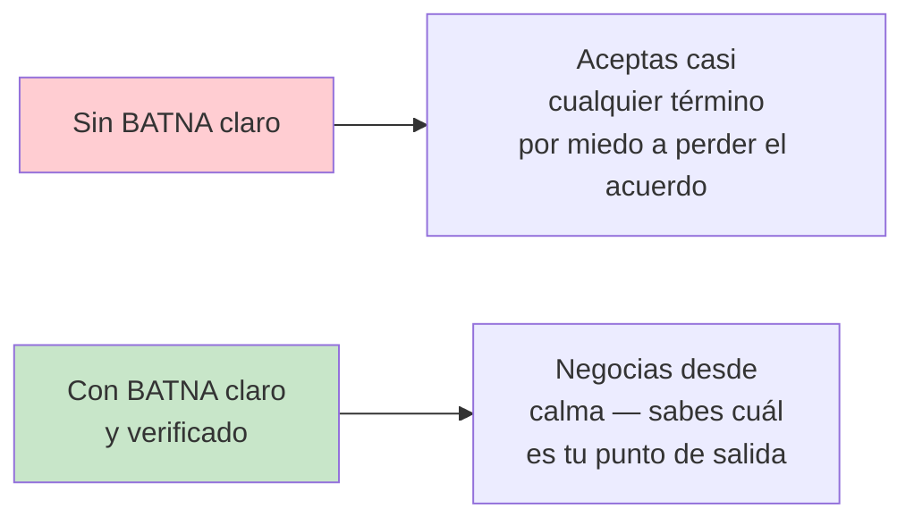
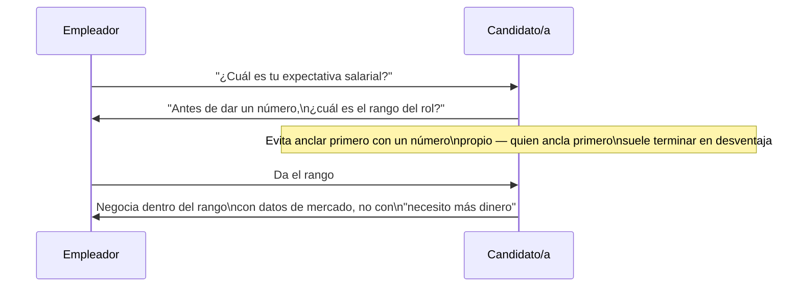
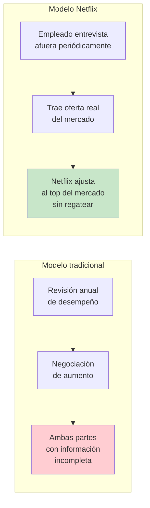

# Negociación Técnica y de Carrera

## Resumen Ejecutivo

Negociación no es solo "pedir más salario" — es una habilidad que usas cada semana: negociar un
deadline con producto, negociar alcance con un stakeholder que quiere todo para ayer, negociar prioridad
de recursos con otro equipo. Este tema cubre el modelo de **negociación basada en intereses** (no en
posiciones), que es el mismo framework tanto para negociar una oferta de trabajo como para negociar que
un proyecto tenga 2 semanas más de tiempo.

## 🧒 Explicación para Dummies (ELI5)

Dos hermanos se pelean por una naranja. Cada uno dice "la quiero toda" (posición). Si el papá la corta a
la mitad, ambos quedan parcialmente insatisfechos. Pero si el papá pregunta "¿para qué la quieres?", uno
dice "quiero el jugo" y el otro dice "quiero la cáscara para una receta". **Ambos pueden tener el 100%
de lo que realmente querían** — jugo para uno, cáscara para el otro — en vez de la mitad de lo que
pidieron.

Esa es la diferencia entre negociar por **posiciones** ("quiero la naranja entera") y negociar por
**intereses** ("¿para qué la necesitas realmente?"). Casi toda negociación técnica mal hecha se queda en
el nivel de posiciones ("necesito 2 semanas más" vs. "no, tiene que salir el viernes") sin nunca llegar
al interés real detrás ("¿por qué el viernes específicamente? ¿qué pasa si no?").

## 🎯 Objetivos de Aprendizaje

Al terminar este tema podrás:

- Distinguir posición de interés en cualquier negociación técnica
- Aplicar el concepto de BATNA (tu mejor alternativa si no hay acuerdo) antes de negociar cualquier cosa
- Negociar una oferta de trabajo o un ajuste salarial sin quemar la relación con el empleador
- Reconocer cuándo estás negociando y cuándo en realidad solo estás pidiendo permiso

## 📋 Prerequisitos

- [Comunicación Escrita](../communication/written-communication.md)
- [Ownership y Liderazgo Técnico](../leadership/leadership-mindset.md)

## 📖 Definición

**Negociación basada en intereses** (Harvard Negotiation Project, ver Historia) es un método que separa
a las personas del problema, se enfoca en los intereses subyacentes (no en las posiciones declaradas),
genera opciones que beneficien a ambas partes antes de decidir, y usa criterios objetivos para resolver
diferencias — en vez de una simple pulseada de voluntades donde gana quien cede menos.

## 🕰️ Historia y Motivación

El modelo de negociación basada en intereses se formalizó en el libro *Getting to Yes* (1981) de Roger
Fisher y William Ury, producto del Harvard Negotiation Project, y sigue siendo el marco de referencia
enseñado en la mayoría de programas de negociación de MBA y liderazgo corporativo hasta hoy.

> 💎 **Perla Escondida #1**: el concepto más rentable de todo el libro para un ingeniero es el **BATNA**
> (Best Alternative To a Negotiated Agreement — tu mejor alternativa si esta negociación específica
> fracasa). Quien tiene el BATNA más fuerte tiene más poder de negociación, casi sin importar cuán bien
> argumente. Por eso "tener otra oferta en la mano" cambia tanto una negociación salarial: no es que la
> otra oferta te dé mejores argumentos — es que te da un BATNA real, y eso se siente en el tono de toda
> la conversación aunque nunca lo menciones explícitamente.

## 🧩 Conceptos Fundamentales

### 1. Posición vs. Interés

> 💎 **Perla Escondida #2**: la pregunta más subutilizada en negociación técnica es simplemente "¿por
> qué?", repetida 2-3 veces seguidas ("¿por qué el viernes? — porque el cliente lo ve entonces — ¿por
> qué lo ve entonces específicamente?"). Cada repetición pela una capa de posición y expone más el
> interés real. La mayoría de la gente se detiene en la primera respuesta y negocia sobre esa, perdiendo
> la oportunidad de encontrar una solución que satisfaga el interés real con mucho menos esfuerzo.

### 2. BATNA: Tu Poder de Negociación Real

Antes de cualquier negociación importante (salario, alcance, deadline), define por escrito: ¿cuál es mi
mejor alternativa real si esto no se resuelve como quiero? Si no tienes una, tu poder de negociación es
más bajo de lo que crees — y está bien, pero debes saberlo antes de sentarte a negociar, no descubrirlo
a mitad de la conversación.

> 💎 **Perla Escondida #3**: nunca reveles un BATNA débil ni finjas uno fuerte que no puedes sostener —
> ambos son errores costosos. Revelar debilidad ("si no aceptas esto no tengo otra opción") elimina tu
> poder de negociación por completo. Fingir fuerza que no existe ("tengo otra oferta" cuando no la hay)
> es un riesgo reputacional enorme si se descubre. La posición correcta es simplemente no revelar el
> BATNA en ningún sentido — dejar que la otra parte no sepa cuán fuerte o débil es, sin mentir sobre ello.

### 3. Negociación Salarial: El Caso Especial

> 💎 **Perla Escondida #4**: en negociación salarial, quien menciona el primer número numérico "ancla"
> la conversación alrededor de ese número — por eso conviene, siempre que sea posible, preguntar el rango
> antes de dar una cifra propia. Si te obligan a dar un número primero, da un rango (no un número único)
> basado en datos de mercado reales (Levels.fyi, Glassdoor, conversaciones con reclutadores de otras
> empresas) — un rango con evidencia pesa mucho más que "siento que merezco X".

## 🏢 Caso Real: Netflix y "Pay Top of Market"

Netflix documentó públicamente (en su famoso memo de cultura "Freedom & Responsibility", y luego en el
libro de Reed Hastings y Erin Meyer *No Rules Rules*, 2020) una política poco común: pagar
deliberadamente en el percentil más alto del mercado para cada rol, sin bonos anuales tradicionales, y
animar explícitamente a los empleados a entrevistar en otras empresas cada año o dos — no para irse,
sino para que Netflix tenga datos reales de cuánto pagaría el mercado por ese empleado específico.

La lógica de Netflix, explicada en sus propios términos: la negociación salarial tradicional depende de
qué tan buen negociador es cada empleado, no de cuánto vale realmente su trabajo en el mercado — lo cual
genera inequidad (quien negocia mejor gana más, independientemente del desempeño real) y desgaste anual
repetido. Al pagar top-of-market de entrada y usar datos reales de mercado en vez de negociación
posicional, Netflix intenta eliminar la fricción de la negociación salarial recurrente a cambio de una
política de despido más directa cuando el desempeño no corresponde a ese salario alto — el trade-off
explícito de su modelo ("keeper test").

> 💎 **Perla Escondida #5**: el caso de Netflix ilustra el concepto de BATNA llevado a políticas de
> empresa: en vez de que cada empleado individual tenga que construir su propio BATNA para negociar
> (entrevistando en secreto, con el riesgo que eso implica), Netflix institucionalizó el proceso —
> anima a hacerlo abiertamente y usa esos datos como entrada legítima a la conversación salarial. Es un
> recordatorio de que las mismas herramientas de negociación individual (BATNA, datos de mercado, evitar
> el anclaje) también se pueden diseñar a nivel de política de una organización completa.

## ⚖️ Trade-offs

| Enfoque | Beneficio | Costo |
|---|---|---|
| Negociar por intereses | Soluciones ganar-ganar, relación intacta | Toma más tiempo que simplemente ceder o imponer |
| Negociar por posiciones | Rápido, simple | Deja valor sin capturar, puede dañar la relación |
| Aceptar sin negociar | Cero fricción inmediata | Costo compuesto a largo plazo (salario, precedente) |

## ✅ Buenas Prácticas

- Antes de negociar algo importante, escribe tu BATNA y el interés real de la otra parte (no su posición)
- En negociaciones de deadline/alcance, ofrece siempre 2-3 opciones con trade-offs claros, no un sí/no binario
- Negocia en tiempo real cuando sea posible (llamada), no solo por escrito — el tono importa
- Después de una negociación salarial, pide la oferta final por escrito antes de decidir

## 🚫 Anti-Patrones

### AP1: "El Negociador de Una Sola Ronda"

Aceptar la primera contraoferta sin explorar si hay espacio, asumiendo que negociar de vuelta "se ve mal".
En la mayoría de contextos profesionales, una contra-propuesta razonable y bien justificada no daña la
relación — de hecho, muchas empresas esperan al menos una ronda de negociación salarial.

### AP2: "Pedir Permiso Disfrazado de Negociación"

Presentar una solicitud como negociación ("¿podemos negociar el deadline?") sin ninguna alternativa,
dato o interés propio sobre la mesa — en realidad es solo pedir permiso. Negociación real requiere que
ambas partes tengan algo que la otra quiere; si solo estás pidiendo, dilo directamente, es más honesto.

## 🎤 Preguntas de Entrevista

**P: "Cuéntame de una negociación difícil que tuviste en un proyecto."**

R: La señal buscada es evidencia de haber buscado el interés real detrás de una posición (no solo "cedí"
o "impuse mi postura"), y idealmente una solución que benefició a ambas partes, no una donde "ganaste" a
costa de la otra.

## ☑️ Checklist

- [ ] Antes de mi última negociación importante, definí mi BATNA por escrito
- [ ] Sé identificar la diferencia entre la posición declarada de alguien y su interés real
- [ ] En la última negociación salarial que tuve, esperé a conocer el rango antes de dar un número
- [ ] Ofrezco opciones con trade-offs en vez de un sí/no binario cuando negocio alcance o tiempo

## 🔗 Conceptos Relacionados

- [Feedback y Crecimiento](../feedback/feedback-and-growth.md)
- [Presentaciones Técnicas Efectivas](../communication/presentations.md)
- [Ownership y Liderazgo Técnico](../leadership/leadership-mindset.md)

## 📚 Recursos Oficiales

- Roger Fisher & William Ury — *Getting to Yes* (1981), Harvard Negotiation Project
- Chris Voss — *Never Split the Difference* (2016)
- Patrick McKenzie — ensayo "Salary Negotiation" (kalzumeus.com)

## 📝 Resumen Final

Negociar bien no es ganar una discusión — es encontrar el interés real detrás de una posición declarada
y construir una solución que lo satisfaga con el menor costo posible para ambas partes. El BATNA (tu
mejor alternativa real) determina tu poder de negociación mucho más que la habilidad de argumentar, así
que definirlo por escrito antes de cualquier negociación importante —de alcance, deadline o salario— es
el paso más rentable que puedes dar antes de sentarte a la mesa.

## 📖 Diccionario Rápido de Este Tema

| Término | Qué significa | Contexto en este tema |
|---|---|---|
| BATNA (Best Alternative To a Negotiated Agreement) | Tu mejor alternativa real si la negociación actual fracasa | Concepto central de poder de negociación |
| Anclaje (anchoring) | Sesgo por el cual el primer número mencionado condiciona toda la negociación | Sección de negociación salarial |
| Negociación por intereses vs. posiciones | Enfocarse en el "por qué" detrás de una demanda, no en la demanda literal | Marco central del tema (Getting to Yes) |

## 🃏 Flashcards

1. **P:** ¿Qué es el BATNA y por qué determina tu poder de negociación?
   **R:** Tu mejor alternativa real si el acuerdo actual no se logra; entre más fuerte tu BATNA, más poder
   tienes, casi independientemente de cuán bien argumentes.

2. **P:** ¿Por qué conviene preguntar el rango salarial antes de dar tu propio número?
   **R:** Porque quien menciona el primer número "ancla" la negociación alrededor de esa cifra; dar el
   número primero suele terminar en desventaja.

## 🧪 Quiz

**1. Un stakeholder insiste en que el proyecto "tiene que salir el viernes". Según este tema, ¿cuál es la mejor primera respuesta?**

- A) Aceptar el viernes sin cuestionar
- B) Decir que es imposible y dejarlo ahí
- C) Preguntar por qué el viernes específicamente, para descubrir el interés real detrás de la fecha
- D) Escalarlo de inmediato a un manager

*Respuesta correcta: C*
