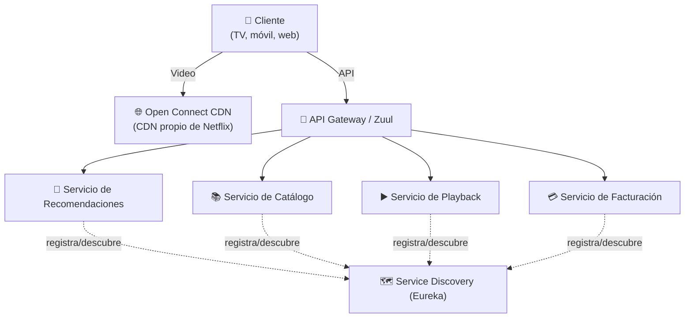
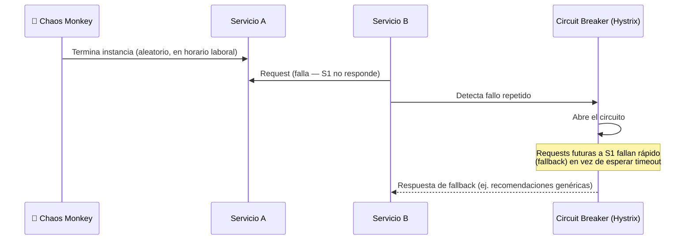

# Caso de Estudio: Netflix

## 🎯 Resumen Ejecutivo

Netflix sirve contenido a más de 260 millones de suscriptores en más de
190 países, representando en su momento hasta el 15% del tráfico total
de Internet en horas pico en algunas regiones. Su arquitectura es el
caso de estudio más citado de microservicios a gran escala — pero la
parte que casi nadie cuenta es que **empezaron como un monolito**, y la
migración fue forzada por un incidente real, no por una decisión
proactiva de moda arquitectónica.

## 📖 El Problema Original

En 2008, Netflix operaba un monolito Java corriendo en sus propios
centros de datos. Un fallo de corrupción en su base de datos relacional
dejó a la compañía **3 días sin poder enviar DVDs** a sus clientes. Este
incidente, no una charla de conferencia, es el origen real de su
migración a microservicios y a la nube (AWS) — que tomó **7 años**
completos (2008-2015), no un sprint de dos semanas.

## 📋 Requerimientos

- Disponibilidad extrema: el streaming de video no tolera downtime largo
- Escalado geográfico: servir contenido con baja latencia en 190+ países
- Resiliencia ante fallos parciales: un servicio caído no debe tumbar
  toda la experiencia de usuario
- Despliegues frecuentes e independientes por equipo (cientos de
  despliegues diarios en toda la organización)

## 🏗️ Arquitectura



**Decisión clave: CDN propio (Open Connect).** En vez de depender
completamente de terceros para entregar video, Netflix construyó su
propia red de distribución de contenido, colocando servidores
físicamente dentro de los ISPs de todo el mundo. Esto separa el
problema "entregar video" (resuelto por Open Connect) del problema
"decidir qué mostrar y gestionar la cuenta" (resuelto por los
microservicios en AWS).

> **💎 Perla escondida #1:** La mayoría de charlas sobre Netflix se
> centran en los microservicios de la capa de control (recomendaciones,
> catálogo, facturación), pero el verdadero tráfico masivo —el video en
> sí— **no pasa por esos microservicios en absoluto**. Va directo del
> CDN al dispositivo. Separar "plano de control" (decisiones, metadata)
> de "plano de datos" (el contenido pesado) es un patrón que aparece una
> y otra vez en sistemas a gran escala.

## ⚖️ Trade-offs

**✅ Ganancias de la migración a microservicios:**
- Equipos autónomos pueden desplegar sin coordinar con el resto de la organización
- Fallos aislados: si el servicio de Recomendaciones cae, el usuario
  puede seguir viendo contenido (solo pierde personalización)
- Escalado independiente por servicio según su carga real

**❌ Costos que asumieron:**
- Complejidad operacional masiva: cientos de microservicios requieren
  tooling propio (Eureka para service discovery, Hystrix para circuit
  breaking, Zuul como gateway — todos desarrollados internamente y luego
  liberados como open source)
- 7 años de migración incremental, no un rediseño de una vez
- Necesidad de inventar **Chaos Engineering** (Chaos Monkey, 2011) para
  poder confiar en que el sistema distribuido realmente toleraba fallos

## 🛡️ Resiliencia: Chaos Monkey

**💎 Perla escondida #2:** Chaos Monkey no nació de un deseo abstracto de
"probar resiliencia" — nació de la observación de que los servicios en
AWS **fallan constantemente** de forma impredecible (instancias que
mueren, zonas de disponibilidad que fallan). Netflix decidió: si van a
fallar de todas formas, mejor que fallen **on purpose, en horario
laboral, cuando el equipo puede observar y responder**, que a las 3am de
un domingo sin nadie mirando. Chaos Monkey mata instancias de producción
aleatoriamente durante el día para forzar a que cada servicio esté
diseñado para tolerar la pérdida de sus dependencias.



## 📈 Escalabilidad y Costos

Netflix opera casi en su totalidad en AWS (no en centros de datos
propios, salvo el CDN Open Connect), pagando por capacidad elástica en
vez de mantener infraestructura fija dimensionada para el pico máximo.
Esta decisión de **no ser dueños de su infraestructura de cómputo**
—pero sí de su CDN de entrega de contenido— refleja un principio de
arquitecto: sé dueño de lo que es tu ventaja competitiva real (la
entrega de video de bajísima latencia), y delega lo que es una
commodity (cómputo genérico).

> **💎 Perla escondida #3:** Muchas empresas intentan copiar "Netflix usa
> microservicios" sin copiar la parte más cara y menos glamorosa: la
> inversión en **herramientas internas de observabilidad y resiliencia**
> (Hystrix, Eureka, Chaos Monkey, Atlas para métricas). Adoptar
> microservicios sin esa inversión es adoptar la complejidad sin las
> herramientas que la hacen manejable.

## 🔒 Seguridad y Disponibilidad

- Múltiples zonas de disponibilidad y regiones de AWS para tolerar la
  caída de una región completa
- Autenticación y autorización centralizadas en el API Gateway, no
  duplicadas en cada microservicio
- SLA de disponibilidad extremadamente alto para el catálogo y
  reproducción, con degradación elegante (mostrar catálogo cacheado si
  el servicio de recomendaciones en tiempo real falla) en vez de fallo
  total

## 🧠 Lecciones Clave para Tu Propia Arquitectura

1. **No empieces donde Netflix terminó.** Empezaron con un monolito
   durante años. La migración fue una respuesta a un incidente real
   medible, no una preferencia estética.
2. **Microservicios sin herramientas de resiliencia son solo
   complejidad distribuida.** Si vas a adoptarlos, presupuesta también
   circuit breakers, service discovery y observabilidad.
3. **Separa el plano de control del plano de datos** cuando el volumen
   de datos pesados (video, en este caso) es órdenes de magnitud mayor
   que el de metadata.

## ❓ Preguntas de Entrevista

**P1: "¿Qué aprendizaje de Netflix aplicarías a un sistema mucho más pequeño?"**

*Respuesta modelo:* "El principio de degradación elegante: diseñar cada
componente para que, si una dependencia falla, el sistema ofrezca una
versión reducida del servicio en vez de fallar completamente — por
ejemplo, mostrar contenido cacheado si el servicio de personalización
está caído. Esto aplica sin importar la escala."

## 🏁 Resumen Final

Netflix es el caso de estudio de microservicios más citado, pero su
lección más valiosa no es "usa microservicios" — es "invierte en
resiliencia y observabilidad en proporción a la complejidad distribuida
que introduces, y migra por evidencia de un problema real, no por moda."

## 🃏 Flashcards

```
Q: ¿Qué evento real forzó la migración de Netflix a microservicios?
A: Un incidente de corrupción de base de datos en 2008 que los dejó 3 días sin poder enviar DVDs.

Q: ¿Qué es Chaos Monkey y por qué se creó?
A: Una herramienta que termina instancias de producción aleatoriamente en horario laboral, para forzar que los servicios toleren fallos de forma controlada y observable, en vez de descubrir esa fragilidad en un incidente real sin nadie mirando.

Q: ¿Por qué Netflix separa su CDN (Open Connect) de sus microservicios en AWS?
A: Porque el volumen de tráfico de video (plano de datos) es órdenes de magnitud mayor que el de las decisiones de negocio (plano de control), y cada uno tiene requisitos de escalado completamente distintos.
```

## 📖 Diccionario Rápido de Este Tema

| Término | Qué significa | Contexto en este tema |
|---|---|---|
| **Chaos Monkey** | Herramienta de Netflix que apaga instancias de producción al azar, en horario laboral, para forzar resiliencia. | Nació de aceptar que AWS falla constantemente — mejor fallar controladamente que a las 3am. |
| **Circuit Breaker** | Patrón que "abre el circuito" y deja de llamar a un servicio que está fallando repetidamente, respondiendo con un fallback en vez de esperar timeouts. | Implementado por Netflix en su herramienta Hystrix. |
| **Service Discovery** | Mecanismo para que un servicio encuentre la dirección de red de otro sin tenerla escrita a mano (hardcoded). | Netflix lo resuelve con su herramienta Eureka. |
| **CDN** | "Content Delivery Network" — servidores distribuidos geográficamente que entregan contenido (como video) cerca del usuario final. | Netflix construyó el suyo propio: Open Connect. |
| **Plano de control vs. plano de datos** | Plano de control = decisiones y metadata (qué mostrar, facturación). Plano de datos = el contenido pesado en sí (el video). | Netflix los separa completamente: microservicios manejan el control, Open Connect maneja el video. |
| **SLA** | "Service Level Agreement" — el compromiso formal de disponibilidad o rendimiento que un servicio promete cumplir. | Netflix diseña con degradación elegante para proteger su SLA de reproducción. |
| **Zona de disponibilidad** | Un centro de datos físicamente independiente dentro de una región de la nube (AWS, en este caso). | Netflix opera en múltiples zonas para tolerar que una completa falle. |
