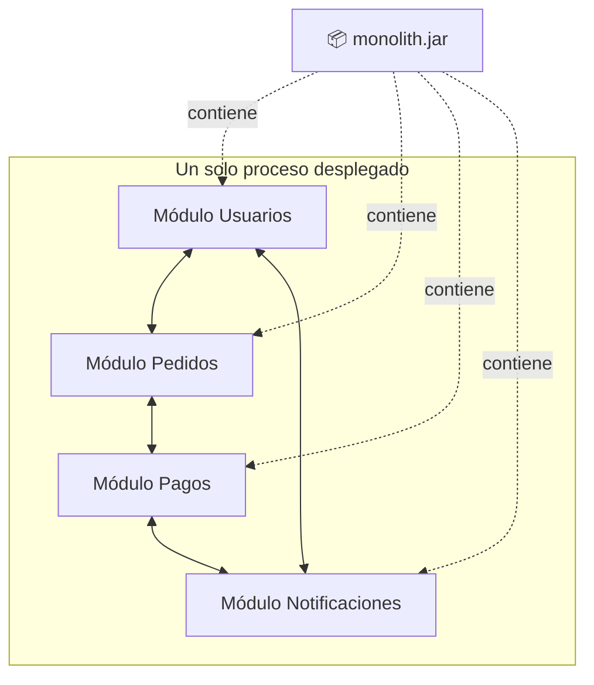
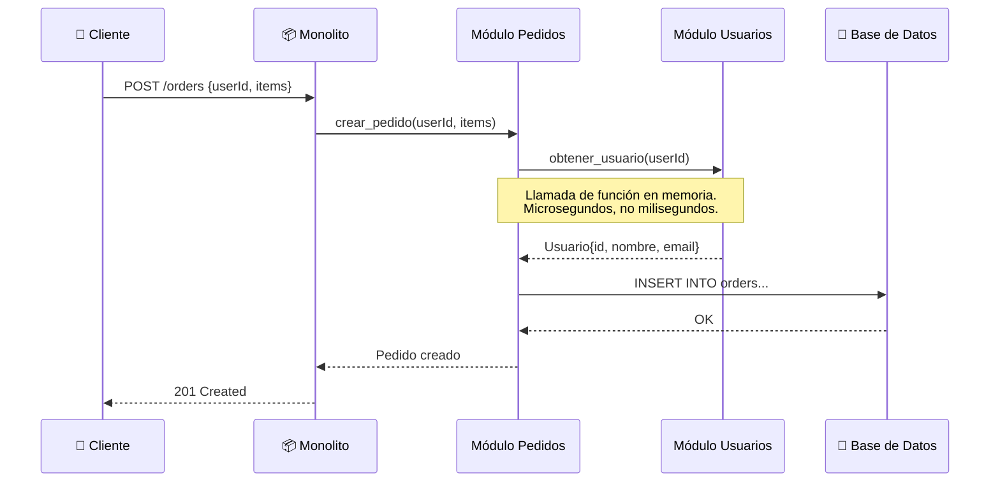
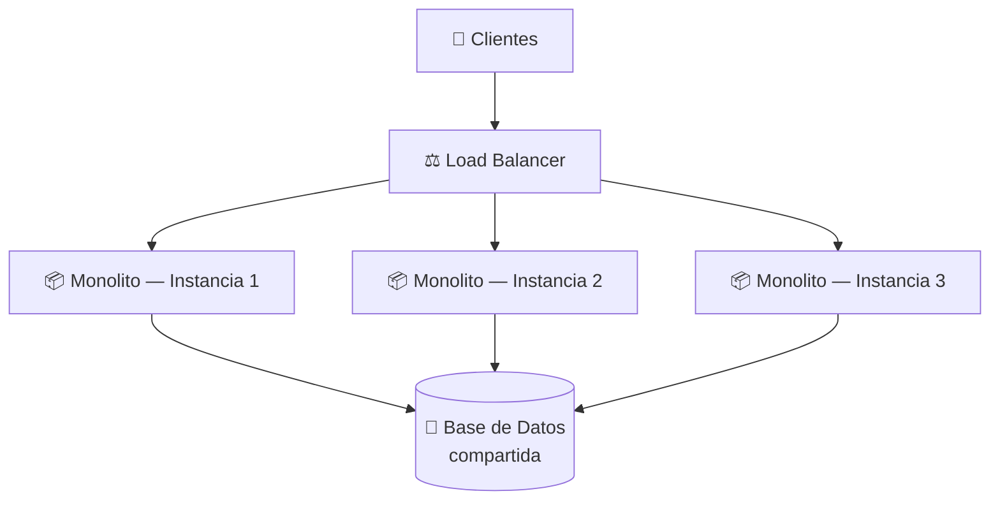
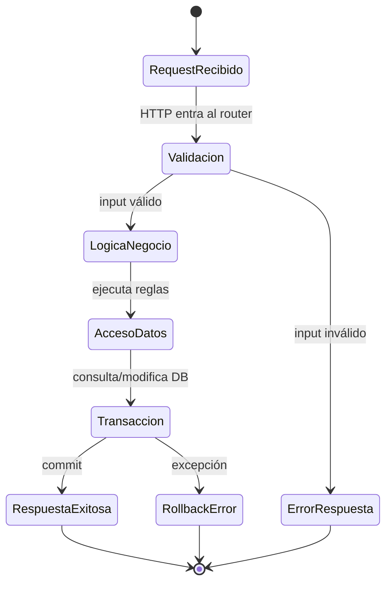

# Arquitectura Monolítica

## 🎯 Resumen Ejecutivo

Un **monolito** es una aplicación donde toda la lógica de negocio —
usuarios, pedidos, pagos, notificaciones— vive en un único proceso que se
despliega como una sola unidad. No es un "error de principiante" ni algo
que debas evitar: es la arquitectura por defecto correcta para el 90% de
los productos en su primer año de vida, y muchas empresas masivas (Shopify,
Basecamp, StackOverflow) la mantienen durante toda su existencia.

**Por qué te importa:** en una entrevista de Staff Engineer no te van a
preguntar "¿qué es un microservicio?" — te van a preguntar "¿cuándo NO
usarías microservicios?", y la respuesta correcta empieza entendiendo
profundamente el monolito.

## 🎓 Para Dummies (ELI5)

Imagina que tu cocina de casa es tu "aplicación". Tienes una sola cocina:
ahí guardas los ingredientes (base de datos), cocinas (lógica de negocio)
y sirves los platos (respuestas al usuario). Todo está en el mismo lugar,
con las mismas ollas y el mismo refrigerador.

Funciona perfecto si cocinas para tu familia. El problema aparece cuando
quieres abrir un restaurante con 50 cocineros: todos compitiendo por la
misma cocina, chocando entre sí, y si alguien quema algo, puede afectar
la comida de los demás. Ese es, en esencia, el problema que resuelven
arquitecturas más complejas — pero **no lo tienes hasta que lo tienes**:
no construyas una cocina industrial para cocinar para tres personas.

## 🎯 Objetivos de Aprendizaje

Al terminar este tema podrás:

- [ ] Explicar qué es un monolito a alguien sin experiencia técnica
- [ ] Identificar las 4 características que definen a un monolito
- [ ] Argumentar con datos cuándo un monolito es la decisión correcta
- [ ] Reconocer las señales de que un monolito necesita evolucionar
- [ ] Evitar el anti-patrón del "Big Ball of Mud" (bola de lodo)
- [ ] Responder con confianza la pregunta de entrevista "¿monolito o microservicios?"

## 📚 Prerequisitos

> **Antes de seguir, deberías dominar:**
> - Fundamentos de programación (funciones, clases, módulos)
> - Fundamentos de bases de datos (qué es una tabla, una consulta)
>
> Si no los tienes claros, este tema seguirá siendo legible, pero los
> ejemplos de código te costarán más.

## 🔍 Definición

> Un **monolito** es una aplicación de software en la que todos los
> componentes —interfaz, lógica de negocio y acceso a datos— están
> integrados en una única base de código y se despliegan como un solo
> artefacto ejecutable.

Definición técnica formal:

> Arquitectónicamente, un monolito presenta **acoplamiento de despliegue**
> (deployment coupling): no puedes actualizar una parte del sistema sin
> re-desplegar el sistema completo, porque todo comparte el mismo proceso
> en tiempo de ejecución.

## 📖 Historia y Motivación

### El problema que resolvía originalmente

Antes de que existiera el concepto de "arquitectura de software" como
disciplina separada, simplemente **así se escribía software**: no había
alternativa. En los años 90 y principios de los 2000, las aplicaciones
web (piensa en las primeras versiones de Amazon, eBay, o cualquier app
en Java EE / Rails / PHP) se construían como un único WAR, un único
proceso Rails, un único árbol de PHP.

La motivación no era "elegir un monolito" — era la forma natural y más
simple de resolver el problema: "necesito una app que reciba requests HTTP,
consulte una base de datos y devuelva HTML o JSON". Un solo proceso que
hace las tres cosas es la solución más directa posible.

### Cómo evolucionó la conversación

El término "monolito" se volvió casi peyorativo alrededor de 2014-2015,
cuando empresas como Netflix y Amazon popularizaron los microservicios y
la industria entera saltó a imitarlos — muchas veces sin tener el problema
de escala que Netflix y Amazon sí tenían. Este es uno de los patrones más
caros y más comunes en la historia reciente de la ingeniería de software:
copiar la solución de otro sin haber tenido su problema.

> **💎 Perla escondida #1:** Netflix no empezó con microservicios. Empezó
> como un DVD-by-mail monolítico y migró a microservicios *después* de
> un incidente de corrupción de base de datos en 2008 que los dejó 3 días
> sin poder enviar DVDs. La migración tomó **años**, no un sprint. Si tu
> empresa no tiene el problema de escala de Netflix en 2008, probablemente
> no necesitas su solución de 2015.

## 🧩 Conceptos Fundamentales

### Concepto 1: Unidad de Despliegue Única

**¿Qué es?** Todo el código —sin importar cuántos módulos internos
tenga— se compila, empaqueta y despliega como **un solo artefacto**
(un `.jar`, un contenedor Docker, una carpeta PHP).

**Analogía:** Es como imprimir un libro completo cada vez que corriges
una sola palabra en un capítulo, en vez de reimprimir solo esa página.



**💎 Perla escondida #2:** Muchos ingenieros creen que "monolito" significa
"código desorganizado". Falso. Puedes tener un monolito perfectamente
modular internamente (con límites claros entre módulos, interfaces
bien definidas) — a eso se le llama **monolito modular**, y es
frecuentemente el mejor punto intermedio antes de considerar
microservicios.

### Concepto 2: Base de Datos Compartida

**¿Qué es?** Todos los módulos leen y escriben en el mismo esquema de
base de datos, típicamente sin barreras de acceso entre ellos.

**Ejemplo real:** El módulo de "Pedidos" puede hacer un `JOIN` directo
con la tabla de "Usuarios" sin pasar por ninguna API — están en la misma
base de datos.

**Ventaja oculta:** Esto te da **transacciones ACID reales** entre
módulos. Si creas un pedido y necesitas descontar inventario, puedes
hacerlo en una sola transacción de base de datos. En un sistema
distribuido, este mismo problema requiere patrones complejos como Saga
(que verás más adelante en tu roadmap).

### Concepto 3: Comunicación In-Process

**¿Qué es?** Cuando el módulo de Pedidos necesita algo del módulo de
Usuarios, simplemente **llama a una función o método** — no hay red de
por medio, no hay serialización JSON, no hay latencia de red.



**💎 Perla escondida #3:** Esta es la razón real por la que los monolitos
son más rápidos en desarrollo: no hay "impuesto de red". Cada llamada
entre "servicios" en un monolito cuesta nanosegundos. La misma llamada
en microservicios cuesta milisegundos (red) + el trabajo de manejar
fallos parciales (¿qué pasa si el servicio de Usuarios está caído?).

### Concepto 4: Escalado Uniforme

**¿Qué es?** Para manejar más tráfico, no escalas "el módulo de Pedidos"
por separado — escalas **todo el proceso**, corriendo múltiples copias
idénticas detrás de un load balancer.



## 🏗️ Arquitectura y Funcionamiento Interno

### Componentes y Responsabilidades

| Componente | Responsabilidad | Notas |
|---|---|---|
| **Capa de presentación** | Recibe HTTP, serializa/deserializa | Controllers, routers |
| **Capa de negocio** | Reglas de negocio, validaciones | Services, use cases |
| **Capa de datos** | Acceso a la base de datos | Repositories, ORMs |
| **Base de datos** | Persistencia | Compartida entre todos los módulos |

### Flujo Paso a Paso: Ciclo de Vida de un Request



1. **Request entra**: El load balancer enruta a una instancia disponible.
2. **Router despacha**: El framework (Express, Rails, Spring) identifica
   qué controller maneja la ruta.
3. **Validación**: Se valida el payload antes de tocar lógica de negocio.
4. **Lógica de negocio**: El service ejecuta las reglas — todo esto ocurre
   **en el mismo proceso**, sin llamadas de red.
5. **Acceso a datos**: Se abre una transacción, se ejecutan queries.
6. **Commit o rollback**: Si todo salió bien, se confirma; si algo falla,
   se revierte **toda la transacción**, garantía que sistemas distribuidos
   no dan gratis.
7. **Respuesta**: Se serializa y se devuelve al cliente.

## 💻 Ejemplos de Código

### Ejemplo 1: Monolito sin separación (el punto de partida real)

```python
# monolith_v1.py — así empieza casi todo proyecto real, y está BIEN.

class Aplicacion:
    def __init__(self, db):
        self.db = db

    def registrar_usuario(self, email, password):
        # Validación
        if "@" not in email:
            raise ValueError("Email inválido")

        # Lógica de negocio + acceso a datos, todo junto
        usuario_id = self.db.insert(
            "usuarios", {"email": email, "password_hash": hash(password)}
        )

        # 💎 Nota: enviar el email de bienvenida aquí es tentador,
        # pero acopla el registro al proveedor de email. Ver Anti-patrón AP2.
        self.enviar_email_bienvenida(email)

        return usuario_id

    def crear_pedido(self, usuario_id, items):
        usuario = self.db.find("usuarios", usuario_id)
        if not usuario:
            raise ValueError("Usuario no existe")

        total = sum(item["precio"] * item["cantidad"] for item in items)

        # Transacción real: si algo falla, TODO se revierte.
        with self.db.transaction():
            pedido_id = self.db.insert("pedidos", {
                "usuario_id": usuario_id,
                "total": total,
            })
            for item in items:
                self.db.insert("pedido_items", {
                    "pedido_id": pedido_id,
                    **item,
                })
        return pedido_id
```

**Qué aprender:** esto es simple, funciona, y para una startup con 3
ingenieros es **la decisión correcta**. No hay nada que "arreglar" aquí
todavía.

### Ejemplo 2: Monolito Modular (el siguiente paso correcto)

```python
# monolith_v2.py — mismo proceso, mismo despliegue,
# pero con límites internos claros (monolito modular).

class UsuariosService:
    def __init__(self, repo):
        self.repo = repo

    def registrar(self, email, password):
        if "@" not in email:
            raise ValueError("Email inválido")
        return self.repo.crear(email, hash(password))

    def obtener(self, usuario_id):
        return self.repo.buscar_por_id(usuario_id)


class PedidosService:
    def __init__(self, repo, usuarios_service):
        self.repo = repo
        # 💎 Dependencia explícita, no acceso directo a la tabla de usuarios.
        # Esto es lo que hace que este monolito sea FÁCIL de separar
        # en microservicios el día que realmente lo necesites.
        self.usuarios_service = usuarios_service

    def crear(self, usuario_id, items):
        usuario = self.usuarios_service.obtener(usuario_id)
        if not usuario:
            raise ValueError("Usuario no existe")

        total = sum(item["precio"] * item["cantidad"] for item in items)
        with self.repo.transaction():
            return self.repo.crear_pedido(usuario_id, items, total)
```

**Diferencia clave:** `PedidosService` nunca toca la tabla `usuarios`
directamente — pasa siempre por `UsuariosService`. Es la misma app, el
mismo despliegue, la misma base de datos — pero el día de mañana, extraer
"Usuarios" como su propio servicio es un cambio localizado, no una
reescritura completa.

## ⚖️ Trade-offs

### ✅ Ventajas

**1. Velocidad de desarrollo inicial**
Un solo repositorio, un solo entorno de desarrollo, un solo comando para
levantar todo (`npm start`, `rails server`). Cero overhead de
coordinación entre servicios.

**2. Debugging simple**
Un stack trace completo, de principio a fin, en un solo proceso. Sin
distributed tracing, sin correlacionar logs de 5 servicios distintos.

**3. Transacciones ACID reales**
Como viste arriba: consistencia garantizada por la base de datos, sin
necesidad de patrones compensatorios complejos.

**4. Deployment simple**
Un solo artefacto, un solo pipeline de CI/CD, un solo rollback si algo
sale mal.

### ❌ Desventajas

**1. Escalado uniforme, no selectivo**
Si el módulo de "Reportes" es pesado en CPU pero "Login" es liviano, no
puedes escalar solo Reportes — escalas el proceso completo, incluyendo
el código de Login que no lo necesita.

**2. Blast radius grande**
Un memory leak en un módulo poco usado puede tumbar el proceso completo,
afectando funcionalidades que no tenían nada que ver.

**3. Fricción organizacional a partir de cierto tamaño de equipo**
Con 5 ingenieros, un monolito es perfecto. Con 80 ingenieros tocando el
mismo repositorio, los merge conflicts y la coordinación de despliegues
se vuelven un costo real (esto es la **Ley de Conway** en acción: la
arquitectura del software tiende a reflejar la estructura de comunicación
de la organización que lo construye).

**4. Lock-in tecnológico**
Todo el sistema comparte lenguaje y runtime. Si quieres usar Python para
un módulo de Machine Learning y tu monolito es Java, no es trivial.

## ✨ Buenas Prácticas

**BP1 — Diseña módulos con límites claros desde el día 1**

```python
# ✅ CORRECTO: acceso a través de una interfaz de servicio
usuario = usuarios_service.obtener(usuario_id)

# ❌ INCORRECTO: acceso directo a la tabla de otro dominio
usuario = db.query("SELECT * FROM usuarios WHERE id = ?", usuario_id)
```

**BP2 — Una transacción, una responsabilidad de negocio**
No mezcles operaciones no relacionadas en la misma transacción — dificulta
razonar sobre qué puede fallar y por qué.

**BP3 — Trata los límites de módulo como si ya fueran límites de servicio**
Escribe el código como si algún día `UsuariosService` pudiera convertirse
en una llamada HTTP a otro servicio. Esto hace que una futura extracción
sea mecánica, no una reescritura.

## ⚠️ Anti-patrones y Errores Comunes

### AP1: El "Big Ball of Mud" (Bola de Lodo)

```python
# ❌ Nadie planeó esto, simplemente pasó con el tiempo
def procesar_pedido(datos):
    # 300 líneas mezclando validación, SQL crudo,
    # llamadas a APIs externas, lógica de email,
    # y cálculos de impuestos, todo en una función.
    ...
```

**Por qué pasa:** no por elegir un monolito, sino por **no mantener
límites internos**. Un monolito modular bien diseñado no tiene este
problema — el Big Ball of Mud es un fallo de disciplina, no de
arquitectura.

**Cómo evitarlo:** revisiones de código enfocadas específicamente en
"¿esta función está tocando responsabilidades de más de un módulo?".

### AP2: Acoplar efectos secundarios lentos a la transacción principal

```python
# ❌ INCORRECTO
def registrar_usuario(email, password):
    usuario_id = db.insert(...)
    enviar_email_bienvenida(email)  # si el proveedor de email está lento,
                                      # el usuario espera innecesariamente
    return usuario_id
```

```python
# ✅ MEJOR: encola el efecto secundario, no bloquees el request
def registrar_usuario(email, password):
    usuario_id = db.insert(...)
    cola_de_eventos.encolar("usuario_registrado", {"email": email})
    return usuario_id
```

> **💎 Perla escondida #4:** Este es el punto exacto donde muchos equipos
> descubren que necesitan **Event-Driven Architecture** — no porque
> decidieron "hacer microservicios", sino porque un monolito bien llevado
> naturalmente empieza a necesitar desacoplar efectos secundarios lentos.
> Es la puerta de entrada natural al siguiente nivel de tu roadmap.

## 🔬 Comparaciones y Casos de Uso

| Escenario | ¿Monolito? |
|---|---|
| Startup, equipo < 15 personas | ✅ Sí, casi siempre |
| MVP / validar producto-mercado | ✅ Sí, sin duda |
| Equipo > 50 personas en el mismo repo | ⚠️ Considera modularizar o dividir |
| Necesitas escalar un módulo 100x más que el resto | ⚠️ Señal de alerta |
| Distintos SLAs por funcionalidad (pagos vs. reportes) | ⚠️ Señal de alerta |
| Cumplimiento regulatorio exige aislar un dominio (ej. PCI-DSS para pagos) | ❌ Considera extraerlo |

**Cuándo usarlo:** producto nuevo, equipo pequeño-mediano, dominio de
negocio aún no bien entendido (es más fácil reorganizar código en un
monolito que reorganizar límites de servicios en producción).

**Cuándo NO usarlo:** cuando ya tienes evidencia medible (no intuición)
de que el equipo o la escala lo exigen — ver `scalability-101` y
`microservices` en tu roadmap antes de decidir.

## 🏢 Caso Real

**Shopify** procesa miles de millones de dólares en transacciones sobre
lo que ellos mismos llaman un **"monolito modular"** (lo describen
públicamente como *"Majestic Monolith"*, término acuñado por DHH, creador
de Ruby on Rails). En vez de dividir en microservicios, invirtieron en
límites internos fuertes entre módulos (a través de un patrón que
llaman *component-based architecture*) dentro del mismo despliegue.
Resultado: mantienen la velocidad de desarrollo de un monolito a escala
de miles de ingenieros.

## 🧠 Cómo Piensa un Arquitecto

Un arquitecto senior no pregunta "¿monolito o microservicios?" como una
elección binaria de estilo. Pregunta: *"¿Qué problema específico, medible,
tengo hoy que un monolito no puede resolver?"* Si la respuesta es "ninguno
concreto, pero he leído que microservicios es lo moderno", la respuesta
correcta es quedarse con el monolito y seguir modularizando internamente.
El arquitecto también evalúa el **costo organizacional** de cada decisión,
no solo el técnico: microservicios resuelven problemas de coordinación de
equipos grandes tanto como problemas técnicos de escala.

## ❓ Preguntas de Entrevista

**P1: "¿Cuándo usarías un monolito en vez de microservicios?"**

*Respuesta modelo:*
> "Lo usaría cuando el equipo es pequeño (menos de ~20 personas), el
> dominio de negocio todavía está siendo descubierto (los límites entre
> módulos cambian frecuentemente), y no tengo evidencia concreta de
> necesidades de escalado diferenciado entre partes del sistema. La
> velocidad de iteración y la simplicidad operacional superan los
> beneficios teóricos de microservicios en esa etapa."

*Qué busca el entrevistador:* que menciones trade-offs concretos, no una
opinión absoluta, y que reconozcas el costo organizacional además del
técnico.

**P2: "¿Cómo evitarías que un monolito se convierta en una bola de lodo?"**

*Respuesta modelo:*
> "Definiendo límites de módulo explícitos desde el principio —cada
> módulo accede a los datos de otro solo a través de su servicio, nunca
> por SQL directo— y reforzándolo en code review. Trato los límites
> internos como si algún día fueran a convertirse en límites de red."

**P3: "¿Qué señales te dirían que es momento de dividir un monolito?"**

*Respuesta modelo:*
> "Señales organizacionales: equipos que constantemente bloquean sus
> despliegues entre sí. Señales técnicas: necesidad real de escalar un
> módulo específico de forma desproporcionada, o requisitos de
> aislamiento (seguridad, cumplimiento) para un dominio concreto. Nunca
> lo haría solo porque 'es lo que hace la industria'."

## 📋 Checklist de Implementación

- [ ] ¿Cada módulo tiene una interfaz de servicio clara (no acceso directo a tablas ajenas)?
- [ ] ¿Las transacciones están limitadas a una sola responsabilidad de negocio?
- [ ] ¿Los efectos secundarios lentos (emails, notificaciones) están desacoplados del flujo principal?
- [ ] ¿Existe una razón medible (no intuición) para considerar dividir el sistema?
- [ ] ¿El equipo entiende la diferencia entre "monolito desordenado" y "monolito modular"?

## 🔗 Temas Relacionados

- Layered Architecture *(próximamente)* — cómo organizar las capas internas
- [API Design](./api-design.md) — el contrato que expondrás sin importar la arquitectura interna
- [Scalability 101](../patterns/event-driven-architecture.md) — el siguiente nivel de tu roadmap
- Microservicios *(próximamente)* — la alternativa, y cuándo sí tiene sentido

## 📚 Recursos Oficiales

**Libros:**
- *"Building Microservices"* — Sam Newman (el capítulo 1 explica honestamente por qué empezar con un monolito)
- *"Monolith to Microservices"* — Sam Newman

**Artículos:**
- *"MonolithFirst"* — Martin Fowler (martinfowler.com) — el artículo que popularizó el término "monolito modular"
- *"The Majestic Monolith"* — DHH (signalvnoise.com)

**Videos:**
- *"Monolith Decomposition Patterns"* — charlas de GOTO Conferences sobre cuándo y cómo dividir

## 🏁 Resumen Final

**Qué es:** una aplicación donde toda la lógica vive en un único proceso
desplegado como unidad.

**Por qué importa:** es la arquitectura correcta por defecto para la
mayoría de productos en su primer año, y muchas empresas la mantienen
para siempre con éxito.

**Cuándo lo usas:** equipos pequeños-medianos, dominio de negocio en
evolución, sin evidencia concreta de necesidades de escalado
diferenciado.

**Trade-offs:**
✅ Velocidad de desarrollo, debugging simple, transacciones ACID reales
❌ Escalado uniforme, blast radius grande, fricción con equipos grandes

**Recuerda:**
- Monolito ≠ código desordenado. Un monolito modular es una arquitectura legítima y duradera.
- No dividas por moda — divide por evidencia.
- Los límites internos de hoy son la extracción de mañana.

## 🃏 Flashcards

```
Q: ¿Qué es un monolito?
A: Una aplicación donde toda la lógica de negocio vive en un único proceso desplegado como una sola unidad.

Q: ¿Cuál es la ventaja principal de la comunicación in-process?
A: No hay latencia de red — las llamadas entre módulos cuestan nanosegundos, no milisegundos.

Q: ¿Qué es un "monolito modular"?
A: Un monolito con límites internos claros entre módulos, donde cada uno accede a los datos de otro solo a través de una interfaz de servicio, nunca por SQL directo.

Q: ¿Qué es el "Big Ball of Mud"?
A: Un anti-patrón donde un sistema (monolítico o no) pierde todo límite interno claro, mezclando responsabilidades sin ninguna estructura.

Q: ¿Qué ventaja transaccional tiene un monolito que un sistema distribuido pierde por defecto?
A: Transacciones ACID reales entre distintos módulos de negocio, garantizadas por la base de datos compartida.
```

## 📝 Quiz

1. **¿Cuál de estas NO es una característica de un monolito?**
   - [ ] Unidad de despliegue única
   - [ ] Base de datos compartida
   - [x] Comunicación entre módulos vía HTTP y red
   - [ ] Comunicación entre módulos en memoria (in-process)

   *Explicación: la comunicación vía HTTP entre componentes es característica de sistemas distribuidos (microservicios), no de un monolito, donde la comunicación es in-process.*

2. **Un equipo de 8 personas está construyendo el MVP de una startup. ¿Qué arquitectura recomendarías?**
   - [x] Monolito modular
   - [ ] Microservicios desde el día 1
   - [ ] Arquitectura serverless distribuida
   - [ ] Event-driven con 10 colas de mensajes

   *Explicación: con un equipo pequeño y un dominio de negocio aún sin validar, un monolito modular maximiza velocidad de iteración sin sacrificar la posibilidad de evolucionar después.*

3. **¿Qué señal es la MÁS fuerte para considerar dividir un monolito?**
   - [ ] "Leí un blog post de Netflix sobre microservicios"
   - [ ] "El código se ve grande"
   - [x] "Tenemos evidencia medible de que un módulo específico necesita escalar 100x más que el resto, o equipos que constantemente se bloquean entre sí"
   - [ ] "Ya llevamos 6 meses con el mismo repositorio"

   *Explicación: las decisiones arquitectónicas deben basarse en evidencia medible (técnica u organizacional), no en tamaño percibido o tendencias de la industria.*

## 📖 Diccionario Rápido de Este Tema

Si algún término de arriba no te sonó familiar, aquí está explicado en corto —
como te lo explicaría un senior en un pasillo, no un libro de texto.

| Término | Qué significa | Contexto en este tema |
|---|---|---|
| **Acoplamiento de despliegue** | Que no puedas actualizar una parte del sistema sin re-desplegar todo lo demás. | Es la característica que define técnicamente a un monolito. |
| **ACID** | Siglas de Atomicidad, Consistencia, Aislamiento, Durabilidad — las garantías que da una transacción de base de datos bien hecha. | Un monolito las obtiene "gratis" al compartir una sola base de datos. |
| **Blast radius** | Qué tanto del sistema se ve afectado cuando algo falla. Literalmente, "radio de la explosión". | Un bug en un monolito puede tener blast radius grande: afecta todo el proceso. |
| **Big Ball of Mud** | Anti-patrón donde el código perdió toda estructura interna clara, sin importar la arquitectura. | No es un problema exclusivo de monolitos — es falta de disciplina de límites internos. |
| **WAR (Java)** | "Web Application Archive" — el formato en que se empaquetaba una app Java para desplegarla como una sola unidad. | Ejemplo histórico de cómo se desplegaban los monolitos antes de Docker. |
| **Ley de Conway** | La arquitectura de un sistema tiende a copiar la estructura de comunicación del equipo que lo construye. | Explica por qué equipos grandes migran a microservicios: no es solo técnico, es organizacional. |
