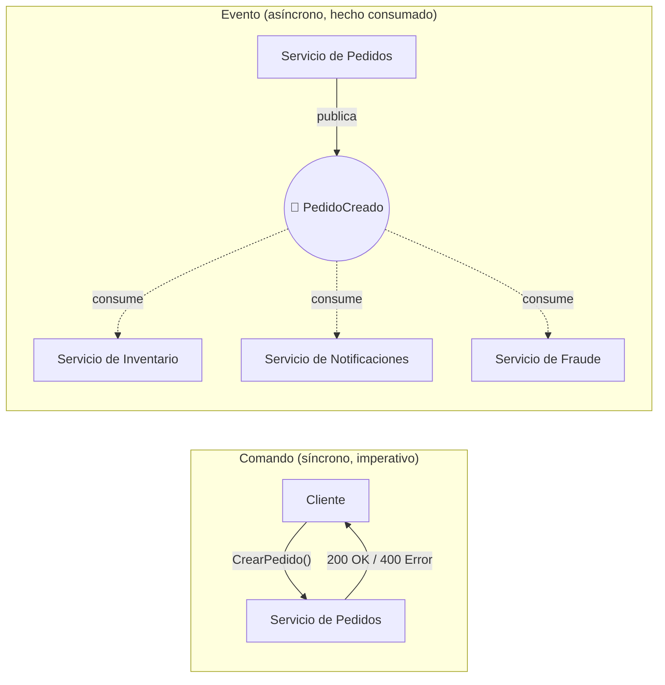
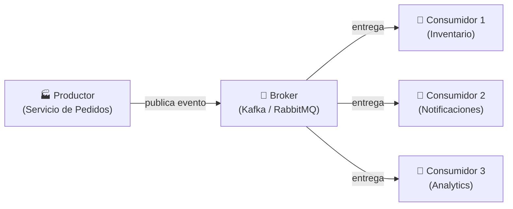
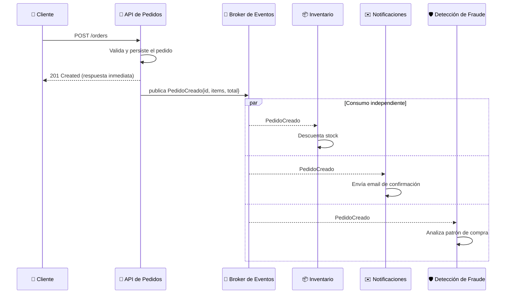

# Event-Driven Architecture

## 🎯 Resumen Ejecutivo

**Event-Driven Architecture (EDA)** es un estilo arquitectónico donde los
componentes se comunican **publicando y reaccionando a eventos**, en vez
de llamarse directamente unos a otros. Un "evento" es simplemente el
registro de algo que ya ocurrió: `PedidoCreado`, `PagoConfirmado`,
`UsuarioRegistrado`.

**Por qué te importa:** es el requisito conceptual real antes de tocar
Kafka, RabbitMQ, o cualquier "cola de mensajes" — si no entiendes por qué
existe EDA, esas herramientas son magia negra que usas por copiar
tutoriales, no por entender el problema que resuelven.

## 🎓 Para Dummies (ELI5)

Imagina un grupo de WhatsApp de un edificio de departamentos. Cuando el
portero recibe un paquete, no llama personalmente a cada uno de los 50
vecinos para avisarles ("llamada directa" = acoplamiento). En cambio,
**publica un mensaje en el grupo**: "Llegó un paquete para el depto 4B".
El portero no sabe ni le importa quién está mirando el grupo en ese
momento, ni cuántos vecinos hay, ni qué hará cada uno con esa información.
Cada vecino interesado **reacciona** al mensaje a su manera: alguien baja
por su paquete, otro lo ignora porque no es para él.

Eso es exactamente EDA: un **publicador** (el portero) emite un
**evento** (el mensaje) sin saber quién lo consumirá, y los
**suscriptores** (los vecinos) reaccionan de forma independiente.

## 🎯 Objetivos de Aprendizaje

- [ ] Diferenciar "comando" de "evento"
- [ ] Explicar la diferencia entre acoplamiento síncrono y asíncrono
- [ ] Identificar cuándo un problema pide EDA y cuándo NO
- [ ] Reconocer el anti-patrón del "monolito distribuido"
- [ ] Entender por qué EDA es requisito conceptual para Kafka/RabbitMQ

## 📚 Prerequisitos

> - [Arquitectura Monolítica](../fundamentals/monolith-architecture.md) — necesitas entender qué problema tiene la comunicación in-process antes de apreciar por qué desacoplar importa
> - [API Design](../fundamentals/api-design.md) — para entender la diferencia entre un contrato síncrono (REST) y uno asíncrono (eventos)

## 🔍 Definición

> **Event-Driven Architecture** es un patrón donde los componentes de un
> sistema se comunican mediante la producción y el consumo de eventos —
> hechos inmutables que describen algo que ya sucedió— en lugar de
> invocarse directamente.

Definición técnica formal:

> EDA introduce **acoplamiento temporal débil**: el productor de un
> evento no necesita que el consumidor esté disponible en el momento de
> la publicación, ni conoce su identidad. La comunicación ocurre a
> través de un intermediario (broker) que garantiza la entrega.

## 📖 Historia y Motivación

### El problema real

Retomando el `monolith-architecture.md`: viste el Anti-patrón AP2, donde
`registrar_usuario()` llamaba directamente a `enviar_email_bienvenida()`,
bloqueando el request si el proveedor de email estaba lento. Este es
el dolor real y concreto que EDA resuelve — no es una moda, es una
respuesta a un problema que **ya tuviste** en el tema anterior.

A medida que los sistemas crecen, aparecen más y más de estas
dependencias: "cuando se crea un pedido, además hay que actualizar
inventario, notificar al almacén, calcular puntos de lealtad, y avisar
al equipo de fraude". Si cada una de estas llamadas es directa y
síncrona, el sistema se vuelve **frágil**: si el servicio de fraude está
caído, ¿debería fallar la creación del pedido completo?

### Cómo se popularizó

El patrón existe desde los años 80 en sistemas financieros y de trading
(donde la reacción a eventos de mercado en tiempo real era el negocio
mismo), pero se popularizó ampliamente en la industria de software de
consumo con la llegada de brokers de mensajería robustos y accesibles
como RabbitMQ (2007) y, más tarde, Apache Kafka (2011, creado en LinkedIn
específicamente para manejar streams de eventos a gran escala).

> **💎 Perla escondida #1:** Kafka no fue diseñado originalmente como una
> "cola de mensajes" — fue diseñado como un **log distribuido e
> inmutable**. Esa diferencia importa: en una cola tradicional, el
> mensaje desaparece cuando se consume. En Kafka, el evento permanece
> en el log durante un periodo configurable, y **múltiples consumidores
> distintos pueden leerlo de forma independiente**, cada uno a su propio
> ritmo. Es la diferencia entre un buzón de correo (RabbitMQ, clásicamente)
> y una grabación de radio que puedes rebobinar (Kafka).

## 🧩 Conceptos Fundamentales

### Concepto 1: Evento vs. Comando

**¿Qué es?** Un **comando** es una petición de que algo suceda ("CrearPedido"
— imperativo, puede ser rechazado). Un **evento** es la notificación de
que algo ya sucedió ("PedidoCreado" — pasado, es un hecho, no se puede
"rechazar").



**💎 Perla escondida #2:** El error más común de juniors migrando a EDA
es nombrar sus eventos como comandos: `CrearNotificacion` en vez de
`PedidoCreado`. Si tu "evento" le está diciendo a otro servicio qué hacer,
en realidad es un comando disfrazado, y probablemente deberías estar
usando una llamada directa (o estás creando un acoplamiento oculto: el
productor ya sabe qué hará el consumidor, lo cual rompe el propósito
mismo de EDA).

### Concepto 2: Productor, Broker y Consumidor



- **Productor:** emite el evento, no sabe ni le importa quién lo consume.
- **Broker:** intermediario que garantiza entrega, orden (a veces) y
  persistencia temporal del evento.
- **Consumidor:** reacciona al evento de forma independiente y a su
  propio ritmo.

### Concepto 3: Acoplamiento Temporal vs. Acoplamiento de Contrato

**¿Qué es?** EDA reduce el acoplamiento *temporal* (el consumidor no
necesita estar disponible en el momento exacto de la publicación) pero
**no elimina** el acoplamiento de *contrato* (productor y consumidor
siguen necesitando acordar la forma del evento).

**💎 Perla escondida #3:** Esta es la trampa en la que caen equipos que
adoptan EDA esperando "desacoplamiento total". Si cambias el formato del
evento `PedidoCreado` (por ejemplo, renombras un campo), **rompes a todos
los consumidores silenciosamente** — y como es asíncrono, el error puede
aparecer horas después, muy lejos del cambio que lo causó. La solución
real es versionar los esquemas de eventos (Schema Registry) desde el
día 1, no cuando ya duela.

## 🏗️ Arquitectura y Funcionamiento Interno

### Flujo completo: de "clic en comprar" a 3 servicios reaccionando



**Punto clave:** el cliente recibe su `201 Created` **antes** de que
Inventario, Notificaciones o Fraude terminen su trabajo. Esa es la
ganancia real de latencia percibida — el usuario no espera por trabajo
que no necesita ver reflejado inmediatamente.

### Componentes de una arquitectura EDA madura

| Componente | Responsabilidad |
|---|---|
| **Event Schema Registry** | Define y versiona la forma de cada evento |
| **Broker** | Enruta, persiste temporalmente, garantiza entrega |
| **Dead Letter Queue (DLQ)** | Captura eventos que fallaron repetidamente al procesarse |
| **Consumer Groups** | Permiten escalar el consumo horizontalmente sin duplicar trabajo |

## 💻 Ejemplos de Código

### Ejemplo 1: Antes (acoplamiento síncrono directo)

```python
# ❌ Acoplado: si enviar_email() es lento o falla, todo el request falla
def crear_pedido(usuario_id, items):
    pedido = db.insertar_pedido(usuario_id, items)
    inventario.descontar_stock(items)          # llamada directa
    notificaciones.enviar_email_confirmacion(usuario_id, pedido)  # llamada directa
    fraude.analizar(pedido)                     # llamada directa
    return pedido
```

### Ejemplo 2: Después (Event-Driven)

```python
# ✅ Desacoplado: el productor solo publica el hecho, no orquesta reacciones
def crear_pedido(usuario_id, items):
    pedido = db.insertar_pedido(usuario_id, items)

    event_bus.publicar("PedidoCreado", {
        "pedido_id": pedido.id,
        "usuario_id": usuario_id,
        "items": items,
        "total": pedido.total,
        "version_esquema": 1,   # 💎 versiona desde el día 1
    })

    return pedido  # responde inmediato, sin esperar a los consumidores


# --- En un servicio completamente distinto ---
@event_bus.suscribir("PedidoCreado")
def al_crear_pedido(evento):
    inventario.descontar_stock(evento["items"])


@event_bus.suscribir("PedidoCreado")
def notificar_cliente(evento):
    notificaciones.enviar_email_confirmacion(
        evento["usuario_id"], evento["pedido_id"]
    )
```

**Qué cambió realmente:** `crear_pedido()` ya no conoce la existencia de
Inventario, Notificaciones ni Fraude. Puedes agregar un cuarto consumidor
mañana (por ejemplo, Analytics) **sin tocar una sola línea** de
`crear_pedido()`.

## ⚖️ Trade-offs

### ✅ Ventajas

- **Desacoplamiento real entre servicios** — agregar un consumidor nuevo no requiere modificar al productor.
- **Resiliencia parcial** — si un consumidor está caído, los demás siguen funcionando; el evento espera en el broker.
- **Escalabilidad independiente** — cada consumidor escala según su propia carga.
- **Latencia percibida menor** — el cliente no espera por trabajo asíncrono.

### ❌ Desventajas

- **Consistencia eventual, no inmediata** — el stock puede tardar milisegundos (o más) en reflejarse tras crear el pedido.
- **Debugging más difícil** — un flujo que antes era un stack trace ahora está distribuido entre productor, broker y N consumidores.
- **Requiere infraestructura adicional** — un broker (Kafka/RabbitMQ) es un componente más para operar, monitorear y hacer resiliente.
- **Riesgo de eventos duplicados o fuera de orden** — según el broker y la configuración, debes diseñar consumidores idempotentes.

## ✨ Buenas Prácticas

**BP1 — Diseña eventos idempotentes**
Un consumidor debe poder procesar el mismo evento dos veces sin efectos
duplicados (ej. usando el `pedido_id` como clave de deduplicación).

**BP2 — Versiona el esquema del evento desde el primer día**
Incluye `version_esquema` en cada evento. Cambiar un campo sin versionar
rompe consumidores silenciosamente.

**BP3 — Usa una Dead Letter Queue**
Si un consumidor falla repetidamente al procesar un evento, no lo
reintentes infinitamente — muévelo a una DLQ para inspección manual.

## ⚠️ Anti-patrones y Errores Comunes

### AP1: El "Monolito Distribuido"

```
❌ Servicio A publica un evento, y espera SÍNCRONAMENTE
   una respuesta de Servicio B antes de continuar.
```

Esto no es EDA — es una llamada síncrona disfrazada de asíncrona, con
toda la complejidad operacional de un broker y ninguno de sus beneficios
de desacoplamiento real.

### AP2: Eventos como Comandos Encubiertos

Ya mencionado en la Perla #2: nombrar eventos en imperativo
(`EnviarNotificacion`) revela que el productor sabe demasiado sobre lo
que el consumidor debe hacer. Nombra siempre en pasado: `PedidoCreado`,
`PagoConfirmado`.

### AP3: No manejar duplicados

```python
# ❌ Si el broker entrega el evento dos veces (puede pasar),
# descontarás stock dos veces.
def al_crear_pedido(evento):
    inventario.descontar_stock(evento["items"])
```

```python
# ✅ Idempotente: verifica si ya procesaste este pedido_id
def al_crear_pedido(evento):
    if ya_procesado(evento["pedido_id"]):
        return
    inventario.descontar_stock(evento["items"])
    marcar_procesado(evento["pedido_id"])
```

## 🔬 Comparaciones y Casos de Uso

| Escenario | ¿Event-Driven? |
|---|---|
| Notificar a múltiples sistemas de un mismo hecho de negocio | ✅ Sí |
| Necesitas respuesta inmediata y síncrona con el resultado | ❌ Usa una llamada directa/API |
| Auditoría o analítica que no debe bloquear el flujo principal | ✅ Sí |
| Transacción que requiere consistencia fuerte instantánea | ⚠️ Considera si de verdad la necesitas, o si consistencia eventual es aceptable |

## 🏢 Caso Real

**Uber** procesa cada solicitud de viaje como una cadena de eventos:
`ViajeSolicitado` → `ConductorAsignado` → `ViajeIniciado` →
`ViajeFinalizado` → `PagoProcesado`. Cada uno de estos eventos es
consumido por sistemas completamente distintos (facturación, mapas de
calor de demanda, detección de fraude, calificaciones) sin que el
servicio que gestiona el viaje necesite conocer la existencia de ninguno
de ellos.

## 🧠 Cómo Piensa un Arquitecto

Un arquitecto no pregunta "¿debería usar eventos?" en abstracto — pregunta
*"¿qué reacciones a este hecho de negocio son opcionales o pueden
tolerar demora, y cuáles son obligatorias e inmediatas?"* Las obligatorias
e inmediatas (¿el pago fue aprobado o no, ahora mismo?) suelen seguir
siendo síncronas. Las opcionales o tolerantes a demora (notificar,
analizar, auditar) son las candidatas naturales para eventos.

## ❓ Preguntas de Entrevista

**P1: "¿Cuál es la diferencia entre un comando y un evento?"**

*Respuesta modelo:* "Un comando es una instrucción imperativa que puede
ser rechazada ('CrearPedido'), mientras que un evento es la notificación
de un hecho que ya ocurrió y es inmutable ('PedidoCreado'). Esta
diferencia determina si la comunicación debería ser síncrona (comandos,
normalmente vía API) o asíncrona (eventos, vía broker)."

**P2: "¿Qué pasa si un consumidor recibe el mismo evento dos veces?"**

*Respuesta modelo:* "Depende de las garantías del broker, pero en la
práctica siempre diseño consumidores idempotentes — verificando si el
evento ya fue procesado antes de aplicar sus efectos— porque la mayoría
de brokers garantizan 'at-least-once delivery', no 'exactly-once'."

**P3: "¿Cuándo NO usarías Event-Driven Architecture?"**

*Respuesta modelo:* "Cuando necesito una respuesta inmediata y
consistente para continuar el flujo —por ejemplo, confirmar si un pago
fue aprobado antes de mostrarle al usuario el resultado— ahí una llamada
síncrona directa es más simple y correcta que introducir la complejidad
de un broker."

## 📋 Checklist de Implementación

- [ ] ¿Los eventos están nombrados en pasado (hechos), no en imperativo (comandos)?
- [ ] ¿Cada evento tiene un campo de versión de esquema?
- [ ] ¿Los consumidores son idempotentes?
- [ ] ¿Existe una Dead Letter Queue para eventos que fallan repetidamente?
- [ ] ¿Verificaste que el flujo NO necesita consistencia síncrona inmediata?

## 🔗 Temas Relacionados

- [Arquitectura Monolítica](../fundamentals/monolith-architecture.md) — el punto de partida que motiva EDA
- Saga Pattern *(próximamente)* — cómo manejar transacciones distribuidas con eventos
- CQRS *(próximamente)* — separar lectura y escritura, frecuentemente combinado con EDA
- Outbox Pattern *(próximamente)* — cómo publicar eventos sin perder consistencia con la base de datos

## 📚 Recursos Oficiales

**Libros:**
- *"Designing Event-Driven Systems"* — Ben Stopford (O'Reilly, gratuito por Confluent)
- *"Enterprise Integration Patterns"* — Gregor Hohpe & Bobby Woolf

**Artículos:**
- *"What do you mean by Event-Driven?"* — Martin Fowler (martinfowler.com)
- Documentación oficial de Apache Kafka: kafka.apache.org/documentation

**Videos:**
- *"Event Sourcing and Event-Driven Architecture"* — charlas de Confluent (creadores de Kafka)

## 🏁 Resumen Final

**Qué es:** comunicación entre sistemas mediante hechos publicados
(eventos), no llamadas directas.

**Por qué importa:** es el requisito real antes de Kafka/RabbitMQ, y
resuelve el dolor concreto de acoplar efectos secundarios lentos a un
flujo principal (visto en el tema de Monolito).

**Cuándo lo usas:** reacciones múltiples, opcionales o tolerantes a
demora ante un mismo hecho de negocio.

**Trade-offs:**
✅ Desacoplamiento real, resiliencia parcial, escalado independiente
❌ Consistencia eventual, debugging distribuido, infraestructura adicional

## 🃏 Flashcards

```
Q: ¿Cuál es la diferencia entre comando y evento?
A: Comando = instrucción imperativa que puede rechazarse. Evento = hecho pasado, inmutable, que ya ocurrió.

Q: ¿Qué garantiza típicamente un broker de mensajería respecto a duplicados?
A: "At-least-once delivery" (al menos una vez) — por eso los consumidores deben ser idempotentes, no "exactly-once" por defecto.

Q: ¿Qué es un "Monolito Distribuido"?
A: Un anti-patrón donde servicios usan un broker de eventos pero se comunican de forma síncrona esperando respuesta inmediata, obteniendo la complejidad de EDA sin sus beneficios.

Q: ¿Por qué versionar el esquema de un evento desde el día 1?
A: Porque cambiar el formato de un evento sin versionarlo rompe a todos los consumidores existentes de forma silenciosa y asíncrona, difícil de detectar rápido.
```

## 📝 Quiz

1. **¿Cómo deberías nombrar un evento correctamente?**
   - [ ] `EnviarEmail`
   - [x] `PedidoCreado`
   - [ ] `ProcesarPago`
   - [ ] `ActualizarInventario`

   *Explicación: los eventos se nombran en pasado porque describen un hecho ya ocurrido, no una instrucción. Los otros ejemplos son comandos disfrazados de eventos.*

2. **Un consumidor recibe el mismo evento `PedidoCreado` dos veces debido a un reintento del broker. ¿Qué debería pasar?**
   - [ ] Descontar el stock dos veces, es responsabilidad del broker evitarlo
   - [x] El consumidor detecta que ya procesó ese `pedido_id` y no repite el efecto
   - [ ] El sistema debe fallar y alertar inmediatamente
   - [ ] Ignorar todos los eventos duplicados sin verificación

   *Explicación: la mayoría de brokers garantizan "at-least-once delivery", por lo que el consumidor debe ser idempotente y manejar duplicados explícitamente.*

3. **¿Cuál es un caso donde NO conviene usar Event-Driven Architecture?**
   - [ ] Notificar a analytics de un nuevo registro de usuario
   - [ ] Actualizar un índice de búsqueda tras crear un producto
   - [x] Confirmar si un pago fue aprobado antes de mostrar el resultado al usuario
   - [ ] Auditar cambios en un sistema para cumplimiento regulatorio

   *Explicación: cuando el flujo necesita una respuesta inmediata y consistente para continuar, una llamada síncrona directa es más simple y apropiada que introducir consistencia eventual.*
