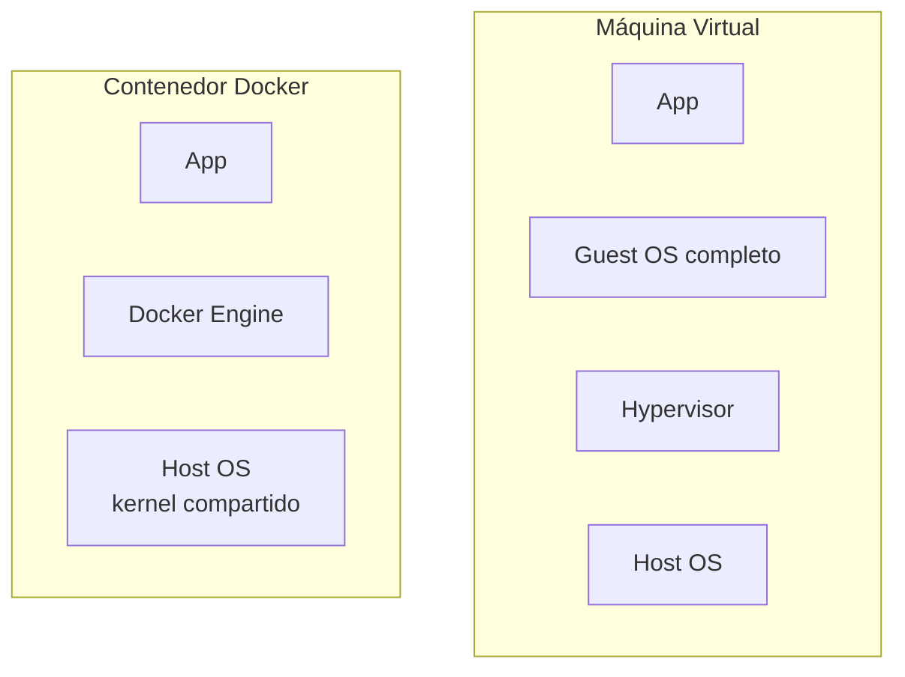
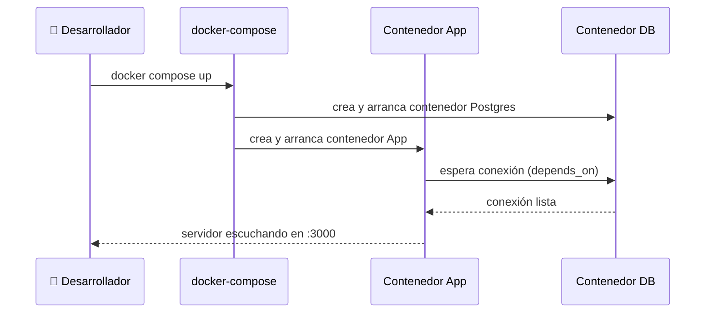

# Laboratorio: Docker desde Cero

## 🎯 Resumen Ejecutivo

Docker empaqueta tu aplicación **junto con todo lo que necesita para
correr** —dependencias, versión exacta del runtime, variables de
entorno— en una unidad portable llamada **imagen**. El resultado es la
frase que resolvió miles de horas de debugging: *"funciona en mi
máquina"* deja de ser un problema porque la máquina viaja con la app.

## 🎓 Para Dummies (ELI5)

Piensa en mudarte de casa. Podrías cargar cada mueble suelto en la
camioneta (instalar dependencias manualmente en cada servidor, rezando
que las versiones coincidan) o podrías empacar todo en cajas etiquetadas
que sabes que van a llegar exactamente igual a como salieron (una imagen
Docker). Un contenedor es la caja ya armada, lista para abrirse en
cualquier lugar que tenga Docker instalado.

## 🎯 Objetivos de Aprendizaje

- [ ] Diferenciar imagen de contenedor
- [ ] Escribir un Dockerfile optimizado con multi-stage build
- [ ] Levantar un entorno multi-servicio con docker-compose
- [ ] Evitar los 3 errores más comunes que inflan el tamaño de una imagen

## 🔍 Definición

> Una **imagen** es una plantilla inmutable con el sistema de archivos y
> configuración necesarios para ejecutar una aplicación. Un
> **contenedor** es una instancia en ejecución de esa imagen —aislada
> mediante namespaces y cgroups del kernel de Linux, pero compartiendo
> el mismo kernel del host (a diferencia de una máquina virtual).



> **💎 Perla escondida #1:** La razón por la que los contenedores
> arrancan en milisegundos y una VM tarda minutos es exactamente esto:
> un contenedor **no bootea un sistema operativo nuevo**, solo aísla
> procesos dentro del kernel que ya está corriendo. Esto también explica
> por qué un contenedor Linux no puede correr sobre Windows sin una capa
> de compatibilidad (WSL2) — necesita el kernel Linux real debajo.

## 🏗️ Tu Primer Dockerfile

```dockerfile
# ❌ Versión ingenua — funciona, pero la imagen final pesa ~1.2GB
FROM node:20
WORKDIR /app
COPY . .
RUN npm install
CMD ["node", "server.js"]
```

```dockerfile
# ✅ Multi-stage build — la imagen final pesa ~180MB
# ETAPA 1: build (incluye devDependencies, herramientas de compilación)
FROM node:20 AS builder
WORKDIR /app
COPY package*.json ./
RUN npm ci
COPY . .
RUN npm run build

# ETAPA 2: producción (solo lo esencial para ejecutar)
FROM node:20-alpine AS production
WORKDIR /app
COPY --from=builder /app/dist ./dist
COPY --from=builder /app/node_modules ./node_modules
COPY package*.json ./
USER node
CMD ["node", "dist/server.js"]
```

**💎 Perla escondida #2:** `node:20-alpine` pesa ~180MB menos que
`node:20` porque usa Alpine Linux (basado en `musl` en vez de `glibc`).
El truco senior: compila en la imagen completa (`node:20`, con todas las
herramientas), y copia solo el resultado a la imagen ligera (`alpine`).
Nunca instales herramientas de compilación en la imagen que va a
producción — cada capa extra es superficie de ataque y peso muerto.

## 🐳 docker-compose.yml: Orquestando Múltiples Servicios

```yaml
version: "3.9"
services:
  app:
    build: .
    ports:
      - "3000:3000"
    environment:
      - DATABASE_URL=postgres://user:pass@db:5432/miapp
    depends_on:
      - db
    restart: unless-stopped

  db:
    image: postgres:16-alpine
    environment:
      - POSTGRES_USER=user
      - POSTGRES_PASSWORD=pass
      - POSTGRES_DB=miapp
    volumes:
      - db_data:/var/lib/postgresql/data
    ports:
      - "5432:5432"

volumes:
  db_data:
```



**💎 Perla escondida #3:** `depends_on` solo espera a que el contenedor
**arranque**, no a que el servicio dentro esté realmente listo para
recibir conexiones (Postgres puede tardar unos segundos extra en aceptar
conexiones después de arrancar). El error clásico de junior: la app falla
al conectarse en el primer intento. La solución real es implementar un
`healthcheck` en el `docker-compose.yml` y usar `condition:
service_healthy`, no solo `depends_on`.

## ⚖️ Trade-offs

**✅ Ventajas:** portabilidad total, arranque rápido, aislamiento de
dependencias, consistencia entre dev/staging/producción.

**❌ Desventajas:** overhead de aprendizaje real, capa adicional de
infraestructura a mantener, no es aislamiento tan fuerte como una VM
(comparten kernel — relevante para multi-tenancy con requisitos de
seguridad estrictos).

## ✨ Buenas Prácticas

- Usa `.dockerignore` (igual que `.gitignore`) para no copiar `node_modules`, `.git`, archivos de entorno con secretos.
- Nunca corras el proceso principal como `root` dentro del contenedor (`USER node` en el ejemplo).
- Usa tags específicos (`node:20.11.0-alpine`), nunca `latest`, para builds reproducibles.
- Ordena las instrucciones del Dockerfile de menos a más cambiantes (dependencias primero, código después) para aprovechar el cache de capas.

## ⚠️ Errores Comunes

```dockerfile
# ❌ Copiar todo antes de instalar dependencias invalida el cache
# en CADA cambio de código, incluso si package.json no cambió.
COPY . .
RUN npm install
```

```dockerfile
# ✅ Copiar package.json primero: el cache de la capa `npm ci`
# se reutiliza mientras las dependencias no cambien.
COPY package*.json ./
RUN npm ci
COPY . .
```

## 📋 Checklist de Implementación

- [ ] ¿Usas multi-stage build para separar compilación de producción?
- [ ] ¿La imagen final usa una base ligera (`alpine` o `slim`)?
- [ ] ¿Tienes un `.dockerignore` configurado?
- [ ] ¿El proceso corre como usuario no-root?
- [ ] ¿Usas tags de versión específicos, no `latest`?
- [ ] ¿Configuraste `healthcheck` en vez de confiar solo en `depends_on`?

## ❓ Preguntas de Entrevista

**P1: "¿Cuál es la diferencia entre una imagen y un contenedor?"**

*Respuesta modelo:* "Una imagen es una plantilla inmutable; un
contenedor es una instancia en ejecución de esa imagen. Es análogo a
clase vs. objeto en programación orientada a objetos."

**P2: "¿Por qué usar multi-stage builds?"**

*Respuesta modelo:* "Para separar las herramientas necesarias en tiempo
de compilación (compiladores, devDependencies) de lo que realmente se
necesita en producción, reduciendo drásticamente el tamaño final de la
imagen y su superficie de ataque."

## 🔗 Temas Relacionados

- [Arquitectura Monolítica](../../volume-3-architecture/fundamentals/monolith-architecture.md)
- Kubernetes *(próximamente — requiere este lab completado primero)*

## 📚 Recursos Oficiales

- Documentación oficial: docs.docker.com
- *"Docker Deep Dive"* — Nigel Poulton

## 🏁 Resumen Final

Docker empaqueta tu app con todo lo que necesita para correr, de forma
portable y reproducible. El multi-stage build es la técnica que separa
al principiante del ingeniero que entiende el costo de cada capa.

## 🃏 Flashcards

```
Q: ¿Qué es un multi-stage build y por qué se usa?
A: Un Dockerfile con múltiples etapas FROM, donde la etapa final copia solo los artefactos necesarios de etapas anteriores, reduciendo el tamaño de la imagen de producción.

Q: ¿Por qué depends_on no garantiza que un servicio esté "listo"?
A: Porque solo espera a que el contenedor arranque, no a que el proceso interno esté aceptando conexiones. Se necesita un healthcheck real.
```

## 📝 Quiz

1. **¿Por qué copiar `package.json` antes que el resto del código en un Dockerfile?**
   - [x] Para aprovechar el cache de capas de Docker cuando las dependencias no cambian
   - [ ] Es un requisito obligatorio de Docker
   - [ ] Para que el archivo se vea primero en el contenedor
   - [ ] No tiene ningún efecto real

   *Explicación: Docker cachea cada instrucción como una capa; si copias todo el código antes de instalar dependencias, cualquier cambio de código invalida el cache de `npm install`, forzando una reinstalación completa innecesaria.*

## 📖 Diccionario Rápido de Este Tema

| Término | Qué significa | Contexto en este tema |
|---|---|---|
| **Imagen** | Una plantilla inmutable con todo lo necesario para correr una app (código, dependencias, configuración). | Es lo que construyes con un Dockerfile. |
| **Contenedor** | Una instancia en ejecución de una imagen. | Como la diferencia entre una clase y un objeto en programación. |
| **Namespace / cgroups** | Mecanismos del kernel de Linux que aíslan procesos y limitan sus recursos (CPU, memoria). | Es la tecnología real detrás del aislamiento de Docker — no es magia, es el kernel. |
| **Multi-stage build** | Un Dockerfile con varias etapas, donde solo el resultado final de la compilación pasa a la imagen de producción. | La técnica clave para reducir el tamaño de la imagen. |
| **Alpine Linux** | Una distribución de Linux minimalista, usada como base para imágenes Docker ligeras. | Por eso `node:20-alpine` pesa mucho menos que `node:20`. |
| **Healthcheck** | Una instrucción que verifica si el proceso dentro del contenedor realmente está listo para recibir tráfico, no solo si arrancó. | Soluciona el problema de que `depends_on` no garantiza que el servicio esté "listo". |
| **Capa (layer)** | Cada instrucción de un Dockerfile crea una "capa" cacheable. | Por eso el orden de las instrucciones en el Dockerfile importa tanto para el cache. |
