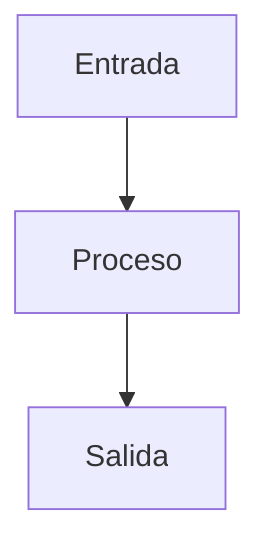
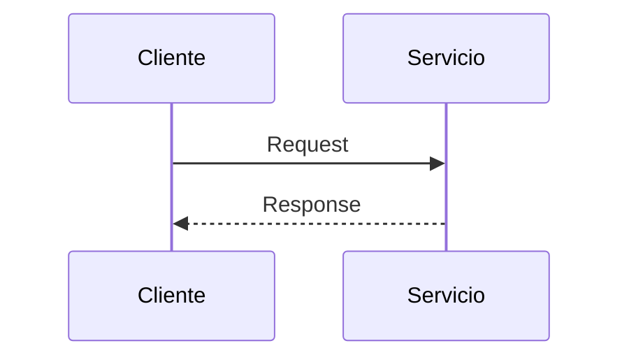

<!--
ESTE ARCHIVO VIVE FUERA DE /docs A PROPÓSITO.
Docusaurus solo renderiza lo que está dentro de /docs, así que esta plantilla
nunca se convierte en una página real ni rompe el build. Cópiala hacia /docs
cuando vayas a escribir un tema nuevo.
-->

# Nombre del Tema

## 🎯 Resumen Ejecutivo

2-3 párrafos. Si el lector solo tiene 3 minutos, esto es lo que debe llevarse:
qué es, por qué importa para su carrera, cuándo se usa.

## 🎓 Para Dummies (ELI5)

Antes de la teoría formal: una analogía del mundo cotidiano que cualquiera
entendería, aunque nunca haya programado. Ejemplo de tono:

> "Imagina que tu cocina es un monolito: un solo lugar donde cocinas, lavas
> y guardas todo. Funciona genial hasta que cinco personas quieren cocinar
> platos distintos al mismo tiempo."

## 🎯 Objetivos de Aprendizaje

Al terminar podrás:
- [ ] Explicar el concepto a un junior sin usar jerga
- [ ] Reconocer cuándo aplica y cuándo no
- [ ] Detectar el anti-patrón más común
- [ ] Responder la pregunta de entrevista típica sobre esto

## 📚 Prerequisitos

> **Antes de seguir, deberías dominar:**
> - [Tema requisito](#) — *por qué*: sin esto, lo siguiente no tiene base

## 🔍 Definición

Definición en una oración, luego la versión técnica formal.

## 📖 Historia y Motivación

¿Qué problema existía antes de esto? ¿Por qué se inventó?

## 🧩 Conceptos Fundamentales

Uno por uno, cada uno con: explicación, analogía, diagrama, ejemplo de código
y una perla escondida.

### Concepto 1



**💎 Perla escondida:** algo que solo se aprende con experiencia real,
no en un tutorial.

## 🏗️ Arquitectura y Funcionamiento Interno

Componentes, responsabilidades, flujo paso a paso.



## 💻 Ejemplos de Código

Código real, comentado, mostrando la forma correcta y una incorrecta.

## ⚖️ Trade-offs (Ventajas / Desventajas)

## ✨ Buenas Prácticas

## ⚠️ Anti-patrones y Errores Comunes

## 🔬 Comparaciones y Casos de Uso

Cuándo usarlo. Cuándo NO usarlo. Contra qué alternativa se compara.

## 🏢 Casos Reales

Cómo lo aplica una empresa real, con números si es posible.

## 🧠 Cómo Piensa un Arquitecto

Un párrafo mostrando el razonamiento senior: qué preguntas se hace, qué
señales busca, cómo decide.

## ❓ Preguntas de Entrevista

3+ preguntas con respuesta modelo y qué busca el entrevistador.

## 📋 Checklist de Implementación

## 🔗 Temas Relacionados

## 📚 Recursos Oficiales

**Libros:** ...
**Papers / RFCs:** ...
**Artículos:** ...
**Videos:** ...

## 🏁 Resumen Final

## 🃏 Flashcards

```
Q: ¿Pregunta corta?
A: Respuesta corta.

Q: ¿Otra pregunta?
A: Otra respuesta.
```

## 📝 Quiz

1. **Pregunta de opción múltiple**
   - [ ] Opción A
   - [x] Opción B (correcta)
   - [ ] Opción C
   - [ ] Opción D

   *Explicación: por qué B es correcta y por qué las otras no.*

## 📖 Diccionario Rápido de Este Tema

Si escribiste algún término técnico, jerga de industria o palabra en inglés
sin explicarla en el cuerpo del tema, agrégala aquí. Esta sección es
obligatoria si el tema usa 2 o más términos que un lector nuevo no
conocería. Formato: como te lo explicaría un colega senior, no un
diccionario formal.

| Término | Qué significa | Contexto en este tema |
|---|---|---|
| **[Término]** | [Explicación en una oración, en español simple] | [Dónde/por qué aparece en este tema específico] |

> Si un término aparece en **muchos** temas distintos (no solo este), no lo
> repitas aquí cada vez — agrégalo una sola vez al
> [Glosario Técnico](/glosario) global y enlázalo desde aquí.
